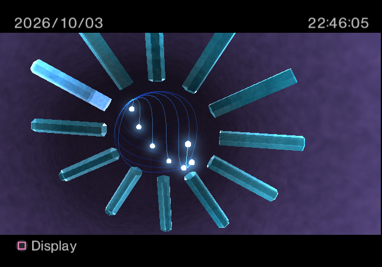
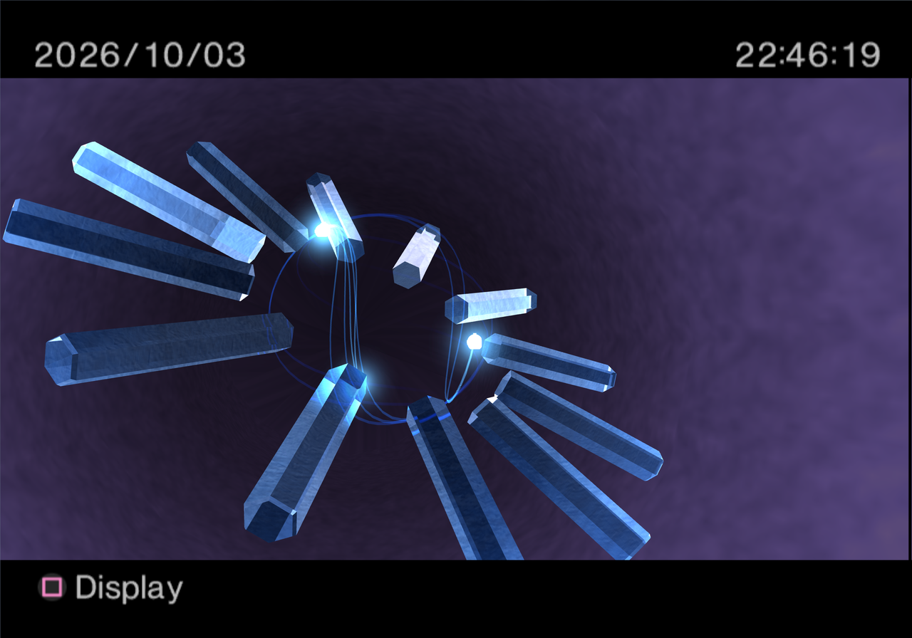
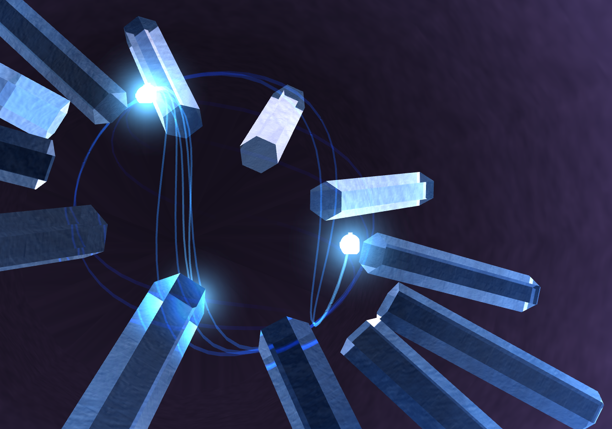
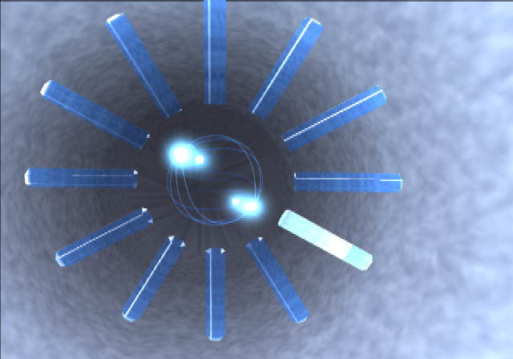
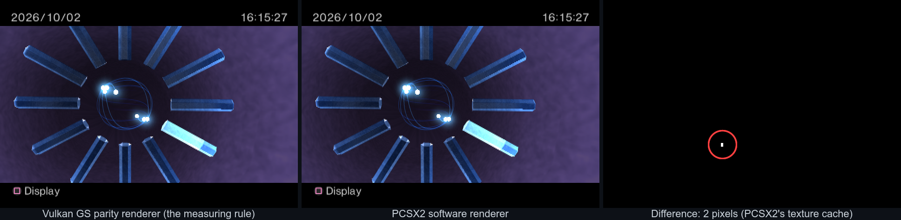
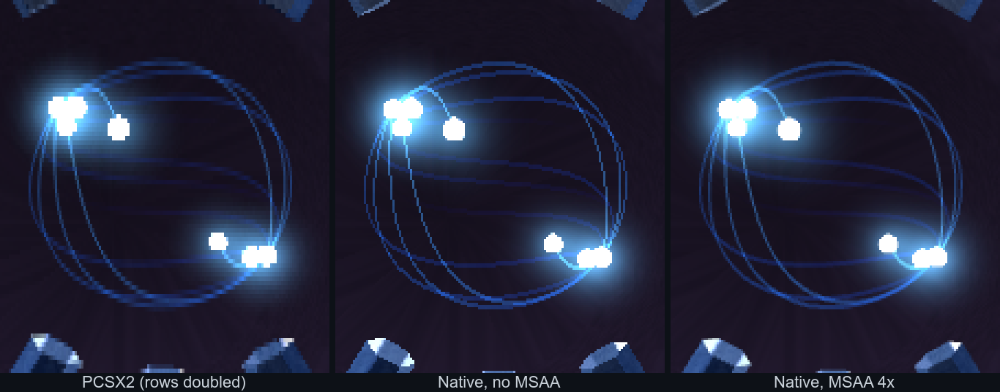
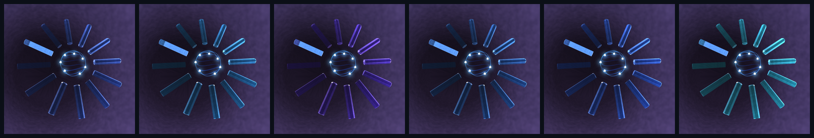
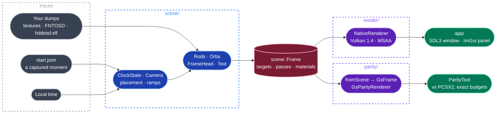

<p align="center">
  
  <h1 align="center">Crystal Clock VK</h1>
  <p align="center">
    <strong>The PlayStation 2 OSD's crystal clock, measured from the console's own code and rebuilt in native C++ and Vulkan.</strong>
  </p>
  <p align="center">
    <a href="https://github.com/JeanxPereira/CrystalClockVK/actions/workflows/build.yml"></a>
    
    
    
    
  </p>
</p>

---

Crystal Clock VK is a clean reimplementation of the crystal clock screen of the PlayStation 2 OSD: twelve
glass rods around a sphere, seven orbs leaving trails, the framebuffer refracted through the blocks, the date,
the time and the button hint. The canon build is **HDD OSD 1.10U** (`hddosd.elf`, SHA-1 `e932f350…`); the
**ROM 2.30** BIOS is a second witness, and every address names the build it belongs to.

Nothing here is emulated. The scene code is ported from an executable JavaScript model of the console's own
functions, and that model is a fact only where a verifier recomputes the console's output from it, bit for bit,
on both builds. PCSX2's GS is used once more at the end, as a measuring rule: the scene drawn through a GS-exact
renderer gives the same frame as PCSX2 except for 8 pixels, all caused by PCSX2's own texture cache. The renderer
that runs in the window is free of the GS: hardware blending, MSAA in place of the GS's edge antialiasing, any
resolution.

US Patent 6,693,606 states the intent of the effect and holds no numbers; every number comes from the binary.
Crystal Clock VK is an independent project and is not affiliated with Sony Interactive Entertainment. No console
data is in this repository.

## Features

| Area | What it does |
|---|---|
| Scene | The clock screen as plain C++ with named objects: state, camera, placement, rods, orbs, frame head, text. One `scene::Frame` per frame, no Vulkan |
| Exactness | The scene is a template over its arithmetic. `Clock<EeArithmetic>` (round toward zero, no denormals, the EE's own sine) reproduces the model bit for bit; the window runs `Clock<NativeArithmetic>` |
| Rods | The five sends of a rod: refracted, textured, reflection, the split rod and its texture offsets, the two extra passes |
| Orbs | Seven orbs on rings of 50 points, one point every 3 frames; trails drawn as the GS's one-pixel bands; sprites and their fade |
| Frame head | Background tube, blur trips, copies to the work buffers, tint, vignette, bars |
| Text | The FNTOSD font, the glyph cache carried from frame to frame, a glyph's twelve-vertex fan, date and time from the OSD's own format strings, the button hint |
| Native renderer | Vulkan 1.4, dynamic rendering, push descriptors; three targets (display, refraction source, work); fixed-function blending; MSAA off, 2x, 4x, 8x |
| Live window | SDL3 window on local time, logic at a fixed 59.94 Hz, 640x448, window size, x2 or x4, a 4:3 picture or square pixels |
| Debug panel | Dear ImGui: resolution, MSAA, pause, step one frame, set the time, show any target, screenshot |
| Measuring rule | `GsParityRenderer` and `ParityTool`: the scene converted to GS draws and compared with PCSX2's software renderer against exact budgets |

## Screenshots

<p align="center">
  
  &nbsp;
  
  
  &nbsp;
  
</p>
<p align="center">
  <sub>The native window at the NTSC frame's 640x448 · at x4 (2560x1792) with MSAA 4x · a 1:1 crop of the x4 frame · the refraction source target, the buffer the rods refract</sub>
</p>

<p align="center">
  
</p>
<p align="center">
  <sub>The measuring rule on frame 0 of the <code>whole3-clock</code> capture, one field with its rows doubled: the Vulkan GS parity renderer · PCSX2's software renderer · the difference. The pixels that differ are budgeted, each with its cause</sub>
</p>

<p align="center">
  
</p>
<p align="center">
  <sub>Orb trails at 640x448: PCSX2 · the native renderer without MSAA · with MSAA 4x. A trail is one GS pixel across in all three</sub>
</p>

<p align="center">
  
</p>
<p align="center">
  <sub>Colour variants of the render the app icon was made from</sub>
</p>

## The method

A value enters the code only once it is a fact, and a fact is a verifier passing.

| Step | What happens |
|---|---|
| Measure | Watson, an instrumented PCSX2, records probes at a function's entry, fast captures, GS traces and GS memory reads, on both builds |
| Read | The function that computes the value is read in the HDD OSD disassembly, so the page records the rule that produces a number and not only the number |
| Verify | A script in `References/scripts/` recomputes the function's output from the probed inputs and compares it bit for bit |
| Mutate | `mutate.mjs` changes one constant, operator or comparison at a time; a verifier that still passes a mutant is not a test |
| Regress | `run_all.mjs` runs every verifier on every capture, build and video mode: 849 of 849 entries pass |
| Write | The result becomes a page in [`facts/`](facts/README.md), which names its build, its script and its capture |

`References/model/clock_frame.mjs` assembles those verified functions into a model that produces every packet of
a clock frame. The native scene is ported from that model, and its tests compare it with state and passes
exported from real captures.

## Architecture



| Layer | Path | Role |
|---|---|---|
| Scene | `src/scene/` | Plain C++. The clock's state, camera, placement, rods, orbs, frame head and text, each part with the facts page it ports. Builds one `scene::Frame`; testable without a window |
| Render | `src/render/` | `Device` (instance, device, queues, VMA, swapchain) and `NativeRenderer`, which executes a `scene::Frame` |
| App | `src/app/` | The SDL3 window, real time, the frame loop and the ImGui debug panel |
| Parity | `src/parity/` | The measuring rule only: GS frame types, `fromScene`, `GsParityRenderer`, fixture loader, comparison |

Support lives in `tools/`: `ParityTool` (isolated and chained comparison against budgets), `tools/parity/`
(fixture generation) and `tools/scene/` (the scene exporter and the start state).

## Build

Requires Windows, Visual Studio 2026, CMake 3.30+ (the presets need 4.2) and the Vulkan SDK 1.4 with `glslc`.
SDL3, VulkanMemoryAllocator, vk-bootstrap, GLM and nlohmann/json are fetched on the first configure; Dear ImGui
is a submodule.

```powershell
git clone --recursive https://github.com/JeanxPereira/CrystalClockVK.git
cd CrystalClockVK
cmake --preset windows
cmake --build --preset release
```

Executables land in `bin/`. CI builds them on every push to `main`.

### Your own data

The textures, the font and the program are Sony's and are not in this repository. They come from your own
console's BIOS and HDD OSD, through the scripts in `References/scripts/`:

```powershell
# The ten clock textures, decoded from the GS memory of a PCSX2 GS dump of the clock screen
node References/scripts/extract_textures.mjs <clock.gs> References/textures
# Optional: check them against your BIOS's TEXIMAGE, texture by texture
node References/scripts/extract_rom_textures.mjs <bios.bin> References/textures

# FNTOSD and hddosd.elf for the text, from an installed HDD OSD 1.10U (the ELF's SHA-1 is checked)
node References/scripts/make_hddosd_host.mjs <hddosd.elf> <installed HDD OSD folder> References/dumps/hddosd-host
```

Configure finds them there by default; `-DCLOCK_REFERENCES=<dir>` and `-DCLOCK_DUMPS=<dir>` point elsewhere.

## Running

```powershell
bin\CrystalClock.exe
```

The clock starts from a real moment, the first frame of the `whole3-clock` capture
(`resources/clock/start.json`, the model has no default state), and runs on local time from there. Over the
first seconds the rods sweep from the captured hour to yours.

| Flag | Does |
|---|---|
| `--soak N` | Runs an unattended scripted session for N seconds (resolutions, MSAA, resizes, minimise, pause and step, every target, a midnight crossing, screenshots) and reports frames and validation errors |
| `--smoke` | A 5.5 s resize and minimise run |
| `--no-validation` | Runs without the Vulkan validation layers |
| `--start <scene.json>` | Starts from another capture's first frame |
| `--textures`, `--font`, `--program`, `--mesh`, `--shaders` | Override the data paths |
| `--screenshots <dir>` | Where the panel's screenshot button writes; `out/screenshots` by default |

## Tests

```powershell
ctest --test-dir build -C Release --output-on-failure
```

| Level | Compares | Against | Criterion |
|---|---|---|---|
| Logic | the scene's state, frame by frame, under `EeArithmetic` | state exported from captures by the JS model | bit for bit |
| Geometry | every pass of 24 carried frames: state, every vertex, the 100 strings and the font state | the GS dump of the same frames | equal: 4 628 passes |
| Pixels | the scene through `fromScene` and `GsParityRenderer` | PCSX2's software renderer | the budget: 8 pixels, cause named |
| Native | `NativeRenderer`: blending, sampling, copies, MSAA, real frames | expected values in bytes | 0 validation errors |
| Eye | the window | the PS2 | Jean's verdict |

The suite holds 18 tests. Those that need captures or your data register only when the files exist, and
configure says which parity gates are active. Budgets in `tools/ParityTool/budgets/` are exact both ways: an
unlisted difference, a larger one or a stale entry all fail. A difference with no known cause is a failure,
never a tolerance.

## Roadmap

| | |
|---|---|
| Clock screen: scene, native renderer, live window, text | Done |
| Menus: System Configuration and its glass cubes, Clock Adjustment, the transitions between them | In progress |
| Sound | In progress |
| The opening, PAL, languages | Planned |
| Improvements beyond resolution and MSAA, each a switch over the faithful base | Planned |
| macOS | Planned |

What is verified and what is still open is kept, line by line, in [`facts/README.md`](facts/README.md) and
[`facts/verification.md`](facts/verification.md).

## Documents

| | |
|---|---|
| What the OSD does, verified, and what is left: start here | [`facts/README.md`](facts/README.md) |
| Every verifier and its result on each build | [`facts/verification.md`](facts/verification.md) |
| A clock frame end to end | [`facts/clock-frame.md`](facts/clock-frame.md) |
| The rod's drawing, pass by pass | [`facts/clock-rod-draw.md`](facts/clock-rod-draw.md) |
| The GS state helpers | [`facts/clock-gs-state.md`](facts/clock-gs-state.md) |
| The font and the clock's strings | [`facts/text.md`](facts/text.md) |
| The native clock's design | [`docs/superpowers/specs/2026-10-03-native-clock-design.md`](docs/superpowers/specs/2026-10-03-native-clock-design.md) |
| The patent | [`docs/clock_patent/`](docs/clock_patent) |

## Dependencies

| Library | Version | Purpose |
|---|---|---|
| [SDL3](https://github.com/libsdl-org/SDL) | 3.4.4 | Window and input |
| [VulkanMemoryAllocator](https://github.com/GPUOpen-LibrariesAndSDKs/VulkanMemoryAllocator) | 3.3.0 | GPU memory |
| [vk-bootstrap](https://github.com/charles-lunarg/vk-bootstrap) | 1.4.341 | Instance and device setup |
| [GLM](https://github.com/g-truc/glm) | 1.0.1 | Math |
| [nlohmann/json](https://github.com/nlohmann/json) | 3.11.3 | Start state, fixtures, budgets |
| [Dear ImGui](https://github.com/ocornut/imgui) | submodule | Debug panel |
| [stb_image](https://github.com/nothings/stb) | bundled | Texture loading |

---

<p align="center">
  Made by <a href="https://github.com/JeanxPereira">JeanxPereira</a>
</p>
