<p align="center">
  
  <h1 align="center">Crystal Clock VK</h1>
  <p align="center">
    <strong>The PlayStation 2 OSD's crystal clock, measured from the console's own code and rebuilt in native C++ and Vulkan.</strong>
  </p>
  <p align="center">
    <a href="https://github.com/JeanxPereira/CrystalClockVK/actions/workflows/build.yml"></a>
    
    
    
    
  </p>
</p>

---

Crystal Clock VK is a clean reimplementation of the crystal clock screen of the PlayStation 2 OSD: twelve
glass rods around a sphere, seven orbs leaving trails, the framebuffer refracted through the blocks, the date,
the time and the button hint. The canon build is **HDD OSD 1.10U** (`hddosd.elf`, SHA-1 `e932f350…`); the
**ROM 2.30** BIOS is a second witness, and every address names the build it belongs to.

Nothing here is emulated. The scene code is ported from an executable JavaScript model of the console's own
functions, and that model is a fact only where a verifier recomputes the console's output from it, bit for bit,
on both builds. PCSX2's GS is used once more at the end, as a measuring rule: the scene drawn through a GS-exact
renderer gives the same frame as PCSX2 except for 8 pixels, all caused by PCSX2's own texture cache. The renderer
that runs in the window is free of the GS: hardware blending, MSAA in place of the GS's edge antialiasing, any
resolution.

US Patent 6,693,606 states the intent of the effect and holds no numbers; every number comes from the binary.
Crystal Clock VK is an independent project and is not affiliated with Sony Interactive Entertainment. The console's raw
resource files in `resources/` are Sony's.

## Features

| Area | What it does |
|---|---|
| Scene | The clock screen as plain C++ with named objects: state, camera, placement, rods, orbs, frame head, text. One `scene::Frame` per frame, no Vulkan |
| Exactness | The scene is a template over its arithmetic. `Clock<EeArithmetic>` (round toward zero, no denormals, the EE's own sine) reproduces the model bit for bit; the window runs `Clock<NativeArithmetic>` |
| Rods | The five sends of a rod: refracted, textured, reflection, the split rod and its texture offsets, the two extra passes |
| Orbs | Seven orbs on rings of 50 points, one point every 3 frames; trails drawn as the GS's one-pixel bands; sprites and their fade |
| Frame head | Background tube, blur trips, copies to the work buffers, tint, vignette, bars |
| Text | The FNTOSD font, the glyph cache carried from frame to frame, a glyph's twelve-vertex fan, date and time from the OSD's own format strings, the button hint |
| Native renderer | Vulkan 1.4, dynamic rendering, push descriptors; three targets (display, refraction source, work); fixed-function blending; MSAA off, 2x, 4x, 8x |
| Live window | SDL3 window on local time, logic at a fixed 59.94 Hz, 640x448, window size, x2 or x4, a 4:3 picture or square pixels |
| Debug panel | Dear ImGui: resolution, MSAA, pause, step one frame, set the time, show any target, screenshot |
| Measuring rule | On the `lab` branch: `GsParityRenderer` and `ParityTool`, the scene converted to GS draws and compared with PCSX2's software renderer against exact budgets |

## Screenshots

<p align="center">
  
  &nbsp;
  
  
  &nbsp;
  
</p>
<p align="center">
  <sub>The native window at the NTSC frame's 640x448 · at x4 (2560x1792) with MSAA 4x · a 1:1 crop of the x4 frame · the refraction source target, the buffer the rods refract</sub>
</p>

<p align="center">
  
</p>
<p align="center">
  <sub>The measuring rule on frame 0 of the <code>whole3-clock</code> capture, one field with its rows doubled: the Vulkan GS parity renderer · PCSX2's software renderer · the difference. The pixels that differ are budgeted, each with its cause</sub>
</p>

<p align="center">
  
</p>
<p align="center">
  <sub>Orb trails at 640x448: PCSX2 · the native renderer without MSAA · with MSAA 4x. A trail is one GS pixel across in all three</sub>
</p>

<p align="center">
  
</p>
<p align="center">
  <sub>Colour variants of the render the app icon was made from</sub>
</p>

## The method

The research lives on the `lab` branch (`facts/`, `References/`, the tests, the parity tools). A value enters the code only once it is a fact, and a fact is a verifier passing.

| Step | What happens |
|---|---|
| Measure | Watson, an instrumented PCSX2, records probes at a function's entry, fast captures, GS traces and GS memory reads, on both builds |
| Read | The function that computes the value is read in the HDD OSD disassembly, so the page records the rule that produces a number and not only the number |
| Verify | A script in `References/scripts/` (lab) recomputes the function's output from the probed inputs and compares it bit for bit |
| Mutate | `mutate.mjs` changes one constant, operator or comparison at a time; a verifier that still passes a mutant is not a test |
| Regress | `run_all.mjs` runs every verifier on every capture, build and video mode: 849 of 849 entries pass |
| Write | The result becomes a page in `facts/` (lab), which names its build, its script and its capture |

`References/model/clock_frame.mjs` (lab) assembles those verified functions into a model that produces every packet of
a clock frame. The native scene is ported from that model, and its tests compare it with state and passes
exported from real captures.

## Architecture

```mermaid
flowchart LR
    classDef input fill:#374151,stroke:#d1d5db,stroke-width:2px,color:#fff
    classDef scene fill:#1e40af,stroke:#bfdbfe,stroke-width:2px,color:#fff
    classDef frame fill:#7a1b33,stroke:#f4b6c6,stroke-width:2px,color:#fff
    classDef draw fill:#5b21b6,stroke:#ddd6fe,stroke-width:2px,color:#fff
    classDef out fill:#047857,stroke:#a7f3d0,stroke-width:2px,color:#fff

    subgraph In["Inputs"]
        direction TB
        Start(["Cold start<br/>the program's initial values · init functions"]):::input
        Data(["Your dumps<br/>textures · FNTOSD · hddosd.elf"]):::input
        Time(["Local time"]):::input
    end

    subgraph Scene["scene/"]
        direction TB
        State(["ClockState · Camera<br/>placement · ramps"]):::scene
        Parts(["Rods · Orbs<br/>FrameHead · Text"]):::scene
    end

    Frame[("scene::Frame<br/>targets · passes · materials")]:::frame

    subgraph Render["render/"]
        direction TB
        Native(["NativeRenderer<br/>Vulkan 1.4 · MSAA"]):::draw
    end

    subgraph Parity["parity/"]
        direction TB
        Rule(["fromScene → GsFrame<br/>GsParityRenderer"]):::draw
    end

    Start --> State
    Time --> State
    Data --> Parts
    State --> Parts --> Frame
    Frame --> Native --> App(["app/<br/>SDL3 window · ImGui panel"]):::out
    Frame --> Rule --> Gate(["ParityTool<br/>vs PCSX2, exact budgets"]):::out

    style In fill:none,stroke:#9ca3af,stroke-width:2px,stroke-dasharray:5 5,color:#9ca3af
    style Scene fill:none,stroke:#3b82f6,stroke-width:2px,stroke-dasharray:5 5,color:#3b82f6
    style Render fill:none,stroke:#8b5cf6,stroke-width:2px,stroke-dasharray:5 5,color:#8b5cf6
    style Parity fill:none,stroke:#8b5cf6,stroke-width:2px,stroke-dasharray:5 5,color:#8b5cf6
```



| Layer | Path | Role |
|---|---|---|
| Scene | `src/scene/` | Plain C++. The clock's state, camera, placement, rods, orbs, frame head and text, each part with the facts page it ports. Builds one `scene::Frame`; testable without a window |
| Render | `src/render/` | `Device` (instance, device, queues, VMA, swapchain) and `NativeRenderer`, which executes a `scene::Frame` |
| App | `src/app/` | The SDL3 window, real time, the frame loop and the ImGui debug panel |
| Assets | `src/assets/` | Plain C++, no Vulkan. The console's raw resource files decoded (ROMDIR, HDD container decrypt, Expand), the BIOS extractor and the `assets.bin` cache |

The measuring rule (`src/parity/`, `ParityTool`, the fixtures and the tests) is on the `lab` branch.

## Build

Requires Windows, Visual Studio 2026, CMake 4.2+ and the Vulkan SDK 1.4 with `glslc`.
SDL3, VulkanMemoryAllocator, vk-bootstrap, GLM and nlohmann/json are fetched on the first configure; Dear ImGui
is a submodule.

```powershell
git clone --recursive https://github.com/JeanxPereira/CrystalClockVK.git
cd CrystalClockVK
toolsuild.ps1 configure app
toolsuild.ps1 build app-release
```

`toolsuild.ps1` enters the Visual Studio developer shell and uses the Ninja that ships with it. The executables
land in `bin/`. The tests are not on this branch: they live on `lab`. `windows-vs` is the Visual Studio generator preset
for the IDE. CI builds the app on every push to `main`.

### Your own data

The console's raw resource files (`TEXIMAGE`, `FNTOSD`, `SNDIMAGE`, `ICOIMAGE`, `JISUCS`, `SKBIMAGE` and HDD OSD
1.10U's `hddosd.elf`) are in `resources/`, as the OSD loads them. They are Sony's. The build copies them to
`bin/resources`, and the app decodes them at each start (ROMDIR, the HDD OSD container decrypt, Expand, the 32-bit
conversion of `func_002344F8`; `src/assets/`).

```powershell
# Other files: a BIOS ROM image's TEXIMAGE, SNDIMAGE and ICOIMAGE are written, unchanged, to the resource folder
bin\CrystalClock.exe --bios <rom.bin>
# Or a folder with hddosd.elf, FNTOSD, TEXIMAGE (encrypted), ...
bin\CrystalClock.exe --resources <folder>
```

With no flag the app reads `resources` beside the executable. When files are missing it says which and exits.

The text needs `FNTOSD` and HDD OSD 1.10U's `hddosd.elf` (the original or the host copy; any other ELF is
recognised and not read): a BIOS gives the textures only, which is not enough to start: the meshes come from
the program. Loose files are used only when their flag is given (`--textures`, `--font`, `--program`, `--mesh`,
`--cube-mesh`). At start-up the app prints where the textures, the mesh and the text come from. The decryption tables and key
words are read from your `hddosd.elf`.

## Running

```powershell
bin\CrystalClock.exe
```

The clock starts as the console starts it: the initial values of `hddosd.elf`, the ported init functions of the clock thread
(`module_clock_init_resources` and its callees), the host's settings and local time, then frames at 59.94 Hz. It opens with the opening, hands off and starts the clock
thread after it; `--skip-boot` runs the clock module's own entry to the main menu instead (the menu takes input 129 frames
after the thread starts), and `--clock` opens System Configuration and hides the list with Square (the clock alone). Settings come from `%LOCALAPPDATA%/CrystalClockVK/settings.json` (`language`, `aspect`, `timeZone`,
`summerTime`, `dateFormat`, `timeFormat`); when it is absent the console's first-start defaults apply and the time zone is the host's.

| Flag | Does |
|---|---|
| `--soak N` | Runs an unattended scripted session for N seconds (resolutions, MSAA, resizes, minimise, pause and step, every target, a midnight crossing, screenshots) and reports frames and validation errors |
| `--smoke` | A 5.5 s resize and minimise run |
| `--no-validation` | Runs without the Vulkan validation layers |
| `--skip-boot` | Starts at the main menu without the opening (the panel also has Skip opening and Restart opening) |
| `--clock` | Starts at the clock alone instead of the main menu |
| `--pal`, `--language N`, `--aspect N` | Video mode and console settings for this run |
| `--settings <settings.json>` | Another host settings file |
| `--resources <dir>` | The folder of raw OSD resource files to decode |
| `--bios <rom.bin>` | Extracts the BIOS's resource files into the resource folder first |
| `--assets <assets.bin>` | Where the decoded cache is read and written |
| `--textures`, `--font`, `--program`, `--mesh`, `--cube-mesh`, `--shaders` | Loose files, used only when named |
| `--screenshots <dir>` | Where the panel's screenshot button writes; `out/screenshots` by default |

## Tests

The tests, the parity gates and `ParityTool` are on the `lab` branch (worktree `D:/CodingProjects/CrystalClockVK-wt/lab`).
It shares this tree's `CMakeLists.txt`: `tests/CMakeLists.txt` is hooked in when present and `-DCLOCK_BUILD_TESTS=ON`
(preset `tests`). A difference with no known cause is a failure, never a tolerance.

## Roadmap

| | |
|---|---|
| Clock screen: scene, native renderer, live window, text | Done |
| Menus: System Configuration and its glass cubes, Clock Adjustment, the transitions between them | In progress |
| Sound | In progress |
| The opening (boot intro, hand-off to the clock; `CrystalClock`) | Done |
| PAL, languages | Planned |
| Improvements beyond resolution and MSAA, each a switch over the faithful base | Planned |
| macOS | Planned |

What is verified and what is still open is kept, line by line, in `facts/README.md` and `facts/verification.md` on the `lab` branch.

## Documents

The facts pages, the verifiers, the design documents and the patent are on the `lab` branch: `facts/README.md` is the place to start.

## Dependencies

| Library | Version | Purpose |
|---|---|---|
| [SDL3](https://github.com/libsdl-org/SDL) | 3.4.4 | Window and input |
| [VulkanMemoryAllocator](https://github.com/GPUOpen-LibrariesAndSDKs/VulkanMemoryAllocator) | 3.3.0 | GPU memory |
| [vk-bootstrap](https://github.com/charles-lunarg/vk-bootstrap) | 1.4.341 | Instance and device setup |
| [GLM](https://github.com/g-truc/glm) | 1.0.1 | Math |
| [nlohmann/json](https://github.com/nlohmann/json) | 3.11.3 | Start state, fixtures, budgets |
| [Dear ImGui](https://github.com/ocornut/imgui) | submodule | Debug panel |
| [stb_image](https://github.com/nothings/stb) | bundled | Texture loading |

## License

CrystalClockVK is free software under the [GNU General Public License v3.0](LICENSE). Copyright (C) 2026 Jean Pereira.

The license covers this code only. Sony's data in `resources/` (HDD OSD, textures, fonts, sounds) is not covered by it.

---

<p align="center">
  Made by <a href="https://github.com/JeanxPereira">JeanxPereira</a>
</p>
