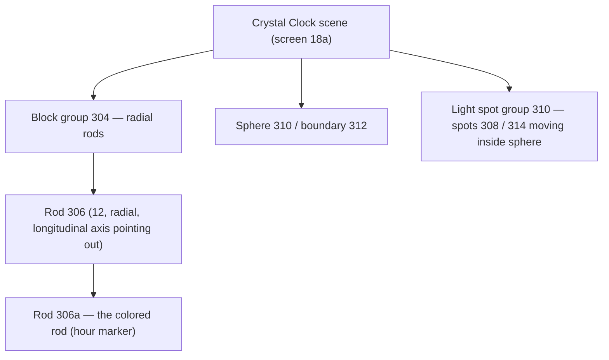
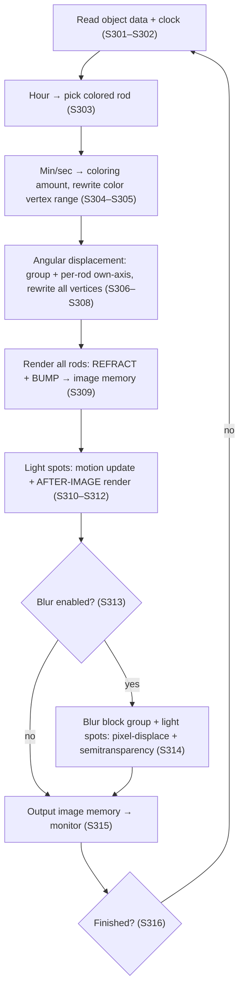

# Patent Digest — US 6,693,606 B1 → CrystalClockVK

> **Purpose.** Project-oriented extraction of the SCEI patent behind the PS2 OSDSYS
> "Crystal Clock". Maps each patented concept to our Vulkan/GS pipeline. This is a
> *digest*, not the source of truth for numeric values — see [Boundary](#boundary--patent-vs-trace).
>
> Full faithful transcription: [`US6693606.md`](./US6693606.md). Figures referenced as `FIG. n`.

---

## TL;DR

The patent describes a clock that renders **transparent 3D prisms** ("blocks") arranged
radially, animated by time, and **refracts the framebuffer behind them** (plus bump
mapping) every frame. Two embodiments:

| Embodiment | Geometry | Matches |
|---|---|---|
| **1st** (FIG 1–3, 5–7) | Two concentric rings of prisms = short/long hand | the *dual-ring* clock |
| **2nd** (FIG 8–10, 13, 16–17) | **One radial rod group + central sphere with light spots + blur** | **our Crystal Clock orb** |

> [!IMPORTANT]
> Our target is the **2nd embodiment**: block group `304` of radial rods around a central
> wireframe **sphere `310`/`312`** seeded with moving **light spots `308`**, with optional
> **blur**. This is the orb/rod render the decomp calls out (`clock_orb_rendering_func`).

---

## 1. Core technique — what the patent actually proves

Every render step ends identically (S8, S15, S208, S309):

> *"RENDER ALL BLOCKS ACCORDING TO **REFRACTING PROCESS, BUMP MAPPING PROCESS**, AND STORE
> IMAGE DATA IN IMAGE MEMORY."*

And the hardware claim that makes refraction legal/cheap (FIG 4 description):

> *"The image memory `74` is of a **unified memory structure** that is able to designate a
> **texture reading area and a display rendering area as the same area**."*

**Implication for us:** the blocks are transparent and sample the *already-rendered
background* as a texture — i.e. a **framebuffer feedback loop**. The prisms distort
(refract) whatever was drawn behind them. This is exactly the GS behavior we emulate with
`VK_KHR_dynamic_rendering_local_read` / `subpassLoad()` (see CLAUDE.md). Bump mapping
perturbs the sampled coordinates per-fragment to give the faceted glass look.

→ Maps to our **Pass 1 / Pass 4** (`(1,0,1)` base glass FB refraction) in the 5-pass table.

---

## 2. Scene graph (2nd embodiment)

- **Rods `306`**: transparent polygonal prisms (quadrangular / hexagonal — FIG 8 shows
  hexagonal cross-section cubes `302` for menu items). Longitudinal axes oriented **radially**.
- **`306a`**: the single colored rod = current hour position.
- **Sphere `310`/`312`**: central wireframe globe; the visual core of the "crystal".
- **Light spots `308`**: small points moving on tangled paths inside the sphere, rendered
  with **after-image (motion-trail) processing** (S312).

---

## 3. Time → visual mapping

| Time component | Visual encoding | Patent ref |
|---|---|---|
| Hours | **Position** of colored rod `306a` (which of 12) — *digital* element | S303 |
| Minutes + seconds | **Amount of coloring** on `306a` — *analog* element | S304 |
| Coloring at 0 min/sec | **100%**, decreasing as time elapses (reaches ~0% near rollover) | desc. |
| AM vs PM | **Blue** before noon, **red** after noon | desc. |
| Continuous motion | Whole group `304` angular displacement + each rod about **its own axis** | S306–S308 |

> [!NOTE]
> "Amount of coloring" rewrites **color-related vertex data** in a *range* of the rod's
> vertices (a partial fill along the rod), not a uniform tint — S305 / claim 1. The fill
> boundary is the analog read-out.

---

## 4. Per-frame render sequence (from FIG 16 + 17)

This is the authoritative *ordering* the patent gives; our pass dispatch should follow it.

**Ordering insight:** rods (refraction pass) are drawn **before** light spots (additive
after-image), and **blur is a post step** over the composited block+spot image. This
constrains our pass order: glass refraction → additive highlights/spots → optional blur post.

---

## 5. Hardware → Vulkan mapping (FIG 4)

| Patent block | Role | Our equivalent |
|---|---|---|
| Image memory `74`, unified | texture-read area == render area | feedback loop via `dynamic_rendering_local_read` / `subpassLoad` |
| Rendering engine `70` | refract + bump rasterizer | fragment shaders + blend pipelines |
| Vector operation unit `16` (VU) | geometry: vertex rewrite, angular displacement | our VU0-decoded transforms (push constants) |
| GIF `22` | command/DMA arbiter | command buffer recording (PassRecorder) |
| OSDROM `26` (OSD function) | holds the OSDSYS program/objects | the `OSDSYS.elf` we reverse-engineer |
| RTC `28` | calendar + clock source | host clock feeding push constants |

---

## 6. Animation details worth keeping

- **Group rotation** (1st embodiment baseline): inner group ≈ 1 rev / 60 min, outer ≈
  1 rev / 60 s. 2nd embodiment uses group-`304` angular displacement + per-rod own-axis spin.
- **After-image** on light spots (S312): trail/persistence — a temporal accumulation/blend,
  not a single-frame draw.
- **Blur** (S314): described as **pixel-displacing + semitransparency** processes — i.e. a
  cheap downsample/offset-accumulate, our optional bloom/blur post pass.

---

## 7. Not relevant to us (skip)

- Generic measured-quantity uses (length, weight, voltage, frequency) — clock only.
- Calendar mode, 24h color labeling variants.
- Menu/parameter-setting UI: program activating / menu setting / item display means
  (FIG 11–12, 14–15) — that's the OSD settings screen, not the clock visual.

---

## Boundary — patent vs. trace

> [!WARNING]
> The patent gives **concepts and ordering**, never the OSDSYS production constants. Do NOT
> read numbers off it. Authoritative sources for real values:
> - **Per-pass angle steps** `0.26 rad` / `0.33 rad` — from decomp, *not* 30°/rod.
> - **Master per-frame render** entry — live render chain, *not* a figure step number.
> - **Blend register values** per pass — PCSX2 GIF/VIF trace (`pcsx2-mcp`), not the patent.
>
> Use this digest to know *what* each pass does and *in what order*; use the decomp +
> PCSX2 trace for the exact transforms, blend modes, and magic numbers.

### Open questions the patent does NOT answer
- Exact prism cross-section used by OSDSYS (quad vs hex) and vertex counts.
- Light-spot count, path generation, after-image decay factor.
- Refraction index / bump-normal source (procedural vs texture).
- Whether blur ships enabled in the retail OSDSYS clock.
