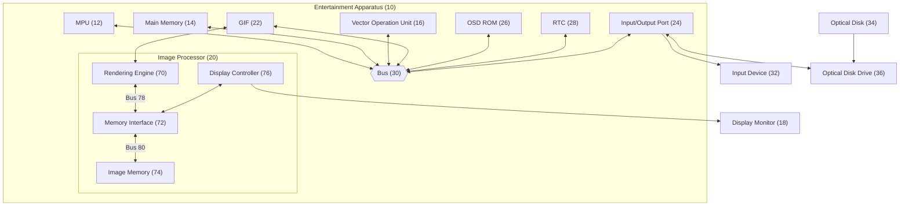
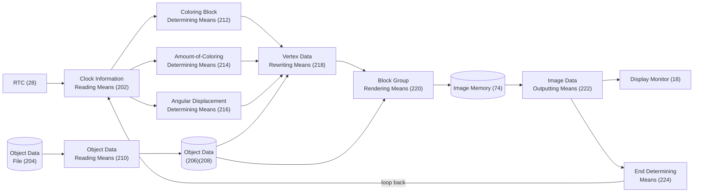
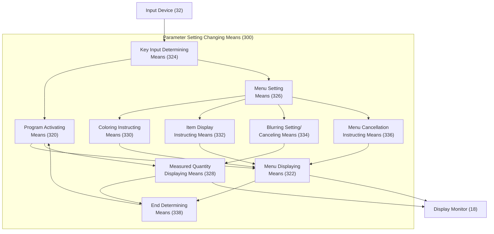
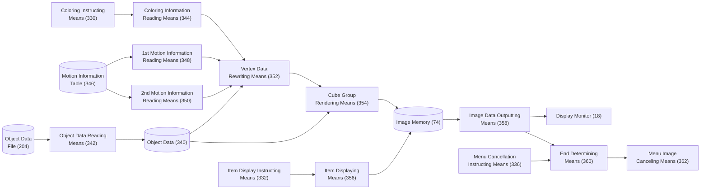
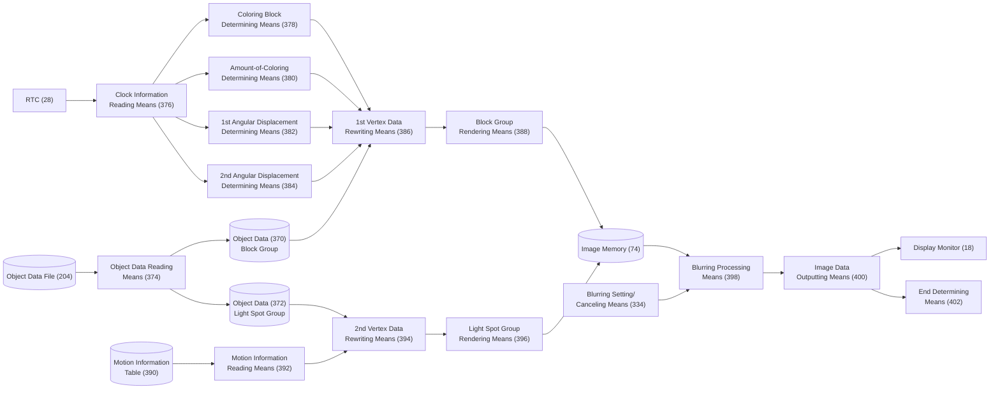
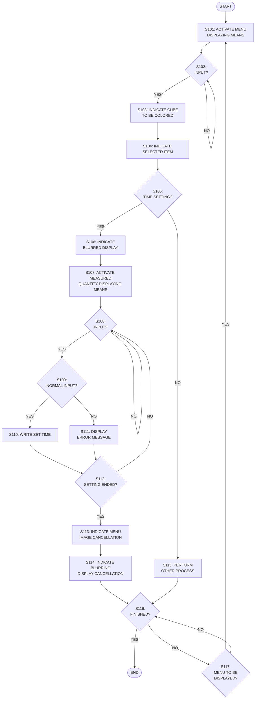
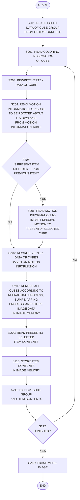

# US 6,693,606 B1

## Method of and Apparatus for Displaying Measured Quantity, Recording Medium, and Program

| | |
|---|---|
| **Patent No.** | US 6,693,606 B1 |
| **Date of Patent** | February 17, 2004 |
| **Inventors** | Takamasa Shitisawa, Tokyo (JP); Hajime Sugiyama, Tokyo (JP) |
| **Assignee** | Sony Computer Entertainment Inc. (JP) |
| **Application No.** | 09/657,037 |
| **Filed** | Sep. 7, 2000 |
| **Int. Cl.** | G09G 3/04; G09G 5/00 |
| **U.S. Cl.** | 345/33; 345/848; 345/844 |
| **Claims** | 38 |
| **Drawing Sheets** | 17 |

### Foreign Application Priority Data

| Date | Country | App. No. |
|------|---------|----------|
| Sep. 10, 1999 | JP | 11-257931 |
| Sep. 16, 1999 | JP | 11-262754 |

---

## Abstract

First and second block groups are arrayed and displayed around respective circles of smaller and larger diameters. A measured physical quantity is expressed by the positional relationship of blocks to be colored among blocks of the block groups and the amounts of coloring on the blocks to be colored.

---

## Drawings

---

### FIG. 1 — First Embodiment: Linear Block Group (Block Group 100)

A cluster of twelve blocks **102** arranged in a horizontal array. Block **102a** (fourth from left) is the colored block, representing the measured physical quantity by its position and degree of coloring.

<svg viewBox="0 0 720 280" xmlns="http://www.w3.org/2000/svg" style="background:white;width:100%;max-width:720px;font-family:serif">
  <defs>
    <pattern id="hatch1" patternUnits="userSpaceOnUse" width="5" height="5" patternTransform="rotate(45)">
      <line x1="0" y1="0" x2="0" y2="5" stroke="#333" stroke-width="1.8"/>
    </pattern>
  </defs>

  <!-- Title -->
  <text x="360" y="28" text-anchor="middle" font-size="20" font-weight="bold">FIG. 1</text>

  <!-- Outer frame -->
  <rect x="20" y="45" width="680" height="175" fill="none" stroke="black" stroke-width="2"/>

  <!-- 12 blocks: width=44, height=130, gap=10, start x=37 -->
  <!-- x_i = 37 + i*(44+10) = 37 + i*54 -->
  <!-- y = 60 -->

  <!-- Block 0 -->
  <rect x="37"   y="60" width="44" height="130" fill="white" stroke="black" stroke-width="1.5"/>
  <!-- Block 1 -->
  <rect x="91"   y="60" width="44" height="130" fill="white" stroke="black" stroke-width="1.5"/>
  <!-- Block 2 -->
  <rect x="145"  y="60" width="44" height="130" fill="white" stroke="black" stroke-width="1.5"/>
  <!-- Block 3 (102a) — colored/hatched -->
  <rect x="199"  y="60" width="44" height="130" fill="url(#hatch1)" stroke="black" stroke-width="1.5"/>
  <!-- Block 4 -->
  <rect x="253"  y="60" width="44" height="130" fill="white" stroke="black" stroke-width="1.5"/>
  <!-- Block 5 -->
  <rect x="307"  y="60" width="44" height="130" fill="white" stroke="black" stroke-width="1.5"/>
  <!-- Block 6 -->
  <rect x="361"  y="60" width="44" height="130" fill="white" stroke="black" stroke-width="1.5"/>
  <!-- Block 7 -->
  <rect x="415"  y="60" width="44" height="130" fill="white" stroke="black" stroke-width="1.5"/>
  <!-- Block 8 -->
  <rect x="469"  y="60" width="44" height="130" fill="white" stroke="black" stroke-width="1.5"/>
  <!-- Block 9 -->
  <rect x="523"  y="60" width="44" height="130" fill="white" stroke="black" stroke-width="1.5"/>
  <!-- Block 10 -->
  <rect x="577"  y="60" width="44" height="130" fill="white" stroke="black" stroke-width="1.5"/>
  <!-- Block 11 -->
  <rect x="631"  y="60" width="44" height="130" fill="white" stroke="black" stroke-width="1.5"/>

  <!-- Labels -->
  <text x="37"  y="52" font-size="13">102</text>
  <text x="191" y="52" font-size="13">102a</text>
  <text x="634" y="52" font-size="13">102</text>

  <!-- Brace for 100 -->
  <path d="M 37 200 Q 37 215 55 215 L 345 215 Q 360 215 360 230 Q 360 215 375 215 L 675 215 Q 693 215 693 200" fill="none" stroke="black" stroke-width="1.5"/>
  <text x="360" y="248" text-anchor="middle" font-size="14">100</text>
</svg>

---

### FIG. 2 — Second Embodiment: Two Concentric Circular Block Groups

Inner block group **110** (twelve narrow blocks **114**, radial orientation, smaller circle) and outer block group **112** (twelve wider blocks **116**, larger circle). Block **114a** (inner, colored) and **116a** (outer, colored) represent the measured quantity. Longitudinal axes are radially oriented.

<svg viewBox="0 0 660 660" xmlns="http://www.w3.org/2000/svg" style="background:white;width:100%;max-width:660px;font-family:serif">
  <defs>
    <pattern id="hatch2" patternUnits="userSpaceOnUse" width="5" height="5" patternTransform="rotate(45)">
      <line x1="0" y1="0" x2="0" y2="5" stroke="#333" stroke-width="1.8"/>
    </pattern>
    <!-- Arrow marker -->
    <marker id="arr" markerWidth="8" markerHeight="6" refX="8" refY="3" orient="auto">
      <polygon points="0 0, 8 3, 0 6" fill="black"/>
    </marker>
  </defs>

  <!-- Title -->
  <text x="330" y="28" text-anchor="middle" font-size="20" font-weight="bold">FIG. 2</text>

  <!-- Outer frame -->
  <rect x="10" y="38" width="640" height="610" fill="none" stroke="black" stroke-width="1.5"/>

  <!-- Down arrow at top center (indicating 12 o'clock) -->
  <line x1="330" y1="50" x2="330" y2="75" stroke="black" stroke-width="1.5" marker-end="url(#arr)"/>

  <!-- ===== OUTER RING (112) blocks 116 — r=195, cx=330, cy=340 =====
       Block size: 26×68, 12 positions, angles: -90°,-60°,-30°,0°,30°,60°,90°,120°,150°,180°,210°,240°
       position (cx+r*cos(a), cy+r*sin(a)), rotated by a degrees
  -->
  <!-- i=0: a=-90, pos=(330, 145) -->
  <rect x="-13" y="-34" width="26" height="68" fill="white" stroke="black" stroke-width="1.5" transform="translate(330,145) rotate(-90)"/>
  <!-- i=1: a=-60, pos=(427.5,152.1) -->
  <rect x="-13" y="-34" width="26" height="68" fill="white" stroke="black" stroke-width="1.5" transform="translate(427.5,145.7) rotate(-60)"/>
  <!-- i=2 (116a, colored): a=-30, pos=(498.9,242.5) -->
  <rect x="-13" y="-34" width="26" height="68" fill="url(#hatch2)" stroke="black" stroke-width="1.5" transform="translate(498.9,242.5) rotate(-30)"/>
  <!-- i=3: a=0, pos=(525,340) -->
  <rect x="-13" y="-34" width="26" height="68" fill="white" stroke="black" stroke-width="1.5" transform="translate(525,340) rotate(0)"/>
  <!-- i=4: a=30, pos=(498.9,437.5) -->
  <rect x="-13" y="-34" width="26" height="68" fill="white" stroke="black" stroke-width="1.5" transform="translate(498.9,437.5) rotate(30)"/>
  <!-- i=5: a=60, pos=(427.5,509.3) -->
  <rect x="-13" y="-34" width="26" height="68" fill="white" stroke="black" stroke-width="1.5" transform="translate(427.5,509.3) rotate(60)"/>
  <!-- i=6: a=90, pos=(330,535) -->
  <rect x="-13" y="-34" width="26" height="68" fill="white" stroke="black" stroke-width="1.5" transform="translate(330,535) rotate(90)"/>
  <!-- i=7: a=120, pos=(232.5,509.3) -->
  <rect x="-13" y="-34" width="26" height="68" fill="white" stroke="black" stroke-width="1.5" transform="translate(232.5,509.3) rotate(120)"/>
  <!-- i=8: a=150, pos=(161.1,437.5) -->
  <rect x="-13" y="-34" width="26" height="68" fill="white" stroke="black" stroke-width="1.5" transform="translate(161.1,437.5) rotate(150)"/>
  <!-- i=9: a=180, pos=(135,340) -->
  <rect x="-13" y="-34" width="26" height="68" fill="white" stroke="black" stroke-width="1.5" transform="translate(135,340) rotate(180)"/>
  <!-- i=10: a=210, pos=(161.1,242.5) -->
  <rect x="-13" y="-34" width="26" height="68" fill="white" stroke="black" stroke-width="1.5" transform="translate(161.1,242.5) rotate(210)"/>
  <!-- i=11: a=240, pos=(232.5,170.7) -->
  <rect x="-13" y="-34" width="26" height="68" fill="white" stroke="black" stroke-width="1.5" transform="translate(232.5,170.7) rotate(240)"/>

  <!-- ===== INNER RING (110) blocks 114 — r=105, cx=330, cy=340 =====
       Block size: 13×42, same 12 angles
  -->
  <!-- i=0: a=-90, pos=(330, 235) -->
  <rect x="-6.5" y="-21" width="13" height="42" fill="white" stroke="black" stroke-width="1.5" transform="translate(330,235) rotate(-90)"/>
  <!-- i=1: a=-60, pos=(381,249.1) -->
  <rect x="-6.5" y="-21" width="13" height="42" fill="white" stroke="black" stroke-width="1.5" transform="translate(381,249.1) rotate(-60)"/>
  <!-- i=2: a=-30, pos=(420.9,287.5) -->
  <rect x="-6.5" y="-21" width="13" height="42" fill="white" stroke="black" stroke-width="1.5" transform="translate(420.9,287.5) rotate(-30)"/>
  <!-- i=3 (114a, colored): a=0, pos=(435, 340) -->
  <rect x="-6.5" y="-21" width="13" height="42" fill="url(#hatch2)" stroke="black" stroke-width="1.5" transform="translate(435,340) rotate(0)"/>
  <!-- i=4: a=30, pos=(420.9,392.5) -->
  <rect x="-6.5" y="-21" width="13" height="42" fill="white" stroke="black" stroke-width="1.5" transform="translate(420.9,392.5) rotate(30)"/>
  <!-- i=5: a=60, pos=(381,403.4) -->
  <rect x="-6.5" y="-21" width="13" height="42" fill="white" stroke="black" stroke-width="1.5" transform="translate(381,403.4) rotate(60)"/>
  <!-- i=6: a=90, pos=(330, 445) -->
  <rect x="-6.5" y="-21" width="13" height="42" fill="white" stroke="black" stroke-width="1.5" transform="translate(330,445) rotate(90)"/>
  <!-- i=7: a=120, pos=(279,403.4) -->
  <rect x="-6.5" y="-21" width="13" height="42" fill="white" stroke="black" stroke-width="1.5" transform="translate(279,403.4) rotate(120)"/>
  <!-- i=8: a=150, pos=(239.1,392.5) -->
  <rect x="-6.5" y="-21" width="13" height="42" fill="white" stroke="black" stroke-width="1.5" transform="translate(239.1,392.5) rotate(150)"/>
  <!-- i=9: a=180, pos=(225,340) -->
  <rect x="-6.5" y="-21" width="13" height="42" fill="white" stroke="black" stroke-width="1.5" transform="translate(225,340) rotate(180)"/>
  <!-- i=10: a=210, pos=(239.1,287.5) -->
  <rect x="-6.5" y="-21" width="13" height="42" fill="white" stroke="black" stroke-width="1.5" transform="translate(239.1,287.5) rotate(210)"/>
  <!-- i=11: a=240, pos=(279,276.6) -->
  <rect x="-6.5" y="-21" width="13" height="42" fill="white" stroke="black" stroke-width="1.5" transform="translate(279,276.6) rotate(240)"/>

  <!-- === Labels and leader lines === -->
  <!-- 110 label (inner group) -->
  <line x1="265" y1="465" x2="210" y2="510" stroke="black" stroke-width="1"/>
  <text x="190" y="525" font-size="14">110</text>

  <!-- 114 label -->
  <line x1="420.9" y1="392.5" x2="460" y2="440" stroke="black" stroke-width="1"/>
  <text x="462" y="448" font-size="14">114</text>

  <!-- 114a label (colored inner) -->
  <line x1="435" y1="340" x2="475" y2="355" stroke="black" stroke-width="1"/>
  <text x="478" y="363" font-size="14">114a</text>

  <!-- 112 label (outer group) -->
  <line x1="498.9" y1="437.5" x2="540" y2="480" stroke="black" stroke-width="1"/>
  <text x="542" y="488" font-size="14">112</text>

  <!-- 116 label -->
  <line x1="498.9" y1="340" x2="548" y2="340" stroke="black" stroke-width="1"/>
  <text x="550" y="345" font-size="14">116</text>

  <!-- 116a label (colored outer) -->
  <line x1="498.9" y1="242.5" x2="540" y2="220" stroke="black" stroke-width="1"/>
  <text x="543" y="218" font-size="14">116a</text>
</svg>

---

### FIG. 3 — Block Groups 110 and 112 Rotated (3D Perspective View)

The first block group **110** is rotated clockwise about the longitudinal axis of block **114a**; the second block group **112** is rotated about the longitudinal axis of block **116a**. The figure shows the state at approximately 07:26 (blue) / 19:26 (red).

<svg viewBox="0 0 680 680" xmlns="http://www.w3.org/2000/svg" style="background:white;width:100%;max-width:680px;font-family:serif">
  <defs>
    <pattern id="hatch3" patternUnits="userSpaceOnUse" width="5" height="5" patternTransform="rotate(45)">
      <line x1="0" y1="0" x2="0" y2="5" stroke="#333" stroke-width="1.8"/>
    </pattern>
  </defs>

  <!-- Title -->
  <text x="340" y="28" text-anchor="middle" font-size="20" font-weight="bold">FIG. 3</text>
  <rect x="10" y="38" width="660" height="630" fill="none" stroke="black" stroke-width="1.5"/>

  <!-- 3D perspective approximation: blocks appear as parallelograms/3D prisms
       arranged in a radial sunburst pattern, viewed from slightly above.
       The arrangement is compressed vertically to simulate a top-down angle.
       cx=340, cy=340; inner r=80, outer r=200 -->

  <!-- OUTER ring (112) — 3D prisms, large, viewed from angle.
       Each block represented as a 3D parallelogram. -->

  <!-- i=0 top: upright tall narrow prism -->
  <polygon points="328,85 348,85 350,185 326,185" fill="white" stroke="black" stroke-width="1.5"/>
  <polygon points="348,85 362,90 364,190 350,185" fill="#ddd" stroke="black" stroke-width="1"/>
  <polygon points="326,85 348,85 362,90 340,85" fill="#eee" stroke="black" stroke-width="1"/>

  <!-- i=1 upper-right: tilted -->
  <polygon points="420,108 438,100 480,175 462,183" fill="white" stroke="black" stroke-width="1.5"/>
  <polygon points="438,100 452,106 494,181 480,175" fill="#ddd" stroke="black" stroke-width="1"/>
  <polygon points="420,108 438,100 452,106 434,114" fill="#eee" stroke="black" stroke-width="1"/>

  <!-- i=2 right-upper (116a, hatched) -->
  <polygon points="508,196 520,180 560,248 548,264" fill="url(#hatch3)" stroke="black" stroke-width="1.5"/>
  <polygon points="520,180 534,188 574,256 560,248" fill="#bbb" stroke="black" stroke-width="1"/>
  <polygon points="508,196 520,180 534,188 522,204" fill="#ccc" stroke="black" stroke-width="1"/>

  <!-- i=3 right: horizontal prism -->
  <polygon points="512,328 548,316 548,356 512,368" fill="white" stroke="black" stroke-width="1.5"/>
  <polygon points="548,316 568,320 568,360 548,356" fill="#ddd" stroke="black" stroke-width="1"/>
  <polygon points="512,328 548,316 568,320 532,324" fill="#eee" stroke="black" stroke-width="1"/>

  <!-- i=4 lower-right -->
  <polygon points="496,436 510,422 552,472 538,486" fill="white" stroke="black" stroke-width="1.5"/>
  <polygon points="510,422 524,430 566,480 552,472" fill="#ddd" stroke="black" stroke-width="1"/>
  <polygon points="496,436 510,422 524,430 510,444" fill="#eee" stroke="black" stroke-width="1"/>

  <!-- i=5 lower -->
  <polygon points="328,510 348,510 354,580 328,580" fill="white" stroke="black" stroke-width="1.5"/>
  <polygon points="348,510 362,515 368,585 354,580" fill="#ddd" stroke="black" stroke-width="1"/>
  <polygon points="326,510 348,510 362,515 340,508" fill="#eee" stroke="black" stroke-width="1"/>

  <!-- i=6 lower-left -->
  <polygon points="172,436 186,450 144,494 130,480" fill="white" stroke="black" stroke-width="1.5"/>
  <polygon points="186,450 200,442 158,486 144,494" fill="#ddd" stroke="black" stroke-width="1"/>
  <polygon points="172,436 186,450 200,442 186,428" fill="#eee" stroke="black" stroke-width="1"/>

  <!-- i=7 left -->
  <polygon points="114,328 114,368 148,356 148,316" fill="white" stroke="black" stroke-width="1.5"/>
  <polygon points="148,316 168,320 168,360 148,356" fill="#ddd" stroke="black" stroke-width="1"/>
  <polygon points="114,328 148,316 168,320 134,316" fill="#eee" stroke="black" stroke-width="1"/>

  <!-- i=8 upper-left -->
  <polygon points="156,196 170,182 130,238 116,252" fill="white" stroke="black" stroke-width="1.5"/>
  <polygon points="170,182 184,190 144,246 130,238" fill="#ddd" stroke="black" stroke-width="1"/>
  <polygon points="156,196 170,182 184,190 170,204" fill="#eee" stroke="black" stroke-width="1"/>

  <!-- i=9 upper-left-2 -->
  <polygon points="212,100 228,106 192,178 176,172" fill="white" stroke="black" stroke-width="1.5"/>
  <polygon points="228,106 242,100 206,172 192,178" fill="#ddd" stroke="black" stroke-width="1"/>
  <polygon points="212,100 228,106 242,100 226,94" fill="#eee" stroke="black" stroke-width="1"/>

  <!-- INNER ring (110) — smaller 3D prisms, inner circle r≈90 -->

  <!-- i=0 top inner -->
  <polygon points="334,252 342,252 344,294 332,294" fill="white" stroke="black" stroke-width="1.5"/>
  <polygon points="342,252 350,255 352,297 344,294" fill="#ddd" stroke="black" stroke-width="1"/>

  <!-- i=1 upper-right inner -->
  <polygon points="375,264 383,258 398,292 390,298" fill="white" stroke="black" stroke-width="1.5"/>
  <polygon points="383,258 391,262 406,296 398,292" fill="#ddd" stroke="black" stroke-width="1"/>

  <!-- i=2 right inner (114a, hatched) -->
  <polygon points="404,308 404,330 426,328 426,306" fill="url(#hatch3)" stroke="black" stroke-width="1.5"/>
  <polygon points="426,306 436,310 436,332 426,328" fill="#bbb" stroke="black" stroke-width="1"/>

  <!-- i=3 lower-right inner -->
  <polygon points="395,370 403,376 386,406 378,400" fill="white" stroke="black" stroke-width="1.5"/>
  <polygon points="403,376 411,370 394,400 386,406" fill="#ddd" stroke="black" stroke-width="1"/>

  <!-- i=4 bottom inner -->
  <polygon points="334,386 342,386 346,416 334,416" fill="white" stroke="black" stroke-width="1.5"/>
  <polygon points="342,386 352,389 356,419 346,416" fill="#ddd" stroke="black" stroke-width="1"/>

  <!-- i=5 lower-left inner -->
  <polygon points="280,370 288,376 272,406 264,400" fill="white" stroke="black" stroke-width="1.5"/>
  <polygon points="288,376 296,370 280,400 272,406" fill="#ddd" stroke="black" stroke-width="1"/>

  <!-- i=6 left inner -->
  <polygon points="252,308 252,330 274,328 274,306" fill="white" stroke="black" stroke-width="1.5"/>
  <polygon points="274,306 284,310 284,332 274,328" fill="#ddd" stroke="black" stroke-width="1"/>

  <!-- i=7 upper-left inner -->
  <polygon points="280,264 288,258 304,292 296,298" fill="white" stroke="black" stroke-width="1.5"/>
  <polygon points="288,258 298,262 314,296 304,292" fill="#ddd" stroke="black" stroke-width="1"/>

  <!-- Labels -->
  <text x="116" y="412" font-size="14">110</text>
  <line x1="130" y1="408" x2="262" y2="370" stroke="black" stroke-width="1"/>

  <text x="88" y="316" font-size="14">114</text>
  <line x1="114" y1="318" x2="252" y2="318" stroke="black" stroke-width="1"/>

  <text x="436" y="344" font-size="14">114a</text>

  <text x="138" y="265" font-size="14">112</text>
  <line x1="158" y1="262" x2="172" y2="262" stroke="black" stroke-width="1"/>

  <text x="554" y="262" font-size="14">116</text>
  <text x="554" y="488" font-size="14">116</text>

  <text x="138" y="246" font-size="14">116a</text>
  <line x1="160" y1="243" x2="168" y2="236" stroke="black" stroke-width="1"/>
</svg>

---

### FIG. 4 — Hardware Block Diagram: Entertainment Apparatus (10)

---

### FIG. 5 — Functional Block Diagram: Measured Quantity Displaying Means (200)

---

### FIGs. 6 & 7 — Flowchart: Measured Quantity Displaying Process (First + Second Block Groups)

```mermaid
flowchart TD
    START([START]) --> S1
    S1["S1: READ CLOCK INFORMATION"] --> S2
    S2["S2: READ OBJECT DATA OF 1ST BLOCK GROUP\nFROM OBJECT DATA FILE"] --> S3
    S3["S3: DETERMINE BLOCK TO BE COLORED\nBASED ON HOUR DATA"] --> S4
    S4["S4: DETERMINE AMOUNT OF COLORING\nBASED ON MINUTE DATA"] --> S5
    S5["S5: REWRITE VERTEX DATA IN RANGE\nDEPENDING ON AMOUNT OF COLORING,\nOF VERTEX DATA OF BLOCK TO BE COLORED"] --> S6
    S6["S6: DETERMINE ANGULAR DISPLACEMENT ABOUT\nLONGITUDINAL AXIS OF BLOCK TO BE COLORED\nBASED ON CLOCK INFORMATION"] --> S7
    S7["S7: REWRITE VERTEX DATA OF ALL BLOCKS OF\n1ST BLOCK GROUP BASED ON ANGULAR DISPLACEMENT"] --> S8
    S8["S8: RENDER ALL BLOCKS ACCORDING TO REFRACTING\nPROCESS, BUMP MAPPING PROCESS, AND STORE\nIMAGE DATA IN IMAGE MEMORY"] --> S9

    S9["S9: READ OBJECT DATA OF 2ND BLOCK GROUP\nFROM OBJECT DATA FILE"] --> S10
    S10["S10: DETERMINE BLOCK TO BE COLORED\nBASED ON MINUTE DATA"] --> S11
    S11["S11: DETERMINE AMOUNT OF COLORING\nBASED ON MINUTE DATA, SECOND DATA"] --> S12
    S12["S12: REWRITE VERTEX DATA IN RANGE\nDEPENDING ON AMOUNT OF COLORING\nOF VERTEX DATA OF BLOCK TO BE COLORED"] --> S13
    S13["S13: DETERMINE ANGULAR DISPLACEMENT ABOUT\nLONGITUDINAL AXIS OF BLOCK TO BE COLORED\nBASED ON CLOCK INFORMATION"] --> S14
    S14["S14: REWRITE VERTEX DATA OF ALL BLOCKS OF\n2ND BLOCK GROUP BASED ON ANGULAR DISPLACEMENT"] --> S15
    S15["S15: RENDER ALL BLOCKS ACCORDING TO REFRACTING\nPROCESS, BUMP MAPPING PROCESS, AND STORE\nIMAGE DATA IN IMAGE MEMORY"] --> S16
    S16["S16: OUTPUT 3D IMAGE DATA STORED IN\nIMAGE MEMORY TO DISPLAY MONITOR"] --> S17

    S17{"S17: END?"} -- NO --> S1
    S17 -- YES --> END([END])
```

---

### FIG. 8 — Parameter Setting Display Screen (18a)

The display shows: a menu with a cube group **316** (three cubes **302** in lower area), and behind it the block group **304** with twelve hexagonal blocks **306** arranged in a circle. The colored block **306a** indicates the current time. Date/time **1999/09/16 13:06:00** is overlaid. The menu is in sharp focus; the time display is blurred in the background.

<svg viewBox="0 0 600 740" xmlns="http://www.w3.org/2000/svg" style="background:white;width:100%;max-width:600px;font-family:serif">
  <defs>
    <pattern id="hatch8" patternUnits="userSpaceOnUse" width="5" height="5" patternTransform="rotate(45)">
      <line x1="0" y1="0" x2="0" y2="5" stroke="#666" stroke-width="1.5"/>
    </pattern>
    <marker id="arr8" markerWidth="7" markerHeight="6" refX="7" refY="3" orient="auto">
      <polygon points="0 0, 7 3, 0 6" fill="black"/>
    </marker>
    <!-- Dashed style for blurred background blocks -->
  </defs>

  <!-- Title -->
  <text x="300" y="26" text-anchor="middle" font-size="20" font-weight="bold">FIG. 8</text>

  <!-- Screen border (18a) -->
  <rect x="30" y="40" width="540" height="660" fill="white" stroke="black" stroke-width="2.5"/>
  <text x="35" y="36" font-size="13">18a</text>

  <!-- === BACKGROUND: block group 304 (blurred/dashed) ===
       Circular arrangement of 12 dashed-rect blocks, cx=300, cy=290, r=140
  -->

  <!-- Date/time text in center (overlaid) -->
  <text x="300" y="285" text-anchor="middle" font-size="30" font-weight="bold" fill="#111" transform="skewX(-5)">1999/09/16</text>
  <text x="300" y="325" text-anchor="middle" font-size="30" font-weight="bold" fill="#111" transform="skewX(-5)">13:06:00</text>

  <!-- Outer dashed circle reference -->
  <circle cx="300" cy="290" r="140" fill="none" stroke="#aaa" stroke-width="1" stroke-dasharray="4,3"/>
  <circle cx="300" cy="290" r="90" fill="none" stroke="#aaa" stroke-width="1" stroke-dasharray="3,3"/>

  <!-- 12 dashed blocks arranged around circle, r=140 -->
  <!-- i=0: a=-90 → (300,150) -->
  <rect x="-10" y="-32" width="20" height="64" fill="none" stroke="#888" stroke-width="1.5" stroke-dasharray="5,3" transform="translate(300,150) rotate(-90)"/>
  <!-- i=1: a=-60 → (421,220) — actually (300+140*cos(-60),290+140*sin(-60))=(370,169) -->
  <rect x="-10" y="-32" width="20" height="64" fill="none" stroke="#888" stroke-width="1.5" stroke-dasharray="5,3" transform="translate(370,169) rotate(-60)"/>
  <!-- i=2 (306a colored): a=-30 → (421,220) → (300+140*0.866,290-70)=(421,220) -->
  <rect x="-10" y="-32" width="20" height="64" fill="url(#hatch8)" stroke="#555" stroke-width="2" stroke-dasharray="5,2" transform="translate(421,220) rotate(-30)"/>
  <!-- i=3: a=0 → (440,290) -->
  <rect x="-10" y="-32" width="20" height="64" fill="none" stroke="#888" stroke-width="1.5" stroke-dasharray="5,3" transform="translate(440,290) rotate(0)"/>
  <!-- i=4: a=30 → (421,360) -->
  <rect x="-10" y="-32" width="20" height="64" fill="none" stroke="#888" stroke-width="1.5" stroke-dasharray="5,3" transform="translate(421,360) rotate(30)"/>
  <!-- i=5: a=60 → (370,411) -->
  <rect x="-10" y="-32" width="20" height="64" fill="none" stroke="#888" stroke-width="1.5" stroke-dasharray="5,3" transform="translate(370,411) rotate(60)"/>
  <!-- i=6: a=90 → (300,430) -->
  <rect x="-10" y="-32" width="20" height="64" fill="none" stroke="#888" stroke-width="1.5" stroke-dasharray="5,3" transform="translate(300,430) rotate(90)"/>
  <!-- i=7: a=120 → (230,411) -->
  <rect x="-10" y="-32" width="20" height="64" fill="none" stroke="#888" stroke-width="1.5" stroke-dasharray="5,3" transform="translate(230,411) rotate(120)"/>
  <!-- i=8: a=150 → (179,360) -->
  <rect x="-10" y="-32" width="20" height="64" fill="none" stroke="#888" stroke-width="1.5" stroke-dasharray="5,3" transform="translate(179,360) rotate(150)"/>
  <!-- i=9: a=180 → (160,290) -->
  <rect x="-10" y="-32" width="20" height="64" fill="none" stroke="#888" stroke-width="1.5" stroke-dasharray="5,3" transform="translate(160,290) rotate(180)"/>
  <!-- i=10: a=210 → (179,220) -->
  <rect x="-10" y="-32" width="20" height="64" fill="none" stroke="#888" stroke-width="1.5" stroke-dasharray="5,3" transform="translate(179,220) rotate(210)"/>
  <!-- i=11: a=240 → (230,169) -->
  <rect x="-10" y="-32" width="20" height="64" fill="none" stroke="#888" stroke-width="1.5" stroke-dasharray="5,3" transform="translate(230,169) rotate(240)"/>

  <!-- Labels for block group -->
  <line x1="421" y1="220" x2="478" y2="185" stroke="black" stroke-width="1" marker-end="url(#arr8)"/>
  <text x="480" y="183" font-size="13">306a</text>
  <line x1="440" y1="290" x2="490" y2="290" stroke="black" stroke-width="1"/>
  <text x="492" y="294" font-size="13">306</text>
  <text x="240" y="170" font-size="13">304</text>
  <line x1="261" y1="173" x2="278" y2="200" stroke="black" stroke-width="1" marker-end="url(#arr8)"/>
  <text x="215" y="390" font-size="13">308</text>

  <!-- === FOREGROUND: cube group 316 (menu items) ===
       Three 3D cubes in lower area
  -->
  <!-- Cube 1 (leftmost, 302) -->
  <polygon points="80,520 130,520 130,570 80,570" fill="white" stroke="black" stroke-width="2"/>
  <polygon points="130,520 160,495 160,545 130,570" fill="#ddd" stroke="black" stroke-width="1.5"/>
  <polygon points="80,520 110,495 160,495 130,520" fill="#eee" stroke="black" stroke-width="1.5"/>
  <text x="75" y="590" font-size="13">302</text>

  <!-- Cube 2 (middle, 302) -->
  <polygon points="240,520 290,520 290,570 240,570" fill="white" stroke="black" stroke-width="2"/>
  <polygon points="290,520 320,495 320,545 290,570" fill="#ddd" stroke="black" stroke-width="1.5"/>
  <polygon points="240,520 270,495 320,495 290,520" fill="#eee" stroke="black" stroke-width="1.5"/>
  <text x="255" y="590" font-size="13">302</text>

  <!-- Cube 3 (rightmost, 302, selected/colored) -->
  <polygon points="400,520 450,520 450,570 400,570" fill="url(#hatch8)" stroke="black" stroke-width="2"/>
  <polygon points="450,520 480,495 480,545 450,570" fill="#bbb" stroke="black" stroke-width="1.5"/>
  <polygon points="400,520 430,495 480,495 450,520" fill="#ccc" stroke="black" stroke-width="1.5"/>
  <text x="395" y="590" font-size="13">302</text>

  <!-- Brace for 316 -->
  <path d="M 70,610 Q 70,625 90,625 L 225,625 Q 300,625 300,640 Q 300,625 375,625 L 500,625 Q 520,625 520,610" fill="none" stroke="black" stroke-width="1.5"/>
  <text x="300" y="660" text-anchor="middle" font-size="14">316</text>

  <!-- Screen label -->
  <text x="540" y="720" font-size="13">18a</text>
</svg>

---

### FIG. 9 — Display Image with Menu Erased (Block Group 304 in Focus)

Block group **304** with twelve hexagonal blocks **306** arranged in a circle. The inner region shows light spots **308** moving along complex paths around simulative sphere **312** (dashed circle). Block **306a** is highlighted. Label **314** indicates light-spot tracks.

<svg viewBox="0 0 600 640" xmlns="http://www.w3.org/2000/svg" style="background:white;width:100%;max-width:600px;font-family:serif">
  <defs>
    <pattern id="hatch9" patternUnits="userSpaceOnUse" width="5" height="5" patternTransform="rotate(45)">
      <line x1="0" y1="0" x2="0" y2="5" stroke="#444" stroke-width="1.8"/>
    </pattern>
    <marker id="arr9" markerWidth="7" markerHeight="6" refX="7" refY="3" orient="auto">
      <polygon points="0 0, 7 3, 0 6" fill="black"/>
    </marker>
  </defs>

  <!-- Title -->
  <text x="300" y="26" text-anchor="middle" font-size="20" font-weight="bold">FIG. 9</text>

  <!-- Screen border -->
  <rect x="30" y="40" width="540" height="575" fill="white" stroke="black" stroke-width="2.5"/>
  <text x="35" y="36" font-size="13">18a</text>

  <!-- Sphere 312 (simulative, dashed circle) -->
  <ellipse cx="300" cy="310" rx="95" ry="80" fill="none" stroke="#555" stroke-width="1.5" stroke-dasharray="6,4"/>
  <text x="390" y="258" font-size="13">312</text>

  <!-- Light spot paths (308) — curving Lissajous-like paths inside sphere -->
  <path d="M 300,230 C 370,240 390,290 380,310 C 370,330 330,350 300,390 C 270,350 230,330 220,310 C 210,290 230,240 300,230" fill="none" stroke="black" stroke-width="1.2"/>
  <path d="M 300,230 C 230,260 215,300 220,320 C 230,350 280,370 300,390 C 320,370 370,350 380,320 C 385,300 370,260 300,230" fill="none" stroke="black" stroke-width="1.2"/>
  <path d="M 210,310 C 230,270 280,250 300,270 C 320,250 370,270 390,310 C 370,350 320,370 300,350 C 280,370 230,350 210,310" fill="none" stroke="black" stroke-width="1.2"/>

  <!-- Light spot dots (308) -->
  <circle cx="300" cy="235" r="4" fill="white" stroke="black" stroke-width="1.5"/>
  <circle cx="378" cy="310" r="4" fill="white" stroke="black" stroke-width="1.5"/>
  <circle cx="300" cy="385" r="4" fill="white" stroke="black" stroke-width="1.5"/>
  <circle cx="222" cy="310" r="4" fill="white" stroke="black" stroke-width="1.5"/>
  <circle cx="342" cy="268" r="4" fill="white" stroke="black" stroke-width="1.5"/>
  <circle cx="258" cy="352" r="4" fill="white" stroke="black" stroke-width="1.5"/>

  <!-- 12 solid blocks arranged around r=155, cx=300, cy=310 -->
  <!-- i=0: a=-90 → (300,155) -->
  <rect x="-10" y="-32" width="20" height="64" fill="white" stroke="black" stroke-width="2" transform="translate(300,155) rotate(-90)"/>
  <!-- i=1: a=-60 → (434,232.5) → (300+155*0.5,310-155*0.866)=(377.5,175.6) -->
  <rect x="-10" y="-32" width="20" height="64" fill="white" stroke="black" stroke-width="2" transform="translate(377.5,175.6) rotate(-60)"/>
  <!-- i=2 (306a): a=-30 → (300+155*0.866,310-155*0.5)=(434.2,232.5) -->
  <rect x="-10" y="-32" width="20" height="64" fill="url(#hatch9)" stroke="black" stroke-width="2" transform="translate(434.2,232.5) rotate(-30)"/>
  <!-- i=3: a=0 → (455,310) -->
  <rect x="-10" y="-32" width="20" height="64" fill="white" stroke="black" stroke-width="2" transform="translate(455,310) rotate(0)"/>
  <!-- i=4: a=30 → (434.2,387.5) -->
  <rect x="-10" y="-32" width="20" height="64" fill="white" stroke="black" stroke-width="2" transform="translate(434.2,387.5) rotate(30)"/>
  <!-- i=5: a=60 → (377.5,444.4) -->
  <rect x="-10" y="-32" width="20" height="64" fill="white" stroke="black" stroke-width="2" transform="translate(377.5,444.4) rotate(60)"/>
  <!-- i=6: a=90 → (300,465) -->
  <rect x="-10" y="-32" width="20" height="64" fill="white" stroke="black" stroke-width="2" transform="translate(300,465) rotate(90)"/>
  <!-- i=7: a=120 → (222.5,444.4) -->
  <rect x="-10" y="-32" width="20" height="64" fill="white" stroke="black" stroke-width="2" transform="translate(222.5,444.4) rotate(120)"/>
  <!-- i=8: a=150 → (165.8,387.5) -->
  <rect x="-10" y="-32" width="20" height="64" fill="white" stroke="black" stroke-width="2" transform="translate(165.8,387.5) rotate(150)"/>
  <!-- i=9: a=180 → (145,310) -->
  <rect x="-10" y="-32" width="20" height="64" fill="white" stroke="black" stroke-width="2" transform="translate(145,310) rotate(180)"/>
  <!-- i=10: a=210 → (165.8,232.5) -->
  <rect x="-10" y="-32" width="20" height="64" fill="white" stroke="black" stroke-width="2" transform="translate(165.8,232.5) rotate(210)"/>
  <!-- i=11: a=240 → (222.5,175.6) -->
  <rect x="-10" y="-32" width="20" height="64" fill="white" stroke="black" stroke-width="2" transform="translate(222.5,175.6) rotate(240)"/>

  <!-- Labels -->
  <line x1="434.2" y1="232.5" x2="478" y2="198" stroke="black" stroke-width="1" marker-end="url(#arr9)"/>
  <text x="480" y="195" font-size="13">306a</text>
  <text x="480" y="215" font-size="13">304</text>

  <line x1="300" y1="155" x2="300" y2="82" stroke="black" stroke-width="1" marker-end="url(#arr9)"/>
  <text x="310" y="80" font-size="13">306</text>

  <!-- 308 label -->
  <line x1="378" y1="308" x2="420" y2="290" stroke="black" stroke-width="1"/>
  <text x="422" y="288" font-size="13">308</text>

  <!-- 314 label (tracks) -->
  <text x="56" y="405" font-size="13">314</text>
  <line x1="90" y1="402" x2="165.8" y2="387.5" stroke="black" stroke-width="1" marker-end="url(#arr9)"/>

  <text x="56" y="450" font-size="13">314</text>
  <line x1="90" y1="447" x2="222.5" y2="444.4" stroke="black" stroke-width="1" marker-end="url(#arr9)"/>

  <!-- 310 label -->
  <text x="455" y="380" font-size="13">310</text>
</svg>

---

### FIG. 10 — Block Group and Light Spot Group in 3D Perspective View

Block group **304** shown in 3-D perspective with hexagonal prism blocks **306** (including colored block **306a**) arrayed in a ring. Inner light spot group **310** with light spots **308** moving around the simulative sphere **312**. Tracks **314** are rendered by after-image processing. The arrangement is tilted ~30° forward from the viewer.

<svg viewBox="0 0 680 700" xmlns="http://www.w3.org/2000/svg" style="background:white;width:100%;max-width:680px;font-family:serif">
  <defs>
    <pattern id="hatch10" patternUnits="userSpaceOnUse" width="5" height="5" patternTransform="rotate(45)">
      <line x1="0" y1="0" x2="0" y2="5" stroke="#333" stroke-width="1.8"/>
    </pattern>
    <marker id="arr10" markerWidth="7" markerHeight="6" refX="7" refY="3" orient="auto">
      <polygon points="0 0, 7 3, 0 6" fill="black"/>
    </marker>
  </defs>

  <!-- Title -->
  <text x="340" y="26" text-anchor="middle" font-size="20" font-weight="bold">FIG. 10</text>
  <rect x="10" y="38" width="660" height="650" fill="none" stroke="black" stroke-width="1.5"/>

  <!-- Sphere 312 (ellipse for 3D tilt) -->
  <ellipse cx="340" cy="340" rx="100" ry="75" fill="none" stroke="#555" stroke-width="1.5" stroke-dasharray="6,4"/>

  <!-- Light spot paths (Lissajous curves on tilted sphere) -->
  <path d="M 340,265 C 420,272 445,310 440,340 C 435,370 390,395 340,415 C 290,395 245,370 240,340 C 235,310 260,272 340,265" fill="none" stroke="black" stroke-width="1.2"/>
  <path d="M 340,265 C 265,285 238,315 240,340 C 242,368 295,398 340,415 C 385,398 438,368 440,340 C 442,315 415,285 340,265" fill="none" stroke="black" stroke-width="1.2"/>
  <path d="M 240,340 C 256,300 298,280 320,295 C 340,280 382,300 398,340 C 382,378 340,398 320,383 C 298,398 256,378 240,340" fill="none" stroke="black" stroke-width="1.2"/>

  <!-- Light spot dots (308) with small circles -->
  <circle cx="340" cy="268" r="5" fill="white" stroke="black" stroke-width="1.5"/>
  <circle cx="438" cy="338" r="5" fill="white" stroke="black" stroke-width="1.5"/>
  <circle cx="340" cy="413" r="5" fill="white" stroke="black" stroke-width="1.5"/>
  <circle cx="243" cy="340" r="5" fill="white" stroke="black" stroke-width="1.5"/>
  <circle cx="355" cy="295" r="5" fill="white" stroke="black" stroke-width="1.5"/>
  <circle cx="324" cy="383" r="5" fill="white" stroke="black" stroke-width="1.5"/>

  <!-- 3D blocks arranged radially, tilt perspective (elliptical positions)
       The viewing angle compresses the Y dimension.
       Outer ring r_x=220, r_y=165 (elliptical) — 3D perspective look.
       Blocks at top appear as tall upright prisms; blocks at side appear as horizontal prisms. -->

  <!-- i=0 top (upright prism, tall): pos=(340,175) -->
  <polygon points="330,80 346,80 348,170 328,170" fill="white" stroke="black" stroke-width="1.5"/>
  <polygon points="346,80 360,84 362,174 348,170" fill="#ccc" stroke="black" stroke-width="1"/>
  <polygon points="328,80 346,80 360,84 342,80" fill="#e8e8e8" stroke="black" stroke-width="1"/>

  <!-- i=1 upper-right (306a, hatched, tilted 3D): pos=(520,190) -->
  <polygon points="508,110 524,102 558,168 542,176" fill="url(#hatch10)" stroke="black" stroke-width="1.5"/>
  <polygon points="524,102 538,108 572,174 558,168" fill="#aaa" stroke="black" stroke-width="1"/>
  <polygon points="508,110 524,102 538,108 522,116" fill="#ccc" stroke="black" stroke-width="1"/>

  <!-- i=2 right-upper: pos=(600,280) -->
  <polygon points="582,224 598,218 630,290 614,296" fill="white" stroke="black" stroke-width="1.5"/>
  <polygon points="598,218 612,224 644,296 630,290" fill="#ccc" stroke="black" stroke-width="1"/>
  <polygon points="582,224 598,218 612,224 596,230" fill="#e8e8e8" stroke="black" stroke-width="1"/>

  <!-- i=3 right: pos=(570,340) — nearly horizontal prism -->
  <polygon points="546,328 582,316 582,356 546,368" fill="white" stroke="black" stroke-width="1.5"/>
  <polygon points="582,316 600,320 600,360 582,356" fill="#ccc" stroke="black" stroke-width="1"/>
  <polygon points="546,328 582,316 600,320 564,324" fill="#e8e8e8" stroke="black" stroke-width="1"/>

  <!-- i=4 right-lower: pos=(508,490) -->
  <polygon points="494,438 510,430 546,492 530,500" fill="white" stroke="black" stroke-width="1.5"/>
  <polygon points="510,430 524,436 560,498 546,492" fill="#ccc" stroke="black" stroke-width="1"/>
  <polygon points="494,438 510,430 524,436 508,444" fill="#e8e8e8" stroke="black" stroke-width="1"/>

  <!-- i=5 lower-right: pos=(340,570) -->
  <polygon points="330,500 346,500 350,570 334,570" fill="white" stroke="black" stroke-width="1.5"/>
  <polygon points="346,500 360,504 364,574 350,570" fill="#ccc" stroke="black" stroke-width="1"/>
  <polygon points="330,500 346,500 360,504 344,498" fill="#e8e8e8" stroke="black" stroke-width="1"/>

  <!-- i=6 lower-left: pos=(172,490) -->
  <polygon points="158,438 174,444 138,498 122,492" fill="white" stroke="black" stroke-width="1.5"/>
  <polygon points="174,444 188,438 152,492 138,498" fill="#ccc" stroke="black" stroke-width="1"/>
  <polygon points="158,438 174,444 188,438 172,432" fill="#e8e8e8" stroke="black" stroke-width="1"/>

  <!-- i=7 left: pos=(110,340) -->
  <polygon points="82,316 118,328 118,368 82,356" fill="white" stroke="black" stroke-width="1.5"/>
  <polygon points="118,328 136,324 136,364 118,368" fill="#ccc" stroke="black" stroke-width="1"/>
  <polygon points="82,316 118,328 136,324 100,320" fill="#e8e8e8" stroke="black" stroke-width="1"/>

  <!-- i=8 upper-left: pos=(120,224) -->
  <polygon points="102,218 116,212 148,284 134,290" fill="white" stroke="black" stroke-width="1.5"/>
  <polygon points="116,212 130,218 162,290 148,284" fill="#ccc" stroke="black" stroke-width="1"/>
  <polygon points="102,218 116,212 130,218 116,224" fill="#e8e8e8" stroke="black" stroke-width="1"/>

  <!-- Labels -->
  <line x1="524" y1="136" x2="480" y2="105" stroke="black" stroke-width="1" marker-end="url(#arr10)"/>
  <text x="460" y="102" font-size="14">304</text>

  <line x1="336" y1="80" x2="336" y2="58" stroke="black" stroke-width="1" marker-end="url(#arr10)"/>
  <!-- 306 label (outer blocks) -->
  <text x="558" y="176" font-size="13">306</text>
  <text x="556" y="500" font-size="13">306</text>

  <!-- 306a label -->
  <text x="540" y="105" font-size="13">306</text>
  <line x1="540" y1="108" x2="525" y2="120" stroke="black" stroke-width="1" marker-end="url(#arr10)"/>

  <!-- 310 label -->
  <text x="440" y="418" font-size="13">310</text>

  <!-- 308 label -->
  <line x1="438" y1="338" x2="450" y2="320" stroke="black" stroke-width="1"/>
  <text x="452" y="316" font-size="13">308</text>

  <!-- 312 (sphere) label -->
  <line x1="437" y1="312" x2="455" y2="295" stroke="black" stroke-width="1" stroke-dasharray="3,2"/>
  <text x="457" y="292" font-size="13">312</text>

  <!-- 314 tracks label -->
  <text x="86" y="486" font-size="13">314</text>
  <text x="86" y="510" font-size="13">314</text>
</svg>

---

### FIG. 11 — Functional Block Diagram: Parameter Setting Changing Means (300)

---

### FIG. 12 — Functional Block Diagram: Menu Displaying Means (322)

---

### FIG. 13 — Functional Block Diagram: Measured Quantity Displaying Means (328) — Second Embodiment

---

### FIG. 14 — Flowchart: Parameter Setting Changing Means (300)

---

### FIG. 15 — Flowchart: Menu Displaying Means (322)

---

### FIGs. 16 & 17 — Flowchart: Measured Quantity Displaying Means (328) — Second Embodiment

```mermaid
flowchart TD
    START([START]) --> S301["S301: READ OBJECT DATA OF BLOCK GROUPS\nFROM OBJECT DATA FILE"]
    S301 --> S302["S302: READ CLOCK INFORMATION"]
    S302 --> S303["S303: DETERMINE BLOCK TO BE COLORED\nBASED ON HOUR DATA"]
    S303 --> S304["S304: DETERMINE AMOUNT OF COLORING\nBASED ON MINUTE DATA, SECOND DATA"]
    S304 --> S305["S305: REWRITE VERTEX DATA IN RANGE\nDEPENDING ON AMOUNT OF COLORING,\nOF VERTEX DATA OF BLOCK TO BE COLORED"]
    S305 --> S306["S306: DETERMINE ANGULAR DISPLACEMENT\nABOUT LONGITUDINAL AXIS OF BLOCK\nTO BE COLORED BASED ON CLOCK INFORMATION"]
    S306 --> S307["S307: DETERMINE ANGULAR DISPLACEMENT\nFOR BLOCK TO BE ROTATED ABOUT ITS OWN\nAXIS BASED ON CLOCK INFORMATION"]
    S307 --> S308["S308: REWRITE VERTEX DATA OF ALL BLOCKS\nOF BLOCK GROUP BASED ON ANGULAR\nDISPLACEMENT OF BLOCK GROUP AND\nANGULAR DISPLACEMENT FOR BLOCK TO BE\nROTATED ABOUT ITS OWN AXIS"]
    S308 --> S309["S309: RENDER ALL BLOCKS ACCORDING TO\nREFRACTING PROCESS, BUMP MAPPING\nPROCESS, AND STORE IMAGE DATA\nIN IMAGE MEMORY"]
    S309 --> S310["S310: READ MOTION INFORMATION OF EACH\nLIGHT SPOT FROM MOTION INFORMATION TABLE"]
    S310 --> S311["S311: REWRITE VERTEX DATA BASED ON\nMOTION INFORMATION OF EACH LIGHT SPOT"]
    S311 --> S312["S312: RENDER ALL LIGHT SPOTS ACCORDING\nTO AFTER-IMAGE PROCESSING, AND STORE\nIMAGE DATA IN IMAGE MEMORY"]
    S312 --> S313{S313:\nBLURRED\nDISPLAY?}
    S313 -- YES --> S314["S314: BLUR IMAGE DATA OF\nBLOCK GROUP AND LIGHT SPOT GROUP"]
    S313 -- NO --> S315
    S314 --> S315["S315: DISPLAY IMAGE DATA STORED\nIN IMAGE MEMORY"]
    S315 --> S316{S316:\nFINISHED?}
    S316 -- YES --> END([END])
    S316 -- NO --> S302
```

---

## Description of the Preferred Embodiments

### Core Principle

A measured physical quantity is displayed using two elements:

| Display Element | Role | Implementation |
|---|---|---|
| **Positional relationship** of the colored block | Digital indicator | Which block among N blocks is highlighted |
| **Amount of coloring** on the colored block | Analog indicator | 100% → 0% as sub-scale value increases |

### First Embodiment (FIG. 1): Single Linear Block Group

- Block group **100**: 12 blocks **102** in horizontal array
- Each block represents a sub-scale unit (e.g., 10 cm, 10 g, 10 m/s, 1 hour, 1 month)
- The colored block **102a** gives the coarse value (digital)
- The fill percentage gives the fine value (analog, negative: 100% at scale start, 0% at end)

**Example** (FIG. 1): Block 4 colored ≈90% → 41 cm, 41 g, 41 m/s, or ~3rd of April, or ~04:06/16:06.

### Second Embodiment (FIG. 2): Two Concentric Circular Block Groups

- **Inner group 110**: 12 narrow blocks **114** arranged on a small circle → represents **short hand (hours)**
  - Block **114a** position = hour; fill = minutes/seconds (100% at :00:00, decreasing)
- **Outer group 112**: 12 wider blocks **116** arranged on a larger circle → represents **long hand (5-minute intervals)**
  - Block **116a** position = 5-min mark; fill = sub-5-minute elapsed time

Both groups rotate about the longitudinal axis of the colored block:
- Group 110 rotates **1 revolution per 60 minutes**
- Group 112 rotates **1 revolution per 60 seconds**

**Color coding**: Blue = AM (before noon); Red = PM (after noon).

### Parameter Setting Changing Means (FIG. 8–10)

When the system is in the settings menu:
- A **cube group 316** (menu items as 3D cubes **302**) is displayed in the foreground, in focus
- A **block group 304** (time display, hexagonal blocks **306**) is displayed in the background, blurred
- The selected cube **302** is highlighted in semitransparent blue
- Each cube rotates about its own axis; the selected cube performs a special motion (swinging/abrupt)
- **Light spot group 310**: small light spots **308** orbit a simulative sphere **312**, with after-image trails **314**; their motion pattern varies by time zone
- When time is changed via the menu, the block group **304** snaps abruptly to the new time setting

---

## Claims Summary

| Claim | Subject | Key Feature |
|---|---|---|
| 1 | Method | Display group of objects, color ≥1 as function of measurement, adjust position, rotate others in 3D perspective |
| 2–3 | Method | Objects are polygonal shapes; central axis rotation |
| 4 | Method | Fixed position of colored object |
| 5 | Method | Multiple groups of objects |
| 6 | Method | Calendar information |
| 7 | Method | Clock information |
| 8–10 | Method | Two concentric circular arrays as clock hands (hours + minutes + seconds) |
| 11–12 | Method | Single circular array, hours as position, minutes as color |
| 13 | Method | Parameter changing application |
| 14–25 | Apparatus | Apparatus claims corresponding to method claims 1–12 |
| 26 | Processor/Program | Processor under program control |
| 27–38 | Recording Medium | Recording medium containing program for claims 1–12 |

---

*Certificate of Correction issued November 21, 2006 (Director Jon W. Dudas): Column 2 line 26 paragraph break; Column 10 line 36 delete "5"; Column 20 line 31 remove hyphen.*