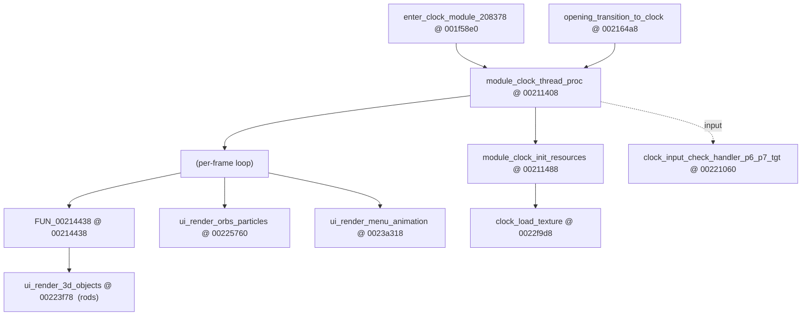
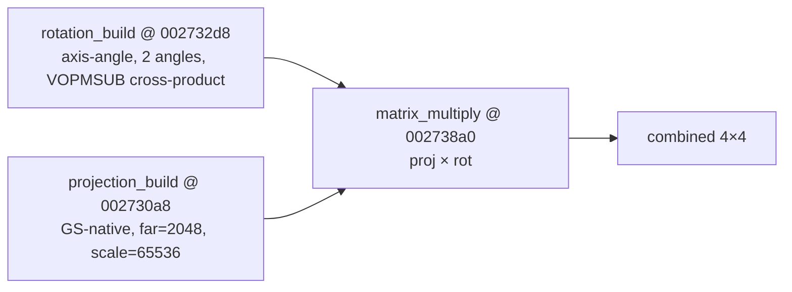

# OSDSYS Crystal Clock — System Map (Ghidra RE)

> Living reverse-engineering map of the OSDSYS **clock + UI + settings** subsystems, mined
> from `OSDSYS.elf` via ghidra-mcp. Goal: 100% comprehension of every module so the procedural
> Vulkan rebuild is read from evidence, never guessed. Every claim cites `name @ address`.
>
> Status: **IN PROGRESS** — this turn anchored the clock render spine. Open items in §7.

## 0. Method & ground rules

- **Program:** always `program="OSDSYS.elf"` (base `0x001f0000`, 2009 funcs). `hddosd.elf` is the
  ghidra *active* program — omitting `program` silently targets the wrong binary.
- **Symbols:** the binary is **partially symbolized** (clock/config/ui funcs have real names from the
  decomp effort; helpers are still `FUN_<addr>`). Names like `module_clock_232438 @ 0021e718` encode
  the *original/runtime* address (232438) in the name and the *Ghidra* entry (0021e718) after it — a
  link-base skew. **The live-trace render `0x00232618` does not resolve as a Ghidra entry** (skew); the
  reliable anchor is `draw_crystal_rod = FUN_00232e38` (confirmed by its 3 matrix callees).
- **Cross-ref:** decomp at `C:\CodingProjects\Personal\CrystalOSD` (`asm/clock/`, `asm/graph/`) has
  named asm (`clock_orb_rendering_func`, `pktSetAlphaBlend`…) — use to confirm Ghidra finds.
- **GS ground truth:** [[gs-dump-format-and-clock-regs]] — 3936 draws, 3 blend modes, DTHE off,
  PSMCT32, rods are textured TRI_STRIP quads. [[live-render-chain]] for live BP addresses.

## 1. Clock module — top level

Entry/lifecycle: `enter_clock_module_208378 @ 001f58e0` /
`disable_enter_clock_module_208388 @ 001f58f0` /
`should_enter_clock_module_2AD22C @ 0027b394`. Dirty flag: `var_clock_is_dirty @ 001f0cb4`.
Orb gate: `get_clock_should_render_orbs @ 00231180`. Anim offset: `module_clock_set_anim_offset @ 00221f88`.

## 2. The three render passes

| Pass | Function | Renders |
|------|----------|---------|
| 3D rods | `ui_render_3d_objects @ 00223f78` | the prism rod ring (crystal clock body) |
| Orbs / particles | `ui_render_orbs_particles @ 00225760` | floating light orbs / particle trails |
| Menu animation | `ui_render_menu_animation @ 0023a318` | UI menu transitions / layout |

Orb math also in `clock_orb_rendering_func @ 00211558`.

## 3. Rod render pipeline — `ui_render_3d_objects @ 00223f78` (decoded)

Signature: `ui_render_3d_objects(float transition, undefined4 p2, int *clockState)`.
`param_1` (transition 0..1) branches between a **transition variant** and a **steady variant**.

**Two rod groups**, iterated with **stride `0x160` bytes/rod**:
- `ROD_GROUP_A @ 0x375250` (confirmed live: `s3=0x00375250`).
- `ROD_GROUP_B @ 0x377e50`.
- Per-rod field `+0x150` is a **front/back flag** (`==0` vs `!=0` selects rendering sub-pass).
- Sub-group split by index: `7 < i` (group A skips first 8) and `1 < i-8` (group B rods 8+).
- `clockState[0x1b]` = a global scale/intensity; `[1]` = rod count; counts at `in_stack_00000000._4_4_`.

**Multi-pass structure** (each pass = set GS blend/test state → build packet header from a
`DAT_00297xxx` template → loop rods drawing). Pass-state setters (→ map to the 3 GS blends in §0):

| Helper | Role (hypothesis — §7 to confirm) |
|--------|------|
| `FUN_002324e8(a,b,c)` / `FUN_00232538(a,b,c)` | set alpha-blend mode (ABE/ALPHA) |
| `FUN_00230518(a,b)` / `FUN_00230fe8(a,b,c)` | set test / Z / pass mode |
| `FUN_0022f720(0x375230)` | alloc/begin GS packet at `0x375230` |
| `FUN_00235350()` | kick/flush packet (GIF/VIF1 DMA) |
| `FUN_00232da0(x,y,rod,…)` | draw rod **after-image / glow** quad |
| `FUN_00232e38(a1,a2,rod,mtx)` | **draw_crystal_rod** (the prism, §4) |
| `FUN_002335e8(…,rodGroup,state)` | per-group transform setup |
| `FUN_002367c0()` / `FUN_00236a80(0,k,0)` | matrix stack get / translate (k = `state[0x1b]*26.0*transition`) |

Packet templates: `DAT_002973a0/a8/ac` (one blend mode) and `DAT_002973c0/c4/c8/cc` (another) —
these are the prebuilt GS A+D register packets (ALPHA/TEST). Per-pass angle advance uses globals
`fGpffff831c / 8320 / 8324 / 8328 / 832c / 8330` (the per-rod angle step), and `fGpffff8318` scales
the group transform inputs.

## 4. `draw_crystal_rod = FUN_00232e38` — matrix pipeline

3-step (confirmed callees), detail in `docs/ghidra_analysis/vu0_decode.md`:

Rotation is **NOT Euler** — proper axis-angle from azimuth/elevation via cross product. Projection
maps directly into GS screen coords (0–2048), aspect hardcoded 1.0 (square), corrected by widescreen
flag. **These are the procedural-geometry funcs to port first** (sceVu0 macro math, known semantics).

## 5. Settings / config subsystem (inventory)

Rich named surface — the System Configuration menu. Getters/setters per option:
`config_get/set_aspect_ratio`, `config_get/set_video_output`, `config_get/set_time_format`,
`config_get/set_date_format`, `config_get/set_timezone_offset`, `config_get/set_timezone_city`,
`config_get/set_daylight_saving`, `config_get/set_spdif_mode`, `config_get/set_rc_gameplay`,
`config_get/set_dvdp_remote_control`, `config_get/set_dvdp_support_clear_progressive`,
`config_get/set_jpn_language`, `config_set_langtbl`, `thunk_config_get_osd_language`.
Clock↔config bridge: `module_clock_get_config_item @ 00221540`,
`clock_config_get_initial_value @ 002139b0`, `module_clock_config_ps1drv_get_value @ 00215760`,
change-cbs `clock_config_change_cb_{spdif_mode,ps1drv,dvdp_reset_progressive}`,
`config_item_change_cb_clock_write_mechacon @ 00221738`.
(Full per-option decode = §7 campaign.)

## 6. Clock module function index (named, from search)

`module_clock_thread_proc @ 00211408`, `module_clock_init_resources @ 00211488`,
`clock_stuff1 @ 00210ff8`, `clock_orb_rendering_func @ 00211558`,
`clock_load_texture @ 0022f9d8`, `get_clock_should_render_orbs @ 00231180`,
`module_clock_set_anim_offset @ 00221f88`, `clock_timezone_str_related @ 00218ed0`,
plus ~40 `module_clock_<runtimeAddr> @ <ghidraAddr>` helpers (skew-named) — to be classified in §7.

## 7. Open items / next targets (the campaign)

Spine is anchored; remaining work to reach 100%:

1. **Resolve render-state helpers** (`FUN_002324e8/00232538/00230518/00230fe8/0022f720/00235350/00232da0`)
   → confirm each maps to a GS blend/test/packet op. These ARE the style, in code.
2. **Decode the rod & clock-state structs** (rod = 0x160 bytes; `+0x150` flag; clockState `[1]` count,
   `[0x1b]` scale, `[0x28..]` transform block). Field-map them.
3. **sceVu0 math port surface** — the 42-func macro lib actually used (RotTransPers, Clip, Light,
   FTOI/ITOF). List + semantics.
4. **Orbs/particles pass** (`ui_render_orbs_particles`, `clock_orb_rendering_func`) — motion math.
5. **Menu/UI layout** (`ui_render_menu_animation`) — 1:1 layout + transitions.
6. **Settings menu** — per-option behavior + the config-item table.
7. **Map the skew-named `module_clock_*` helpers** to their roles.

**Proposed execution:** fan out one Sonnet sub-agent per subsystem (rod-pipeline / sceVu0-math /
orbs / menu-ui / settings), each ghidra-mcp-capable, decompiling + documenting + citing into a
section here, then synthesize. Keeps breadth without one mega-context. (Awaiting go-ahead.)
