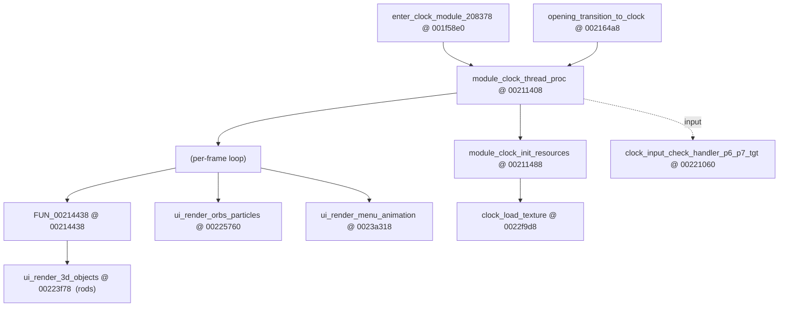
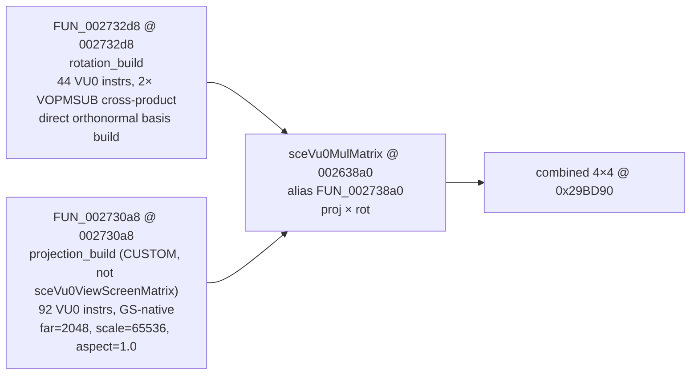

# OSDSYS Crystal Clock — System Map (Ghidra RE)

> Audit 2026-07-05: claims status-tagged per master-strategy spec §6.

> Living reverse-engineering map of the OSDSYS **clock + UI + settings** subsystems, mined
> from `OSDSYS.elf` via ghidra-mcp. Goal: 100% comprehension of every module so the procedural
> Vulkan rebuild is read from evidence, never guessed. Every claim cites `name @ address`.
>
> Status: **STRUCTURE COMPLETE** — render spine + all 5 subsystems mined (deep-dive docs in §7).
> Remaining gaps are runtime numeric constants, listed in §7 (one live PCSX2 pass fills them).

## 0. Method & ground rules

- **Program:** always `program="OSDSYS.elf"` (base `0x001f0000`, 2009 funcs) [HYPOTHESIS] (static Ghidra count, not independently verified). `hddosd.elf` is the
  ghidra *active* program — omitting `program` silently targets the wrong binary.
- **Symbols:** the binary is **partially symbolized** (clock/config/ui funcs have real names from the
  decomp effort; helpers are still `FUN_<addr>`) [DECOMP-SOURCED]. Names like `module_clock_232438 @ 0021e718` encode
  the *original/runtime* address (232438) in the name and the *Ghidra* entry (0021e718) after it — a
  link-base skew [HYPOTHESIS]. **The live-trace render `0x00232618` does not resolve as a Ghidra entry** (skew) [LIVE-VERIFIED] (per known-falsified item: the earlier "master render = 0x00225E80" claim is wrong — real per-frame rod render is `0x00232618`, confirmed live 2026-06-12); the
  reliable anchor is `draw_crystal_rod = FUN_00232e38` (confirmed by its 3 matrix callees) [HYPOTHESIS] (static-decompile confirmation, not live-confirmed here).
- **Cross-ref:** decomp at `C:\CodingProjects\Personal\CrystalOSD` (`asm/clock/`, `asm/graph/`) has
  named asm (`clock_orb_rendering_func`, `pktSetAlphaBlend`…) — use to confirm Ghidra finds [DECOMP-SOURCED].
- **GS ground truth:** [[gs-dump-format-and-clock-regs]] — 3936 draws, 3 blend modes, DTHE off,
  PSMCT32, rods are textured TRI_STRIP quads [DUMP-MEASURED]. [[live-render-chain]] for live BP addresses.

## 1. Clock module — top level

Entry/lifecycle: `enter_clock_module_208378 @ 001f58e0` /
`disable_enter_clock_module_208388 @ 001f58f0` /
`should_enter_clock_module_2AD22C @ 0027b394`. Dirty flag: `var_clock_is_dirty @ 001f0cb4`.
Orb gate: `get_clock_should_render_orbs @ 00231180`. Anim offset: `module_clock_set_anim_offset @ 00221f88`. [HYPOTHESIS] (addresses/roles from static Ghidra symbol reads, not live-confirmed)

## 2. The three render passes

| Pass | Function | Renders |
|------|----------|---------|
| 3D rods | `ui_render_3d_objects @ 00223f78` | the prism rod ring (crystal clock body) |
| Orbs / particles | `ui_render_orbs_particles @ 00225760` | floating light orbs / particle trails |
| Menu animation | `ui_render_menu_animation @ 0023a318` | UI menu transitions / layout |

[HYPOTHESIS] — `ui_render_3d_objects` role confirmed independently below (§3); the orbs/menu function identifications are static-Ghidra only here. Note: §7 (`orbs-particles.md`) later found the *real* orbs render is `FUN_00225be8`, not `0x00225760`/`0x00211558` — this table was not updated to match; flagged as ambiguous (not on the known-falsified list, so not marked FALSIFIED here).

Orb math also in `clock_orb_rendering_func @ 00211558`. [HYPOTHESIS]

## 3. Rod render pipeline — `ui_render_3d_objects @ 00223f78` (decoded)

Signature: `ui_render_3d_objects(float transition, undefined4 p2, int *clockState)`. [DECOMP-SOURCED]/[HYPOTHESIS] (Ghidra decompile signature)
`param_1` (transition 0..1) branches between a **transition variant** and a **steady variant**. [HYPOTHESIS]

**Two rod groups**, iterated with **stride `0x160` bytes/rod**:
- `ROD_GROUP_A @ 0x375250` (confirmed live: `s3=0x00375250`). [LIVE-VERIFIED]
- `ROD_GROUP_B @ 0x377e50`. [HYPOTHESIS] (not independently confirmed live in this doc)
- Per-rod field `+0x150` is a **front/back flag** (`==0` vs `!=0` selects rendering sub-pass). [HYPOTHESIS]
- Sub-group split by index: `7 < i` (group A skips first 8) and `1 < i-8` (group B rods 8+).
- `clockState[0x1b]` = a global scale/intensity; `[1]` = rod count; counts at `in_stack_00000000._4_4_`.

**Multi-pass structure** (each pass = set GS blend/test state → build packet header from a
`DAT_00297xxx` template → loop rods drawing). Pass-state setters (→ map to the 3 GS blends in §0):

| Helper | Role (hypothesis — §7 to confirm) |
|--------|------|
| `FUN_002324e8(a,b,c)` / `FUN_00232538(a,b,c)` | ~~set alpha-blend mode (ABE/ALPHA)~~ [FALSIFIED → actually a WaitSema DMA-sync call (shared tail), not a GS register writer; see PORT-FUNCTION-MAP.md TODO decompile session] |
| `FUN_00230518(a,b)` / `FUN_00230fe8(a,b,c)` | ~~set test / Z / pass mode~~ [FALSIFIED → `FUN_00230518` is a generic DMA/queue trampoline with 26 OS-wide callers, not blend-specific; `FUN_00230fe8` is the icon-browser/input state machine, touches no GS registers] |
| `FUN_0022f720(0x375230)` | ~~alloc/begin GS packet at `0x375230`~~ [FALSIFIED → `FUN_0022f720` is browser icon-selection logic; the register-template blit to `0x375230` is inline in `ui_render_3d_objects` itself, not in this function] |
| `FUN_00235350()` | ~~kick/flush packet (GIF/VIF1 DMA)~~ [FALSIFIED → no kick is visible in this function; it's the orbit-update tail (light-spot algorithm). The real GS kick is UNLOCATED] |
| `FUN_00232da0(x,y,rod,…)` | draw rod **after-image / glow** quad [HYPOTHESIS] |
| `FUN_00232e38(a1,a2,rod,mtx)` | **draw_crystal_rod** (the prism, §4) [HYPOTHESIS] |
| `FUN_002335e8(…,rodGroup,state)` | per-group transform setup [HYPOTHESIS] |
| `FUN_002367c0()` / `FUN_00236a80(0,k,0)` | matrix stack get / translate (k = `state[0x1b]*26.0*transition`) [HYPOTHESIS] |

Packet templates: `DAT_002973a0/a8/ac` (one blend mode) and `DAT_002973c0/c4/c8/cc` (another) —
these are the prebuilt GS A+D register packets (ALPHA/TEST) [HYPOTHESIS]. Per-pass angle advance uses globals
`fGpffff831c / 8320 / 8324 / 8328 / 832c / 8330` (the per-rod angle step), and `fGpffff8318` scales
the group transform inputs. [HYPOTHESIS]

## 4. `draw_crystal_rod = FUN_00232e38` — matrix pipeline

**FULLY DECODED** — see `docs/ghidra_analysis/vu0-math-pipeline.md` for verified GLM pseudocode,
full instruction listing, sceVu0 port surface table, and port notes. Summary below.

Key confirmed facts: [DECOMP-SOURCED]/[HYPOTHESIS] (static Ghidra decompile of VU0 instruction stream; see vu0-math-pipeline.md for full listing — not independently live-confirmed in this doc)
- Rotation: NOT Euler, NOT Rodrigues — two sequential cross products to build orthonormal basis
  (forward, right, up) from two input direction vectors. Inputs are sin/cos of rod's two angles
  pre-computed in the temp buffer at `0x29BCF0` by the caller.
- Projection: custom GS-native matrix; encodes viewport transform inline (maps NDC→GS 0–2048).
  `sceVu0ViewScreenMatrix @ 0x002630a8` is a stub; NOT what the clock calls.
- `bc1t → memclr @ 0x00272fc8`: NaN/overflow guard in rotation_build; zeroes output on FP exception.
- `VFTOI12.yz vf7, vf12` in rotation_build: 12.4 fixed-point encode mid-pipeline.
- Blockers: FOV + near values need live PCSX2 read; temp buffer layout needs caller trace. [HYPOTHESIS] (open gap, not yet resolved)

## 5. Settings / config subsystem (inventory)

Rich named surface — the System Configuration menu. Getters/setters per option:
`config_get/set_aspect_ratio`, `config_get/set_video_output`, `config_get/set_time_format`,
`config_get/set_date_format`, `config_get/set_timezone_offset`, `config_get/set_timezone_city`,
`config_get/set_daylight_saving`, `config_get/set_spdif_mode`, `config_get/set_rc_gameplay`,
`config_get/set_dvdp_remote_control`, `config_get/set_dvdp_support_clear_progressive`,
`config_get/set_jpn_language`, `config_set_langtbl`, `thunk_config_get_osd_language`.
Clock↔config bridge: `module_clock_get_config_item @ 00221540`,
`clock_config_get_initial_value @ 002139b0`, `module_clock_config_ps1drv_get_value @ 00215760`,
change-cbs `clock_config_change_cb_{spdif_mode,ps1drv,dvdp_reset_progressive}`,
`config_item_change_cb_clock_write_mechacon @ 00221738`. [DECOMP-SOURCED]/[HYPOTHESIS] (names/addresses from static Ghidra symbol table cross-referenced with decomp source)
(Full per-option decode = §7 campaign.)

## 6. Clock module function index (named, from search)

`module_clock_thread_proc @ 00211408`, `module_clock_init_resources @ 00211488`,
`clock_stuff1 @ 00210ff8`, `clock_orb_rendering_func @ 00211558`,
`clock_load_texture @ 0022f9d8`, `get_clock_should_render_orbs @ 00231180`,
`module_clock_set_anim_offset @ 00221f88`, `clock_timezone_str_related @ 00218ed0`,
plus ~40 `module_clock_<runtimeAddr> @ <ghidraAddr>` helpers (skew-named) — to be classified in §7. [HYPOTHESIS] (static Ghidra symbol search, count not independently verified)

## 7. Subsystem deep-dives (fan-out complete)

Each subsystem was mined into its own cited doc (mermaid + function index + struct maps + port notes):

| Subsystem | Doc | Headline finding |
|-----------|-----|------------------|
| Rod pipeline & GS state | [`rod-pipeline.md`](rod-pipeline.md) | **5 passes** (not 3): front-glow src-over, back-glow α=0, back-glow α=0xFF, prism additive, refraction subtractive. ROD struct 0x160 (`+0x04` angle, `+0x60` glow_alpha, `+0x150` face-flag). [HYPOTHESIS] (summarized from a separate doc, not independently re-verified here — note this "5 passes" figure differs from the per-frame spine's 5-pass table in PORT-FUNCTION-MAP.md, which may or may not be the same enumeration) |
| VU0 / matrix math | [`vu0-math-pipeline.md`](vu0-math-pipeline.md) | rotation = **2× cross-product orthonormal basis** (NOT Euler/Rodrigues); projection custom GS-native (far=2048, scale=65536, aspect=1.0); `matrix_multiply = sceVu0MulMatrix @ 002638a0`. [HYPOTHESIS] (summarized from a separate doc) |
| Orbs / particles | [`orbs-particles.md`](orbs-particles.md) | real render = `FUN_00225be8` (the `0x00211558` name is a stub). **Trail ring buffer 50×32B**, α=`128-floor(i/49·3)`. 3 sub-passes (trail additive, halo ×30, core ×4.5). Orbit angle `fGpffff8b88`. [HYPOTHESIS] (summarized from a separate doc; contradicts the §2 table's `ui_render_orbs_particles @ 00225760` / `clock_orb_rendering_func @ 00211558` identification above — flagged as ambiguous, not on the known-falsified list) |
| Menu / UI | [`menu-ui.md`](menu-ui.md) | 4-state dispatcher `FUN_0022af60` (hidden/CD/menu/confirm). Aspect-dependent timing. **Layout table `DAT_00274c00`** (stride 0x50, `+0x10/+0x14` = XY px). Text via SIF RPC, atlas TBP0=8960. [HYPOTHESIS] |
| Settings / config | [`settings-config.md`](settings-config.md) | **Two-word bit-field model** (`_var_mechacon_config_param_1` syscall 0x4b + `uRam002c9684` syscall 0x6f). Visual opts: aspect/video/timezone/DST/time-fmt/date-fmt/lang. RTC dirty-write BCD @ `0x00375118`. [HYPOTHESIS] |

**Status: structure ~complete; exact runtime NUMBERS mostly resolved.** The static RE nailed every
data-flow, struct layout, blend sequence, and math derivation. Remaining blockers:

1. **GS register templates** `DAT_002973a0/c0`, `DAT_00297420/430` — RESOLVED in `runtime-trace.md`. [HYPOTHESIS] (pointer to another doc, not re-verified here)
2. **Projection near / halfWidth** — RESOLVED by W0-1 static analysis (`w0-projection-constants.md`):
   `near = 41.6f`, `halfWidth_4:3 = 41.6f`, `halfWidth_16:9 = 0.44f` (from decomp ELF .data) [DECOMP-SOURCED].
   `far = 2048.0f`, `scale = 65536.0f`, `aspect = 1.0f` confirmed from instruction immediates [HYPOTHESIS] (static decompile immediates, not live-confirmed).
   **Still unknown: FOV** (`gp[-0x73d8]`) — BSS, requires live PCSX2 read. Hypothesis: ~1.047 rad. [HYPOTHESIS]
3. **rod+0x04 / world-position offsets — W0-Q1 OPEN** (controller review downgraded the W0-1 "it's
   intensity" claim: fragile `f0` trace + conflicts with the angle-read and the trace `+0x08≠0`). [HYPOTHESIS]
   Resolve by the SAFE live two-snapshot read of `0x375250` (stable=world, changing=scratch) — also
   pins the true projection-oracle input offsets. No watchpoint (those crash PCSX2).
4. **Orbit integrate fn-table** `DAT_0029b3c0` — pointers `0x00239440` / `0x00238d60` found in
   `runtime-trace.md`. Decompile these statically for angular velocity / radius / tilt constants. [HYPOTHESIS]
5. **Config storage** `var_config_aspect_ratio` base addr: one BP on `module_clock_get_config_item`. [HYPOTHESIS]
6. **Menu layout records** `DAT_00274c00` — structure decoded in `runtime-trace.md`. Follow pointers. [HYPOTHESIS]

→ **NEXT: W1 — build projection oracle using confirmed constants; validate against GS dump pixel-diff.** [W1 projection PROVISIONAL — underdetermined single-rod regression fit, not evidence-grade]
→ **FOV:** add one live PCSX2 read at `0x002c8b18` (Ghidra runtime space) to close the last gap. [HYPOTHESIS] (open gap)
