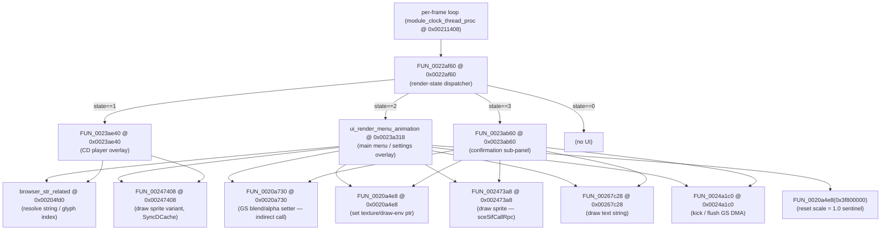
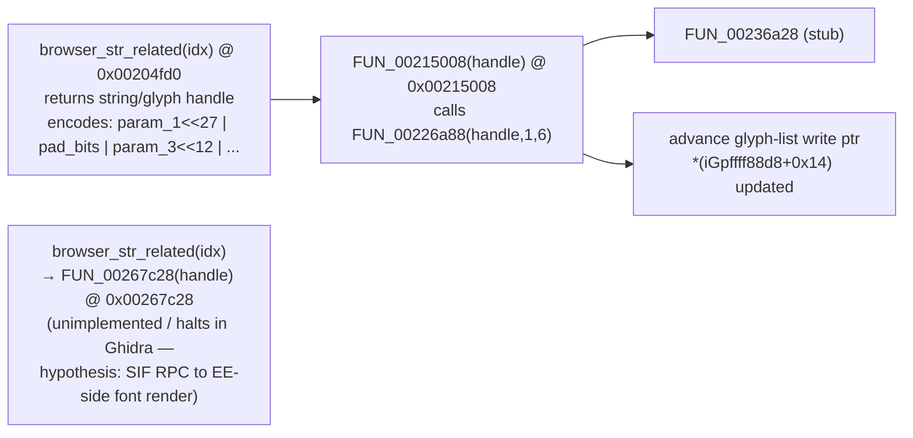

# OSDSYS Browser/Clock UI — Menu & Layout RE Notes

> Source: `OSDSYS.elf`, ghidra-mcp analysis, base `0x001f0000`.
> Every claim cites `name @ address`. Guesses are labelled "hypothesis".

> Audit 2026-07-05: claims status-tagged per master-strategy spec §6.

---

## 1. Call-graph context

[HYPOTHESIS throughout §1 — this call-graph is Ghidra static decompilation of
`OSDSYS.elf`, not independently confirmed by a live PCSX2 trace or GS dump.
Individual nodes are tagged again below only where evidence status differs.]

`ui_render_menu_animation @ 0x0023a318` is one of three top-level render passes
dispatched by the per-frame loop. Its caller is `FUN_0022af60 @ 0x0022af60`, a
4-way state dispatcher:



---

## 2. Menu-state struct (globals at `0x002c8xxx`)

Extracted from `ui_render_menu_animation @ 0x0023a318` and `FUN_0022af60 @ 0x0022af60` [HYPOTHESIS — field names and meanings are inferred from Ghidra decompile, not live-verified]:

| Address | Name (hypothesis) | Width | Meaning |
|---------|-------------------|-------|---------|
| `0x002c8ce0` | `menu_state` | i32 | 0=hidden, 1=show_menu, 2=confirm_dialog, other=fallback |
| `0x002c8c08` | `aspect_widescreen` | i32 | 0=4:3 (NTSC), 1=16:9 (widescreen) |
| `0x002c8cd0` | `anim_frame_counter` | i32 | counts up each frame during transition |
| `0x002c8ccc` | `anim_frame_counter2` | i32 | secondary counter, leads `cd0` |
| `0x002c8ce4` | `menu_item_index` | u32 | selected item (0-based) |
| `0x002c8bb8` | `flag_bb8` | i32 | controls x-position nudge for some items |
| `0x002c8b48` | `flag_b48` | i32 | negative = `StartSysConfig` plays sound |
| `0x002c8e00` | `flag_e00` | i32 | 0=none, 1=draw str 0x8d, 2=draw str 0x8e |
| `0x002c8e04` | `flag_e04` | i32 | 0=none, 1=draw str 0x90, 2=draw str 0x91 |
| `0x002c8948` | `pad_buttons` | u32 | raw pad bitmask — up=0x1000, down=0x4000, cross=0x20, circle=0x10 |
| `0x002c8a60` | `config_item_visited[]` | i8[] | visited-flag array indexed by selected item |
| `0x002c8a3c` | `config_result` | u32 | 0 = start config |
| `0x002c8a6c` | `config_mode` | u32 | 1=play-sound path, 6=silent start |
| `0x002c8a70` | `config_sound_id` | u32 | 0x2b (sound to play on config entry) |
| `0x002c8c60` | `menu_scroll_angle` | f32 | drives rotary scroll animation |
| `0x002c83ec`–`0x002c8420` | texture ptr table | u32[] | pointers to draw-env / texture structs for each menu state |

### Pointer table layout (hypothesis)

Offsets from `0x002c83ec`:

| Offset | Used when |
|--------|-----------|
| `+0x00` (`002c83ec`) | `menu_state==1`: icon/state default |
| `+0x04` (`002c83f0`) | `menu_state==2 && scroll` |
| `+0x08` (`002c83f4`) | widescreen scroll rate |
| `+0x0c` (`002c83f8`) | 4:3 scroll rate |
| `+0x10` (`002c83fc`) | `menu_item_index==0`: tex ptr |
| `+0x14` (`002c8400`) | `menu_item_index==1`: tex ptr |
| `+0x18` (`002c8404`) | general item: sub-tex A (narrow) |
| `+0x1c` (`002c8408`) | general item: sub-tex B (wide/other) |
| `+0x20` (`002c840c`) | item `s3==9`: tex ptr |
| `+0x24` (`002c8410`) | item `s3==10/11`: alt tex ptr |
| `+0x28` (`002c8414`) | item `s3>=12`: fallback tex ptr |
| `+0x2c` (`002c8418`) | sub-icon A (`s3==10`) |
| `+0x30` (`002c841c`) | sub-icon B (`s3==9/11`) |
| `+0x34` (`002c8420`) | sub-icon C (wide layout) |

---

## 3. Alpha/fade animation — timing constants

`ui_render_menu_animation` computes a 0–127 alpha ramp via integer linear
interpolation: `alpha = (counter * 0x7F) / total_frames`. [HYPOTHESIS — from
Ghidra decompile, not live-verified]

Two timing constants exist, selected by `aspect_widescreen @ 0x002c8c08`:

| Mode | Fade-in total | Fade-out start | Notes |
|------|---------------|----------------|-------|
| 4:3 (NTSC) | 15 frames | counter > 10 | `iVar6 = 0xf`, gated at `iRam002c8ccc > 10` |
| 16:9 (widescreen) | 12 frames | counter > 8 | `iVar6 = 0xc`, gated at `iRam002c8ccc > 8` |

[HYPOTHESIS — frame-count constants read directly off Ghidra decompile
literals; not cross-checked against a live 60fps trace.]

The computed `alpha` (0–127, GS half-intensity scale) is passed to
`FUN_0020a730(channel, alpha)` where `channel` is 0 or 1 depending on
`FUN_0024e140()` (hypothesis: checks whether second display/port is active). [HYPOTHESIS]

A secondary fade path in `menu_state==1` uses longer counters (0x1e=30 frames
for 4:3, 0x19=25 frames for 16:9) with a two-phase ramp: fast-ramp at `+0x14`
frames, slow-ramp at `+0x10` frames, making a cubic-feeling ease-in. [HYPOTHESIS]

Confirmation sub-panel (`FUN_0023ab60 @ 0x0023ab60`) uses the same constants
and the same ramp arithmetic — this is a shared animation primitive by static
reading of both decompiles [HYPOTHESIS, not live-verified].

---

## 4. Scroll animation (`menu_state == 2`)

When `menu_state == 2` and `uRam002c8ce4 != 0` [HYPOTHESIS throughout §4 —
Ghidra decompile only]:

1. `fRam002c8c60` (scroll angle) is incremented each frame by `fRam002c83f8`
   (4:3 rate) or `fRam002c83f4` (16:9 rate).
2. `FUN_00247ae8(scroll_angle)` reads a byte from a lookup table — hypothesis:
   a sine/cosine LUT. Offset into table is `scroll_angle * 4 + 0x32` (4:3) or
   `+0x33` (16:9). Returns the scrolled magnitude.
3. The magnitude drives `FUN_0020a730(0, alpha)` — so scroll feeds the alpha.
4. The visible glyph is set via `browser_str_related(0x92)` then `FUN_0020c6f8`.
   String index 0x92 (146 decimal) = the scroll-bar or menu body glyph — exact
   string TBD (see §7).

---

## 5. Screen coordinate / fixed-point scheme

Source evidence from `FUN_00226110 @ 0x00226110` (a `draw_crystal_rod` helper
that also draws the light-spot sprite backdrop — call site confirmed by static
xref from `menupos_p3_p8_tgt`, not live-verified) [HYPOTHESIS]:

```c
// Sprite vertex X in GS coords:
in_t0 = (long)(int)((pfVar2[1] + 2048.0) * 16.0);
// Sprite vertex Y in GS coords:
in_v0_lo = (uint)(pfVar2[2] * 16.0);
// DAT_202973e0 (XY SPRITE top-left):
DAT_202973e0 = (int)(((fVar9 - fVar11) + (float)(_screenW / 2)) * 16.0);
DAT_202973e4 = (int)(((fVar12 - fVar11 * 0.5) + (float)(_screenH / 2)) * 16.0);
```

Rules [HYPOTHESIS — inferred from the decompiled code above, not confirmed by
a live register read or GS dump for this specific code path]:
- All GS XY coords are 12.4 fixed-point: `screen_pixel * 16`.
- **+2048 offset** is applied to X before multiply: `(x_world + 2048.0) * 16`.
  This is the standard GS XYOFFSET where the rasteriser's scissor origin is at
  pixel (0,0) = GS XY (2048*16, 2048*16) = `0x8000`. The offset converts
  from a signed "world" space to unsigned GS register space.
- Y does NOT add 2048 in the vertex loop (the `+2048` is baked in the XYOFFSET
  GS register; Y enters directly as `y * 16`).
- Screen centre: `(_screenW / 2, _screenH / 2)` in pixel units —
  `_screenW = 640`, `_screenH = 224` (native interlaced field) → centre
  `(320, 112)`.
- Text/sprite draws use **pixel coordinates** passed to sprite-draw helpers
  (e.g. `FUN_00247408(0xac - iVar6)` passes Y = `0xac - offset` = 172 px minus
  a small offset). X is passed separately.

Key coordinate constants observed in `ui_render_menu_animation` [HYPOTHESIS — decompile literals, not live-verified]:
- `0xac` (172) — base Y for the menu-item name row.
- `0x9e` (158) — base Y for the confirmation panel body row.
- `0xa2` (162) — base Y for a secondary row.
- `0x80` (128) — base Y for confirmation-dialog icon.
- `0x94` (148) — base Y for confirmation text body.
- `0x29` (41) = `0x0029` — X offset used in `FUN_00247498(0, 0x29, ...)`:
  horizontal position for an icon in the menu panel.
- `iVar6 +/- 2..5` — per-item X nudge, driven by `unaff_s2_lo`.

---

## 6. Text / glyph draw path

[HYPOTHESIS throughout §6 unless noted — Ghidra static decompile only.]



`browser_str_related @ 0x00204fd0` signature:
```c
void browser_str_related(int idx, int param_2, int param_3)
// builds: idx<<27 | in_v1_lo | param_3<<12 | *(param_2+0xcc0)<<17 | *(param_2+0xcc8)<<6
// then calls FUN_00215008(packed_handle)
```

The packed handle encodes: string table index (top 5 bits), alignment/flags
(middle bits), colour palette select (`+0xcc0`/`+0xcc8` offsets into a colour
struct). String indices seen in the UI:

| Index | Site | Hypothesis |
|-------|------|------------|
| 0x2d  | `menu_ce4 in [2..9], data[0]==0` | "empty" / no-content item label |
| 0x2e  | `data[ce4] > 0, < 1000` | item label (short) |
| 0x2f  | `data[ce4] >= 1000` | item label (long/alt) |
| 0x30  | `browser_confirmation_menu` | "OK" / primary action label |
| 0x31  | confirmation menu | left-side choice label |
| 0x32  | confirmation menu | right-side choice label |
| 0x48  | `FUN_0022e290` (nav loop) | nav item A |
| 0x49  | nav loop | nav item B |
| 0x4a  | nav loop | nav item C |
| 0x4d  | `FUN_0023ae40` (CD player) | CD player label A |
| 0x4e  | `FUN_0023ae40` | CD player label B |
| 0x8d  | `flag_e00==1` | flag-state text A |
| 0x8e  | `flag_e00==2` | flag-state text B |
| 0x90  | `flag_e04==1` | flag-state text C |
| 0x91  | `flag_e04==2` | flag-state text D |
| 0x92  | scroll overlay | scroll-body / menu-body glyph |

`FUN_00267c28 @ 0x00267c28` is the final draw call. Ghidra marks it as
"unimplemented instruction" — it uses a PS2-specific instruction (likely
`cache` or a VU0 macro) that halts the decompiler. Hypothesis: it issues a
DMA to the GS to rasterise glyphs from the freeze atlas (TBP0 = 8960).

`FUN_0020c6f8 @ 0x0020c6f8` is the **refraction / light-intensity texture
fill** function (static-decompile-confirmed by its 20×20 pixel nested loop,
radial-distance intensity formula, and output stride of `0x50` bytes to
`DAT_0034a070`, but not live/dump-verified) [HYPOTHESIS]. It
fills a 20×20 tile buffer that is used as the refraction map, NOT glyph draw.
It is called after `browser_str_related` in the menu path — the glyph sets up
which atlas tile to sample, and this fills the per-tile intensity. [HYPOTHESIS]

---

## 7. Draw-env / texture-select path

`FUN_0020a4e8 @ 0x0020a4e8` receives a draw-env pointer (from the pointer
table at `0x002c83ec`) and zeroes a block of fields within it:

```c
// offsets cleared: +0x20, +0x24, +0x30, +0x34, +0x38, +0x40, +0x44
// also clears: uRam002c869c = 0
```

Hypothesis: these are GS PRIM / FOG / CLAMP registers in the draw-env struct.
Clearing them resets them to "no texture / no fog" before rebuilding the packet. [HYPOTHESIS]

`FUN_0020a730 @ 0x0020a730` (alpha setter) dispatches through a vtable:
`(**(code **)(alpha_value + channel))()` — i.e. `alpha_value` (0 or 1) selects
a row in the per-channel blend vtable, and the int alpha (0–127) selects the
column. This matches the GS ALPHA register `(A-B)*C/128+D` blend where C=alpha. [HYPOTHESIS — decompile-derived, not live-verified against a GS register read]

---

## 8. Sprite draw helpers

[HYPOTHESIS throughout §8 — Ghidra static decompile only.]

| Function | Signature (reconstructed) | Role |
|----------|--------------------------|------|
| `FUN_002473a8 @ 0x002473a8` | `draw_sprite(x, y, handle)` | calls `sceSifCallRpc` to EE-side sprite blit |
| `FUN_00247408 @ 0x00247408` | `draw_sprite_cached(y, handle)` | `SyncDCache(0x411380,0x411480)` then XY from cache buffer |
| `FUN_00247498 @ 0x00247498` | `draw_icon_at(mode, y_offset, handle)` | calls `FUN_00270ee0(mode + 0x59c8)` then `FUN_002475c4` (stub) |
| `FUN_00247040 @ 0x00247040` | `draw_string_rpc(x_idx, y, handle)` | `sceSifCallRpc(0x410f40, 2, ...)` — direct IOP RPC for text |

All sprite Y coordinates passed as raw pixel values (NOT ×16). The ×16 scaling
is applied inside the IOP-side renderer. [HYPOTHESIS]

---

## 9. Navigation / input dispatch

[HYPOTHESIS throughout §9 — Ghidra static decompile only.]

`menupos_p3_p8_tgt @ 0x0021e5c0` (input handler — runtime addr 0x001be5c0):
- Reads `uRam002c8948` (pad buttons).
- Up (0x1000) → `DAT_0028b068 -= 1` (wrap guarded by ≥ 0).
- Down (0x4000) → `DAT_0028b068 += 1` (wrap guarded by `< DAT_0028b060`).
- Cross (0x20) → `FUN_0022e220` (enter/select) or `StartSysConfig`.
- Circle (0x10) → `FUN_00226110` (back / draw previous item).
- `DAT_0028b068` = current menu cursor position (0-based).
- `DAT_0028b060` = total item count.
- `DAT_0028b070` = browser-lock flag (non-zero = suppress input).

Sound: `j_sound_handler_queue_command_3(0x5200, 1, 6)` on up/down — SIF sound
command, ID 0x5200, channel 1, event 6 = menu-scroll click.

---

## 10. Layout table `DAT_0029c3e0` / `DAT_0029c3c0`

[HYPOTHESIS throughout §10 — Ghidra static decompile only.]

In `ui_render_menu_animation`, the item-count check branch:

```c
iVar6 = (uRam002c8ce4 - 2) * 4;           // item index offset
if (DAT_0029c3e0[iVar6] == 0) { ... }     // "is item empty?"
else if (DAT_0029c3c0[iVar6] < 1000) { .. } // "is item count < 1000?"
```

`DAT_0029c3e0` and `DAT_0029c3c0` are parallel `int[]` arrays, one entry per
menu item (stride 4 bytes). `c3e0` is an "is-populated" flag; `c3c0` is the
item count/value. Both are indexed by `menu_item_index - 2`, meaning item 2 is
the first item that can appear in this branch (items 0 and 1 are handled
separately above).

Texture vtable for items: `DAT_002ad6a0` — 13 entries × 4 bytes
(`FUN_00236ed8 @ 0x00236ed8` checks `param_1 < 0xd`), then indexes into
`&UNK_002ad6a0 + idx * 4` to get a draw-env pointer. This covers the 13
browser icon slots.

---

## 11. Full function index

[HYPOTHESIS throughout §11 — role column is Ghidra static decompile / naming
convention only, not live-verified, except where an entry duplicates a
function already re-tagged elsewhere in this file.]

| Function | Address | Role |
|----------|---------|------|
| `ui_render_menu_animation` | `0x0023a318` | Top-level menu/UI render pass |
| `FUN_0022af60` | `0x0022af60` | 4-way state dispatcher (caller of above) |
| `FUN_0023ae40` | `0x0023ae40` | CD player overlay (state==1) |
| `FUN_0023ab60` | `0x0023ab60` | Confirmation sub-panel (state==3) |
| `browser_confirmation_menu` | `0x0022cbb8` | Confirmation dialog draw |
| `FUN_0020a4e8` | `0x0020a4e8` | Set draw-env ptr / clear GS state fields |
| `FUN_0020a730` | `0x0020a730` | Set GS alpha (0–127) via vtable dispatch |
| `FUN_0020c6f8` | `0x0020c6f8` | Fill 20×20 refraction intensity tile |
| `FUN_0020cba0` | `0x0020cba0` | Fatal/assert (does not return) |
| `browser_str_related` | `0x00204fd0` | Resolve/pack string+palette handle |
| `FUN_00215008` | `0x00215008` | Submit glyph handle to draw list |
| `FUN_002473a8` | `0x002473a8` | Draw sprite (SIF RPC) |
| `FUN_00247408` | `0x00247408` | Draw sprite (cached, SyncDCache) |
| `FUN_00247498` | `0x00247498` | Draw icon at offset |
| `FUN_00247040` | `0x00247040` | Draw string (SIF RPC 0x410f40) |
| `FUN_0024a1c0` | `0x0024a1c0` | Kick/flush GS DMA packet |
| `FUN_0024e140` | `0x0024e140` | Check secondary display port |
| `FUN_00267c28` | `0x00267c28` | Draw text string (unimplemented insn) |
| `FUN_00247ae8` | `0x00247ae8` | LUT scroll-angle lookup |
| `FUN_0025ffd8` | `0x0025ffd8` | Item-match predicate |
| `menupos_p3_p8_tgt` | `0x0021e5c0` | Pad input → menu navigation |
| `draw_menu_item` | `0x00212390` | Per-item draw entry (stub-like) |
| `StartSysConfig` | `0x0022d040` | Enter system-config module |
| `FUN_00226110` | `0x00226110` | Back/select — draws light-spot sprite |
| `FUN_0022e220` | `0x0022e220` | Enter/select — nav loop (up to 5 items) |
| `FUN_0022e290` | `0x0022e290` | Nav loop variant |
| `module_browser_23BED8` | `0x00228328` | Init browser layout table (DAT_00274c00) |
| `module_browser_23A958` | `0x00226f98` | Grid scan (6×4, step 20.0 units) |
| `browser_get_icon_bytes` | `0x00237be8` | Get icon data by slot index |
| `FUN_002072a8` | `0x002072a8` | Icon render trampoline |
| `FUN_00227840` | `0x00227840` | Build VIF1 packet for icon geometry |
| `vif1SetTexture` | `0x00208400` | Texture TBP offset ±0x1e / ±0x19 |
| `clock_load_texture` | `0x0022f9d8` | Load clock module textures |
| `browser_exit_previous_module` | `0x00238150` | Pop module stack |
| `browser_transition_to_other_module` | `0x00238038` | Push next module |
| `FUN_0022fd00` | `0x0022fd00` | Post-layout pass: light-spot sprite draw + scroll update |
| `FUN_0022f7f8` | `0x0022f7f8` | Populate layout row table from `DAT_00274c00` |

---

## 12. Port notes (Vulkan rebuild)

[HYPOTHESIS throughout §12 — porting recommendations built on the §1–§11
static-decompile hypotheses above; treat as provisional until cross-checked
against a live trace or GS dump.]

### Coordinate mapping

In the Vulkan rebuild, all GS XY values are 12.4 fixed-point:
- Convert to float pixel: `px = (gs_xy / 16.0) - 2048.0`.
- Native framebuffer: 640 × 224 pixels (or 640 × 448 interlaced at display
  time). The ×16 step is handled in a push-constant or vertex shader.
- XYOFFSET applied in the vertex shader: `ndc.x = (px - 320.0) / 320.0`,
  `ndc.y = (py - 112.0) / 112.0` (or 224 for non-interlaced).

### Alpha / blend

`FUN_0020a730(channel, alpha)` maps to `VkBlendFactor`. Alpha range 0–127
maps directly to GS ALPHA `C` field (fixed 128 = 1.0 in GS blend). Pass as
`push_constant.alpha = alpha / 128.0f`. The GS formula is `(A-B)*C/128+D`
which with A=src, B=0, D=dst gives standard src-alpha blend when C = alpha
value.

### Texture atlas (UI glyphs)

Glyph texture is the freeze atlas at TBP0 = 8960 (0x2300) in VRAM.
`vif1SetTexture @ 0x00208400` offsets TBP by ±0x1e (NTSC) or ±0x19 (16:9) —
these are VRAM page offsets from the atlas base.
In Vulkan: one descriptor-set texture-array slot per atlas page, indexed by
the TBP offset. String index → glyph UV is encoded in the palette handle from
`browser_str_related`.

### Animation timing

All transitions are frame-counted (no wall-clock time). At 60 fps:
- 4:3 fade: 15 frames = 250 ms.
- 16:9 fade: 12 frames = 200 ms.
- Secondary ease-in: up to 30 frames (4:3) / 25 frames (16:9) = 500 / 417 ms.
Implement as `frame_counter / total_frames` normalised to [0, 1], clamped.

### Sprite draw

`FUN_002473a8` / `FUN_00247408` are IOP RPC calls for sprite blitting. In
Vulkan: replace with a single `vkCmdDraw(4, 1, ...)` SPRITE quad per call.
Y coordinate is raw pixel (no ×16 on input side — scale in vertex shader).

### Menu item count

Max 13 browser slots (`DAT_002ad6a0`, 13 entries). Item 0 and 1 are handled
with special-case tex pointers; items 2–9 use the `DAT_0029c3e0` table.
Widescreen mode (`aspect_widescreen==1`) shortens animation counters by 3
frames across the board — apply a global `anim_speed_scale = aspect == 0 ? 1.0 : 15.0/12.0`.

### Screen-Y constants (pixel units, pre-×16)

| Constant | Value | Element |
|----------|-------|---------|
| `0xac`   | 172   | Menu item name row Y |
| `0x9e`   | 158   | Confirmation body Y |
| `0xa2`   | 162   | Secondary body Y |
| `0x80`   | 128   | Confirmation icon Y |
| `0x94`   | 148   | Confirmation text Y |
| `0x5f`   | 95    | CD player label A Y |
| `0x70`   | 112   | CD player label B Y |

---

## 7. Open items / blockers

1. **String table base address unknown.** `browser_str_related` encodes `idx`
   into a packed dword but the base address of the string table is not visible
   from `FUN_00215008` (it calls through a vtable stub that returns 0 in
   Ghidra). Need to trace `param_2 + 0xcc0` pointer chain or search
   for `sceSifCallRpc` call with RPC ID matching font service.

2. **`FUN_00267c28` unimplemented.** Ghidra truncates on a PS2-specific
   instruction. Disassemble bytes at `0x00267c28` manually to confirm if it
   is a `cache` flush + DMA kick. This is the actual glyph rasteriser call.

3. **Refraction tile usage unclear.** `FUN_0020c6f8` fills a 20×20 intensity
   buffer at `DAT_0034a070`. It is called directly after glyph-handle setup,
   suggesting the refraction map is per-glyph, not per-frame. Confirm by
   checking who reads `0x34a070`.

4. **`browser_str_related` colour struct.** Fields at `param_2 + 0xcc0` and
   `+0xcc8` select palette entries; `param_2` is an unresolved register
   value. Need to find the colour/style struct base pointer.

5. **Layout table `DAT_00274c00` contents.** `module_browser_23BED8 @ 0x00228328`
   initialises the row table from `DAT_00274c00` (stride 0x50 bytes/entry,
   5 entries, then 44 more). The actual coordinate data inside each 0x50-byte
   record (offsets `+0x10`, `+0x14`) is the per-item position — decode these
   to recover every menu-item's pixel position.

6. **`FUN_0022f7f8` colour/icon initialization.** This runs at layout-init
   time and populates `DAT_0029b478` with icon row heights (0x1e=30 NTSC,
   0x19=25 wide). Decode the rest of `DAT_0029b4f0..0x0029b50c` block to
   confirm it is the background-gradient colour table.
