# OSDSYS Crystal Clock — Orbs / Particles RE

> Source: `OSDSYS.elf` via ghidra-mcp. Every claim cites `name @ address`.
> Decomp cross-ref: `C:\CodingProjects\Personal\CrystalOSD\asm\clock\clock_orb_rendering_func.s`.
> Status: **COMPLETE first pass** — ring buffer, trail math, blend passes, update chain all decoded.

---

## 1. Orb update + render flow

```mermaid
graph TD
    THREAD["module_clock_thread_proc @ 00211408"]
    THREAD --> CLK["clock_orb_rendering_func stub @ 00211558\n(zero-size Ghidra entry; dispatches via fn-table)"]
    CLK --> DECBCD["osd_decode_bcd_time @ 00221610\nDecode RTC BCD → time fields into context block"]
    CLK --> INITROT["init_rotation_state @ 002216d8\nRead angle accumulator → store in context[+0x2c]"]
    CLK --> SETCTX["set_render_context_flag @ 0022beb8\nBind orb context ptr to render slot [base+0x970*idx]"]
    CLK --> CAMANG["update_camera_angles_input @ 00231478\nController → fGpffff8bc0 orbit angle accumulator"]
    CLK --> GSSWAP["gs_sync_v_or_swap_buffers @ 0022e738\nVSYNC + ping-pong even/odd frame"]
    CLK --> UPD["module_clock_22FE98 @ 0021beb8\nPer-frame orb physics update"]
    UPD --> F298["module_clock_22F298 @ 0022b2b8\nGS texture / render-state setup"]
    UPD --> F5D0["module_clock_22F5D0 @ 0022b5f0\nDispatch via fn-table @ DAT_0029b3c0\n(orbit position integrate + trail push)"]
    UPD --> F760["module_clock_22F760 @ 0022b780\nCopy rendered frame data 0xAC qwords\nto output buffer @ 0x3a8bc0 + idx*0x970"]
    CLK --> DECBCD2["osd_decode_bcd_time @ 002219d8\n(second call: write packed BCD back)"]
    CLK --> CALCDT["calc_animation_delta_time @ 00222160\nCompute frame Δt → fRam002c8f80 accumulator"]
    CLK --> UPDTA["update_time_accumulator @ 00222210\nAdvance animation phase by Δt/period"]
    CLK --> FUN1C0["FUN_0022b1c0 @ 0022b1c0\nFile-load state machine (texture streaming)"]
    CLK --> FUN910["FUN_0022e910 @ 0022e910\nWrite orb spawn position into context[+4..+c]"]
    CLK --> FUN_EB10["FUN_0022eb10 @ 0022eb10\nAngle/matrix transform for orb billboard"]
    CLK --> RENDER["FUN_00225be8 = real clock_orb_rendering_func @ 00225be8\n(see §3 — the GS packet builder)"]
    CLK --> A990["module_clock_22A990 @ 00226930\nMatrix self-multiply [s0 - 0x5580 + idx*0x40]"]
    CLK --> E048["module_clock_231E48 @ 0022e0b8\nBrowser string / UI label render (date/time digits)"]
```



**Address skew note:** Named functions prefixed `module_clock_XXXXXX` encode the *runtime* address in the name; the Ghidra entry follows. Skew = **0x14928** (confirmed: runtime `0x225F38` → Ghidra `0x211610`). Functions in the `0x002261a0`–`0x002264c3` range are NOT separately named — they are labels *within* `FUN_002261a0`; the decomp .s file `func_002262C8/226300/2269E0` are jump targets inside that body.

---

## 2. Function index

| Name / label | Ghidra entry | Role |
|---|---|---|
| `clock_orb_rendering_func` (stub) | `00211558` | Zero-size thunk; Ghidra maps the name here but body is at 00225be8 |
| `ui_render_orbs_particles` | `00225760` | Top-level orb render pass called from frame loop |
| `get_clock_should_render_orbs` | `00231180` | Controller input / UI state machine; decides whether orbs are visible |
| `FUN_00225be8` (real orb renderer) | `00225be8` | GS packet builder for trail points + billboard passes (§3) |
| `FUN_002261a0` (trail inner loop) | `002261a0` | Per-trail-point vertex emit: color cubic attenuation + GS 12.4 encoding |
| `module_clock_22FE98` | `0021beb8` | Per-frame orb physics update dispatcher |
| `module_clock_22F298` | `0022b2b8` | GS render-state setup (calls `FUN_00267c28`, `FUN_002399b8`) |
| `module_clock_22F5D0` | `0022b5f0` | Fn-table dispatch → orbit integrate + trail push (via `DAT_0029b3c0`) |
| `module_clock_22F760` | `0022b780` | Copy 0xAC×8 bytes frame data to output render buffer |
| `module_clock_225F38` | `00211610` | Projection setup: calls `FUN_002730a8` (projection_build) + `FUN_00235360` (draw call) |
| `module_clock_226000` | `002116d8` | Frame-buffer setup: screenW/H→GS XYOFFSET, calls `FUN_00230810`, `module_clock_22FEF0` |
| `module_clock_22FEF0` | `0022bf10` | Write 8 bytes to `param_1 + 0x400` (hypothesis: orb count or phase word) |
| `module_clock_22FE98` | `0021beb8` | Update: calls F298, F5D0 (conditional on `fGpffff8290 < fRam00370f50`), F760, `FUN_0022bcc8` |
| `module_clock_234E70` | `00221478` | UI state machine mirror of `get_clock_should_render_orbs` (same body, different gp-relative globals) |
| `module_clock_232458` | `0021e738` | Complex dispatch: `FUN_0022e718`, font/sprite renderer, font charset check (`CGi` vs default) |
| `module_clock_22A990` | `00226930` | `FUN_002738a0(base + idx*0x40, same)` — matrix self-mul for orb transform |
| `module_clock_231E48` | `0022e0b8` | Animated digit labels (date/time via `browser_str_related` + `FUN_00247438`) |
| `osd_decode_bcd_time` (v1) | `00221610` | Unpack RTC BCD + read config items (aspect, timezone, SPDIF…) into context |
| `osd_decode_bcd_time` (v2) | `002219d8` | Pack BCD back; sets `DAT_001f00b0 = 5`, `uRam001f00a4 = 0x10` on `param_4 == 0` |
| `init_rotation_state` | `002216d8` | `*(ctx + 0x2c) = FUN_00231a48()` — stores orbit angle float |
| `set_render_context_flag` | `0022beb8` | `*(0x3a8bcc + idx*0x970) = param_2`; if non-zero copies `uGpffff8d00` to `+0x3a8bc0` |
| `update_camera_angles_input` | `00231478` | Controller input → `fGpffff8bc0` angle; `iGpffff8bd0/bd4` scroll offsets |
| `gs_sync_v_or_swap_buffers` | `0022e738` | VSYNC barrier + even/odd frame flip |
| `calc_animation_delta_time` | `00222160` | Frame Δt via `FUN_00263940`; clamps at 3000 ticks; feeds `fRam002c8f80` |
| `update_time_accumulator` | `00222210` | Advances phase `*(s6+0x5200)` by `fGpffff8a4c + Δt`; wraps at period; calls `FUN_00231e60` |
| `FUN_0022b1c0` | `0022b1c0` | Texture streaming state machine; reads from `unaff_s0_lo + 0x30e*4` |
| `FUN_0022e910` | `0022e910` | Writes `(f3, f1, at, 0x3f800000)` → context `[param_2+4..+c]`; adjusts by mode `iGpffff8b44` |
| `FUN_0022eb10` | `0022eb10` | Matrix for billboard: `FUN_002477a8` + `FUN_002738a0` + optional `FUN_00242f50`; drives `fGpffff8b88` orbit angle by `fGpffff8464` |
| `FUN_0022fd00` | `0022fd00` | `sceSifSetDChain(0)` + VRAM scanout management; advances `fGpffff8b88 += fGpffff8464` and wraps at 1048576.0 |

---

## 3. Trail ring-buffer struct and field map

The orb trail is stored in an **in-context ring buffer** passed as `in_stack_00000000` (an `int*`).

### Ring-buffer header (at base)

| Offset (int words) | Bytes | Field | Evidence |
|---|---|---|---|
| `[0]` | +0x00 | `count` — current number of trail entries (write head) | `*in_stack_00000000` used as loop bound |
| `[2]` | +0x08 | `overflow_flag` — 0 = partial fill, 1 = ring fully wrapped | `if (in_stack_00000000[2] == 0)` selects branch |

### Per-trail-point entry (stride = **8 int-words = 32 bytes**)

Entries start at `in_stack_00000000 + 4` (word index 4 = byte +0x10), indexed from the *newest* entry:

```
pfVar9 = (float*)(in_stack_00000000 + (in_stack_00000000[0] - i) * 8 + 4)
```

| Field index (float) | pfVar9 offset | Type | Description |
|---|---|---|---|
| `pfVar9[0]` | +0x00 | float | X position in GS space (centered, pre-offset) |
| `pfVar9[1]` | +0x04 | float | Y position in GS space |
| `pfVar9[2]` | +0x08 | float | Z / depth (written as GS Z field × 16.0) |
| `pfVar9[3]` | +0x0c | float | *unused / padding* (not read in trail loop) |
| `pfVar9[4]` | +0x10 | float | Red channel base (fixed-point 0..255 range, scaled by alpha²) |
| `pfVar9[5]` | +0x14 | float | Green channel base (same) |
| `pfVar9[6]` | +0x18 | float | Blue channel base (linear by alpha, not squared) |
| `pfVar9[7]` | +0x1c | float | *unused / padding* |

Capacity = **50 entries** (`0x32`). Confirmed: modulo `% 0x32` in wrapped branch.

**Orb data array address:** the ring buffer is referenced through the context block. The context slot base is `0x3a8bc0 + idx * 0x970` (`set_render_context_flag @ 0022beb8`). The orb position spawn point is written to `context[+4..+c]` by `FUN_0022e910 @ 0022e910`. No single flat orb array like `ROD_GROUP_A @ 0x375250` was found — **hypothesis**: each "orb" is one context slot, and multiple orbs = multiple slots (idx iterates). The exact count of active slots is encoded in `module_clock_22FEF0 @ 0022bf10` writing to `param + 0x400`.

---

## 4. Color attenuation math (trail fade)

Implemented in `FUN_002261a0 @ 002261a0` and duplicated in `FUN_00225be8`. Key equations:

```
// trail index i ∈ [0, count-1], 0 = newest
alpha = clamp(128 - (i / (count-1)) * 3.0 * 128.0 / 128.0, 0, 128)
      ≈ 128 - floor(i * 50 / (count-1)) * 3     [integer: iVar7 = (int)(128.0 - (float)(iVar7/iVar15)*3.0)]

// Blue   (linear × alpha):
B = clamp(pfVar9[6] * alpha, 0, 32767) >> 7      [8.7 fixed divide]

// Red    (quadratic × alpha²):
R_raw = pfVar9[4] * alpha * alpha
R_mid = clamp(R_raw, 0, 32767) >> 7
R = clamp(R_mid * alpha, 0, 16383) >> 7          [two-stage 7-bit shift = divide by 128²/128 = 128]

// Green  (same quadratic as Red):
G = same pipeline as R using pfVar9[5]
```

GS packed word layout (64-bit):
```
bits 63:56 = alpha >> 1              (GS A field, 0..64)
bits 55:48 = B_final >> 7            (GS B field)
bits 47:32 = G_final >> 14 | 0x3f8000000000000  (GS G field + PRIM/ADC bits)
bits 31:16 = 0x3f80 constant word
bits 15: 0 = R_final >> 14 ... see code
```

The `0x3f8000000000000` constant sets the `ADC` bit (no auto-depth clear) and marks the vertex as a point sprite / particle in GS A+D register packet.

GS screen position:
```
GS_X = (int)((pfVar9[0] + 2048.0) * 16.0)   // 12.4 fixed, centered at 2048
GS_Y = (int)((pfVar9[1] + 2048.0) * 16.0)
GS_Z = (int)(pfVar9[2] * 16.0)               // raw depth
```

---

## 5. GS render passes

`FUN_00225be8` / `ui_render_orbs_particles` both execute **3 sub-passes** per orb:

### Pass 1 — Trail point sprites

- GS packet template: `_DAT_00297430 / DAT_00297438 / DAT_0029743c` (4-word header, loaded at top of function)
- Primitives: individual point sprites, one per trail entry, iterated newest→oldest
- Alpha fade: 128→0 over 50 steps (§4 above)
- Blend: set via `DAT_00297430` packet — **hypothesis additive** (matches the glowing trail visual; confirmed by GS ground truth: additive = one of the 3 modes)

### Pass 2 — Orb head billboard (large halo)

- `FUN_00230fe8(7,1,1)` then `FUN_00231078(base+0x7410, ...)` — sets blend mode 7
- Scale: `unaff_f22 * 30.0` (width = height/2 = large soft glow)
- Rectangle in GS 12.4: `XY = (head_X ± scale*16, head_Y ± scale*0.5*16)`
- GS template: `DAT_202973d0..dc` (4 words from `unaff_s5_lo` texture handle)
- Blend mode 7: **hypothesis subtractive** (after-image / dark halo, or src-over with low alpha)
- Kicked via `FUN_0022fd00 @ 0022fd00`

### Pass 3 — Orb head billboard (tight core)

- `FUN_00230fe8(6,1,1)` then `FUN_00231078(base+0x7410, ...)`  — sets blend mode 6
- Scale: `unaff_f22 * 4.5` (tight bright core)
- Same XYOFFSET formula, same `DAT_202973d0..dc` template, different texture handle (`unaff_s4_lo` vs `unaff_s5_lo`)
- Blend mode 6: **hypothesis additive** (bright inner orb)

### Pass 4 — Second trail series

- GS template: `_DAT_00297420 / DAT_00297428 / DAT_0029742c` (second packet at `0x00297420`)
- `puVar1[4] = 0x82` sets a 2-vertex count
- `FUN_00230518(0,3)` — sets Z-test / depth mode
- `FUN_0022f720` — alloc/begin new GS packet
- Trail points repeated with same color math (second render of the trail, possibly with different blend)

GS packet begin/end helpers:
- `FUN_0022f720` → allocate GS DMA packet (start new chain tag)  
- `FUN_0022f7f8` → finalize / emit packet

---

## 6. Time / animation offset driving orbs

```
lRam002c8f80          = raw frame Δt (ticks, from system clock via FUN_00263940)
fRam002c893c          = animation rate scale
*(s6+0x5200)          = running phase accumulator (float)
period                = 1000.0 (wraps at 1 second of phase)
FUN_00231e60(ticks)   = "step the orb orbit by N ticks" (hypothesis — called when phase wraps)
```

`calc_animation_delta_time @ 00222160` clamps jitter > 3000 ticks (skips burst-catch-up), then:
```
smooth_dt = sign(raw) * (rate * |raw| + bias) / divisor
phase += smooth_dt_f
if phase >= 1000.0: FUN_00231e60(floor(phase/1000)); phase = fmod(phase, 1000.0)
```

`fGpffff8b88` (in `FUN_0022eb10`, `FUN_0022fd00`) is a **separate angle accumulator** advanced by `fGpffff8464` every frame, wrapping at **1048576.0**. This drives the continuous orbital rotation independent of the BCD time decode.

`fGpffff8bc0` (in `update_camera_angles_input @ 00231478`) is the **camera/view orbit angle** modified by controller input (L/R buttons → `+= fGpffff8478` or `+= fGpffff8474`, increments by 8–9 per frame).

---

## 7. Orb count — what is known

- The context slot stride is **0x970 bytes** (`set_render_context_flag @ 0022beb8`)
- `module_clock_22A990 @ 00226930` uses `idx * 0x40` — each orb has a **0x40-byte matrix block**
- `module_clock_22FEF0 @ 0022bf10` writes to `param + 0x400` — likely the count/phase word per slot
- **Hypothesis**: there are at minimum 2 orbs (the function reads `unaff_s4_lo` and `unaff_s5_lo` as two separate texture handles in the billboard passes). The patent digest confirms "light spots" are multiple (≥2).
- **Blocker**: the exact iteration count and spawn positions come from the fn-table at `DAT_0029b3c0` dispatched by `module_clock_22F5D0 @ 0022b5f0`. That table was not decompiled this pass.

---

## 8. Port notes (Vulkan rebuild)

### Blend modes
Per pass:
- Trail points (pass 1 + 4): **additive** `(A-B)*C/128+D` where A=src, B=0, C=alpha, D=dst. Map to `VkBlendFactor`: srcColor=ONE, dstColor=ONE (standard additive).
- Head halo (pass 2, mode 7): likely **src-over** or **subtractive** — wait for GS dump confirmation.
- Head core (pass 3, mode 6): **additive** — matches glow.

### Trail geometry
- Do NOT use a mesh. Each trail point is a **2D point sprite** (GS primitive type). In Vulkan: emit one quad per point, centered at the GS XY, with size derived from the alpha (or fixed small).
- The 50-entry ring buffer maps naturally to a vertex buffer updated every frame (CPU-side trail, not compute).
- No depth write on trail points (GS Z test mode set via `FUN_00230518(0,3)`).

### Billboard passes
- Two texture handles per orb (`unaff_s4_lo` = core, `unaff_s5_lo` = halo). These are GIF A+D register pairs — map to Vulkan descriptor set slots.
- Rectangle is axis-aligned in screen space (not 3D billboard). XY from GS 12.4: undo `× 16, + 2048` to get float screen position, then `± scale` and `± scale * 0.5` for XYWH.
- Scale multipliers: **30.0** (halo) and **4.5** (core). These are in GS units → divide by 16 for pixel space.

### Animation
- Replicate `fGpffff8b88` orbit angle advanced by `fGpffff8464` per frame (wrapping at 1048576.0) in a UBO updated each frame.
- The fn-table at `DAT_0029b3c0` needs to be traced to find the actual orbit integrate function — this is the missing piece for exact orb path math.

---

## 9. Open items / blockers

1. **Fn-table `DAT_0029b3c0`** (called by `module_clock_22F5D0 @ 0022b5f0`) — decode the function pointers to find the actual orbit position integrate. This is the core motion math (angular velocity, radius, tilt angle).
2. **Orb count** — how many slots does the outer loop iterate? Check callers of `set_render_context_flag @ 0022beb8` or `module_clock_22A990 @ 00226930`.
3. **GS packet templates** `DAT_00297420` and `DAT_00297430` — read the raw 128-bit words to extract ALPHA/TEST register values and confirm blend mode mapping.
4. **`unaff_f22` source** in `FUN_00225be8` — this is the orb brightness/scale float, needs to be traced to its write site (controls both billboard sizes).
5. **Trail push function** — where does the fn-table orbiter push a new (X,Y,Z,R,G,B) entry into the ring buffer each frame? Find this to get the exact spawn/update math.
6. **Blend pass for mode 6 vs 7** — confirm by reading `FUN_00230fe8` to decode which of the 3 GS ALPHA register values (src-over/additive/subtractive) each numeric argument selects.
