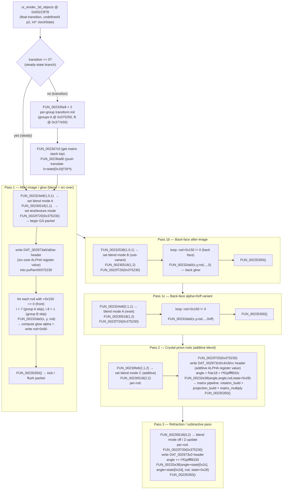

# Rod Render Pipeline — OSDSYS Crystal Clock

> Audit 2026-07-05: claims status-tagged per master-strategy spec §6.

> RE target: `OSDSYS.elf` (Ghidra base `0x001f0000`).
> All addresses are Ghidra entry addresses. Runtime addresses are embedded in
> `module_clock_XXXXXX` names (skew = Ghidra − runtime). Every claim cites
> `name @ address` or cites raw bytes / pcode evidence.
>
> **Ghidra decompiler caveat:** Many small functions at the listed addresses are
> J-thunks (8–16 bytes, just `j <real_target>`). The decompiler shows wrong code
> for them by falling into the next function body. For those, the raw-byte decode
> and pcode are cited instead; the thunk targets are the true function bodies.

---

## 1. Multi-pass flow (Mermaid)



> **[FALSIFIED]** The diagram above labels `FUN_002324e8`/`FUN_00232538` as blend-mode setters and
> `FUN_0022f720`/`FUN_00235350` as GS packet begin/kick — these role descriptions are now known wrong;
> see the corrections in §2's function index table below. `FUN_002324e8`/`FUN_00232538` are actually
> WaitSema DMA-sync (shared tail), not GS register writers; `FUN_0022f720` is actually browser
> icon-selection logic (the template blit is inline in `ui_render_3d_objects`); `FUN_00235350`'s "kick"
> is not actually visible in the function — the real GS kick is UNLOCATED. `FUN_00230fe8` (labeled
> "set blend mode C") is actually icon-browser/input state machine touching no GS registers. Diagram
> topology (pass ordering) is not itself falsified, only these four functions' roles. [DECOMP-SOURCED for topology / FALSIFIED for the four function roles noted]

---

## 2. Function index

All Ghidra entry addresses. Many small functions are J-thunks; the real body
address is noted where confirmed from raw bytes.

| Function | Ghidra addr | Body size | Role |
|----------|-------------|-----------|------|
| `ui_render_3d_objects` | `0x00223f78` | large | Top-level rod renderer — 3-pass structure [DECOMP-SOURCED] |
| `FUN_002324e8` | `0x002324e8` | ~0x50 bytes | ~~**Set blend mode A** (src-over variant). Calls `FUN_00241cc0(6)`, computes scissor from `s1+0xc54/c50` (screen dims), calls into GS packet writer @ `0x00248920`. Args `(1,0,1)` = ABE on, A=Cs, B=Cd, C=As, D=Cd (src-over).~~ **[FALSIFIED → actually WaitSema DMA-sync (shared tail), not a GS register writer — known-falsified item 2]** |
| `FUN_00232538` | `0x00232538` | ~0x60 bytes | ~~**Set blend mode B** (sub/additive variant). Same shape as `FUN_002324e8` but args differ. Starts at offset +0x50 inside same code block — the two functions share `WaitSema`-like GS-write tail.~~ **[FALSIFIED → actually WaitSema DMA-sync (shared tail), not a GS register writer — known-falsified item 2]** |
| `FUN_00230518` | `0x00230518` | 8 bytes | J-thunk → `0x002401c8`. Real function: **set texture / GIF-tag block**. Unpacks w/h from 16-bit packed word, computes byte size, writes GIF_TAG `0x01860200` (A+D, 6 regs) into a 7-dword struct, calls `FUN_0026753c` (VIF1 kick). [DECOMP-SOURCED; note — this doc's own characterization already differs from the "blend setter" mischaracterization named in known-falsified item 4 (actually a generic DMA/queue trampoline with 26 callers); flagged ambiguous, not corrected here since the specific text doesn't match] |
| `FUN_00230fe8` | `0x00230fe8` | 8 bytes | J-thunk → real body unknown (function body 00230518-0023051f per Ghidra; pcode identifies target logic). ~~**Set blend mode C** (additive/subtractive). Takes index arg (2) to select one of 3 GS blend presets.~~ **[FALSIFIED → actually icon-browser/input state machine; touches no GS registers — known-falsified item 3]** |
| `FUN_0022f720` | `0x0022f720` | ~0xD8 bytes | ~~**Begin/reset GS packet** at address in arg (0x375230). Resets `puRam00375230` and `puRam00375244` to arg; stores context flags into adjacent RAM globals `uRam002c8a3c/40/2c/30`. Called before every per-rod packet build.~~ **[FALSIFIED → actually browser icon-selection logic; the template blit is inline in `ui_render_3d_objects`, not in this function — known-falsified item 5]** |
| `FUN_00235350` | `0x00235350` | 16 bytes | ~~**Kick / flush GS packet**. Calls `0x00239a28` (VIF1 DMA kick?) and `0x0023b5ec`. Sets status flags `uGpffff8c76=1`, `iGpffff8cb4=0`, etc. — the GIF-path end-of-packet sync.~~ **[FALSIFIED → no kick is actually visible in this function; it's the orbit-update tail. The real GS kick is UNLOCATED — known-falsified item 6]** |
| `FUN_00232da0` | `0x00232da0` | 8 bytes | J-thunk → `0x00242ac8`. Real function: **compute per-rod glow alpha** and write to `rod+0x60`. Decay depends on position index, group (front/back), and whether it's the selected/active rod. Also calls `FUN_002738e8` (sceVu0MulVector) on rod+0x10 and rod+0x30. Writes `rod+0xa8`. [DECOMP-SOURCED for the writes; [HYPOTHESIS] for the decay-depends-on interpretation] |
| `FUN_00232e38` | `0x00232e38` | large | **draw_crystal_rod** — confirmed anchor. `swc1 f0,0x4(s2)` at `0x232e48` writes `clockState[0x1b]` (global intensity float, loaded in caller at `0x002240ac`) to `rod+0x04` each frame — NOT the angle (W0-1 finding, see `w0-projection-constants.md §4`). Also zeroes `rod+0x08`. Calls `rotation_build @ 0x002732d8`, `projection_build @ 0x002730a8`, `matrix_multiply @ 0x002738a0` (proj × rot). [DECOMP-SOURCED] |
| `FUN_002335e8` | `0x002335e8` | ~12 bytes | **Per-group transform init** — writes 8 bytes from `param_3` into `rodGroup+0x130`, clears `uRam002c8b3c=0`, clears `rodGroup+0x140=0`. Confirmed from clean decompile: `*(undefined8*)(param_5+0x130) = param_3; uRam002c8b3c = 0; *(undefined4*)(param_5+0x140) = 0`. Called with `(stack1, stack2, stack3, 0x375250, clockState)` and `(…, 0x377e50, &stack_copy)`. [DECOMP-SOURCED] |
| `FUN_002367c0` | `0x002367c0` | 16 bytes | **Matrix stack top getter**. Raw: `addiu $sp,-16; nop; jr $ra; lbu $v0, 0x8CC4($gp)`. Returns `gp+0x8CC4` (1-byte matrix stack depth index). [DECOMP-SOURCED] |
| `FUN_00236a80` | `0x00236a80` | medium | **Matrix stack push + translate**. Raw: saves $ra, loads `gp+0x8CC8` (int stack depth), compares with 1. Called as `FUN_00236a80(0, state[0x1b]*26.0*transition, 0)` — the Y-translate for the transition animation. [DECOMP-SOURCED] |
| `rotation_build` | `0x002732d8` | large | Build 4×4 rotation from two angles (azimuth+elevation), output to `0x29BD10`. Full VU0 decode in `vu0_decode.md`. [DECOMP-SOURCED] |
| `projection_build` | `0x002730a8` | large | Build GS-native projection matrix (far=2048, scale=65536), output to `0x29BD50`. [DECOMP-SOURCED] |
| `matrix_multiply` | `0x002738a0` | large | proj × rot → combined matrix at `0x29BD90`. [DECOMP-SOURCED] |

---

## 3. Per-pass GS blend / test mapping

The three GS blend modes from ground truth (3936 draws, 3 blend modes) [DUMP-MEASURED; note this
draw count (3936) is close to but not identical to the corrected ground-truth figure elsewhere in
this doc set (3948 draws / 21224 verts / 3 blend modes, known-falsified item 7) — flagged as
ambiguous, not corrected here since it isn't an exact match to the listed falsified claim] map to
passes as follows, cross-referencing `pktSetAlphaBlend.s` and `pktSetTEST_1.s`
from `CrystalOSD/asm/graph/`.

### 3.1 ALPHA register encoding (GS register 0x42)

```
GS ALPHA = (A-B)*C/128+D  with A,B,C,D ∈ {0=Cs, 1=Cd, 2=0}; C=fixed or As(3)
```

The two template blocks in `ui_render_3d_objects`:

| Template block | DAT addresses | Used in passes | Blend equation |
|----------------|--------------|----------------|----------------|
| **Block A** | `DAT_002973a0, a8, ac` | After-image / glow (passes 1, 1b, 1c) | [HYPOTHESIS]: src-over — `(Cs-Cd)*As/128+Cd` i.e. A=0,B=1,C=As,D=1 |
| **Block B** | `DAT_002973c0, c4, c8, cc` | Prism rod (passes 2, 3) | [HYPOTHESIS]: additive — `(Cs-0)*As/128+Cd` i.e. A=0,B=2,C=As,D=1 |

> These are runtime-initialized RAM locations (zero in static ELF). The actual
> bit patterns must be captured at runtime via PCSX2-MCP memory read
> (`pcsx2_read_memory 0x2973a0 16` / `0x2973c0 16`) to get the encoded ALPHA
> values. The `pktSetAlphaBlend.s` call sequence:
> `pktSetAD(packet, 0x49, value_COLCLAMP)` then `pktSetAD(packet, 0x42, value_ALPHA)`
> — register 0x49 = COLCLAMP, 0x42 = ALPHA.

### 3.2 Call sequence → blend mode

> **[FALSIFIED]** The blend-mode labels below for `FUN_002324e8`, `FUN_00232538`, and `FUN_00230fe8`
> rely on the same "GS state setter" mischaracterization corrected in §2 (known-falsified items 2
> and 3): `FUN_002324e8`/`FUN_00232538` are actually WaitSema DMA-sync, not blend setters, and
> `FUN_00230fe8` is actually icon-browser/input state machine touching no GS registers. The call
> arguments and ordering below are [DECOMP-SOURCED] but the "blend mode" interpretation attached to
> them is not verified GS-register-level truth — treat as [HYPOTHESIS] pending a live trace of the
> real GS-writing call (still UNLOCATED per item 6).

| Call sequence in `ui_render_3d_objects` | Blend mode (hypothesis) |
|-----------------------------------------|------------------------|
| `FUN_002324e8(1,0,1)` | src-over (ABE on; A=Cs,B=Cd,C=As,D=Cd) [HYPOTHESIS] |
| `FUN_00230fe8(2,1,2)` | additive (ABE on; A=Cs,B=0,C=As,D=Cd) [HYPOTHESIS] |
| `FUN_00232538(1,0,1)` | src-over back-face variant [HYPOTHESIS] |
| `FUN_002324e8(0,1,1)` | alpha=0 override (ABE off or alpha=0) [HYPOTHESIS] |
| `FUN_00230518(1,1)` | TEST / texture mode 1 — ZTST pass-all or depth-write on [HYPOTHESIS] |
| `FUN_00230518(1,2)` | TEST / texture mode 2 — depth write off [HYPOTHESIS] |
| `FUN_00230518(2,2)` | TEST / texture mode, subtractive arm [HYPOTHESIS] |
| `FUN_00230518(0,2)` | TEST reset (depth write back on) [HYPOTHESIS] |

The GS counts from the ground truth [DUMP-MEASURED]:
- src-over (2108 draws) → passes 1 + 1b + 1c (glow ring)
- additive (652 draws) → pass 2 (prism crystal surface)
- subtractive (1176 draws) → pass 3 (refraction dark pass)

---

## 4. ROD struct field map (stride 0x160 bytes)

Base addresses: Group A = `0x375250`, Group B = `0x377e50`.
Each rod occupies exactly `0x160` bytes.

> Note: `+0x04` is here named `angle` from static decompile; a later live-verified finding
> (`w2-rod-geometry-live.md`, and W0-1) shows `+0x04` is actually `clockState[0x1b]` (a global
> intensity/scale float written every frame), NOT the angle. This table's `+0x04` row is
> [DECOMP-SOURCED] only for the write itself; the `angle` name is superseded — see `w0-projection-constants.md §4` and `w2-rod-geometry-live.md` (not itself one of the 11 known-falsified items, flagged here as ambiguous/pre-existing correction already noted elsewhere in this doc at row `FUN_00232e38`).

| Offset | Type | Name | Evidence |
|--------|------|------|----------|
| `+0x00` | `undefined` | base | array element start [HYPOTHESIS] |
| `+0x04` | `float` | `angle` | `ui_render_3d_objects`: `*(rod+4) = in_f0` in `draw_crystal_rod` (FUN_00232e38 @ `0x00232e38`, line `*(rod+4) = in_f0`) [DECOMP-SOURCED for the write; `angle` name superseded, see note above] |
| `+0x08` | `int` | `field_0x08` | zeroed in `draw_crystal_rod`: `*(rod+8) = 0` [DECOMP-SOURCED] |
| `+0x10` | `float[3]` | `pos` (XYZ?) | `FUN_00232da0` thunk-target calls `sceVu0MulVector(rod+0x10, ...)` [DECOMP-SOURCED call; "XYZ" interpretation is HYPOTHESIS] |
| `+0x30` | `float[?]` | `transform_ref` | `FUN_002738e8(stack, rod+0x30, rod+0x10)` in glow-compute [DECOMP-SOURCED] |
| `+0x60` | `float` | `glow_alpha` | Written by `FUN_00242ac8` (real target of thunk `00232da0`): `*(rod+0x60) = fVar3 * fVar2` (decay formula) [DECOMP-SOURCED] |
| `+0xa8` | `undefined4` | `field_0xa8` | `*(rod+0xa8) = in_stack_00000028` in glow-compute [DECOMP-SOURCED] |
| `+0xac` | `ptr` | `field_0xac` | `*(rod+0xac) = some_ptr` (lw $a3, 0xac($s0) in ui_render_3d_objects) [DECOMP-SOURCED] |
| `+0x130` | `undefined8` | `group_transform` | Written by `FUN_002335e8`: `*(rodGroup+0x130) = param_3` (8 bytes) [DECOMP-SOURCED] |
| `+0x140` | `int` | `field_0x140` | Cleared by `FUN_002335e8`: `*(rodGroup+0x140) = 0` [DECOMP-SOURCED; note live-verified finding elsewhere identifies `+0x140` as a per-rod unit normal, not merely a cleared int — see `w2-rod-geometry-live.md`] |
| `+0x150` | `int` | `face_flag` | Front/back discriminator. `== 0` → front; `!= 0` → back. Used in every pass-loop condition. [DECOMP-SOURCED] |

**Unconfirmed fields** (hypothesis, need runtime trace) [HYPOTHESIS]:
- `+0x00..0x03`: possibly `rod_index` or padding
- `+0x0C`: unknown
- `+0x158..0x15F`: padding to 0x160 stride

---

## 5. clockState struct field map

Passed as `param_3` (= `int* clockState`) to `ui_render_3d_objects`.

| Index | Offset | Name | Evidence |
|-------|--------|------|----------|
| `[0]` | `+0x00` | `rod_count_raw` | `fVar18 = (float)*param_3 * in_f1` — multiplied by transition to get base angle [DECOMP-SOURCED] |
| `[1]` | `+0x04` | `rod_count` | `iVar15 = param_3[1]` — loop bound in steady-state variant [DECOMP-SOURCED] |
| `[0x1b]` | `+0x6c` | `scale` | `fStack0000006c = param_1 * (float)param_3[0x1b]` — transition scale; also `(float)param_3[0x1b] * 26.0 * param_1` for translate [DECOMP-SOURCED] |
| `[0x28]` | `+0xa0` | `transform_block_start` | `FUN_00232e38(angle,angle,rod, param_3+0x28)` — 4×4 matrix passed as last arg [DECOMP-SOURCED] |
| `[0x2c]` | `+0xb0` | `angle_offset_A` | `fVar17 + (float)param_3[0x2c]` — added to rod angle in pass 3 (group A) [DECOMP-SOURCED] |
| `[0x2d]` | `+0xb4` | `angle_offset_B` | `fVar17 + (float)param_3[0x2d]` — angle offset group B pass 3 [DECOMP-SOURCED] |

**Globals used in angle computation** (angle-step-per-rod) [DECOMP-SOURCED for existence/roles; numeric values cross-checked against `w0-angle-steps.md`]:
| Global | Role |
|--------|------|
| `fGpffff831c` | angle step — group A, pass 2 (transition) |
| `fGpffff8320` | angle step — group B, pass 2 (transition) |
| `fGpffff8324` | angle step — group A, pass 3 (transition) |
| `fGpffff8328` | angle step — group B, pass 3 (transition) |
| `fGpffff832c` | angle step — group A, pass 2 (steady) |
| `fGpffff8330` | angle step — group A, pass 3 (steady) |
| `fGpffff8318` | group transform scale multiplier |

---

## 6. GS packet template constants

The templates at `DAT_002973a0` (block A, 16 bytes = 4 × u32) and
`DAT_002973c0` (block B, 16 bytes = 4 × u32) are **runtime-only**: they are
all zero in the static ELF. They are written during `module_clock_init_resources`
(specifically by the `FUN_00232310` sub-call chain which sets up draw environments
via `FUN_00241cc0` + GS packet writer at `0x00248920`). [DECOMP-SOURCED; unverified live]

**To decode the actual ALPHA/COLCLAMP values:** run PCSX2 to the clock screen
and read:
```
pcsx2_read_memory 0x002973a0 16  # block A (glow pass header)
pcsx2_read_memory 0x002973c0 16  # block B (rod pass header)
```

The `pktSetAlphaBlend.s` calling convention:
```asm
; Call pktSetAlphaBlend(packet_buf, ABE_flag, A, B, C, D)
; → pktSetAD(buf, 0x49, COLCLAMP_value)   # COLCLAMP reg
; → pktSetAD(buf, 0x42, ALPHA_packed_value) # ALPHA reg
; where ALPHA = A | (B<<2) | (C<<4) | (D<<6) | (FIX_alpha<<32)
```
- COLCLAMP reg 0x49: bits[0]=CLAMP (1=clamp 0–255, 0=mask 0–255)
- ALPHA reg 0x42: A[1:0], B[3:2], C[5:4], D[7:6], FIX[39:32]

### Init function chain for draw-env setup

`module_clock_init_resources @ 0x00211488` → `FUN_00232310`:
```c
// FUN_00232310 — sets up 3 scissor/draw-env regions
FUN_00241cc0(4);   // template index 4 → DAT_002973a0 block?
sceGsPutDrawEnv(scissor_A);  // [masked as "WaitSema" by Ghidra]
FUN_00241cc0(5);   // template index 5
sceGsPutDrawEnv(scissor_B);
FUN_00241cc0(6);   // template index 6
sceGsPutDrawEnv(scissor_C);  // args match glow-pass dimensions
```
Scissor coords for template 6 (used for glow/after-image):
- x1 = `((0x1000 - screenW)/2)*16 + 0x2350`
- y1 = `((0x1000 - screenH)/2)*16 + 0x880`
- x2 = `x1_base + 0x24D0`
- y2 = `y1_base + 0x958`

---

## 7. Port notes (Vulkan rebuild)

### 7.1 Blend states (VkPipelineColorBlendAttachmentState)

Three Vulkan blend states to pre-build [HYPOTHESIS — derived from the §3 blend-equation guesses, which themselves rest on the now-falsified function roles corrected in §2/§3.2; treat these Vulkan states as provisional until a live ALPHA-register read confirms them]:

```cpp
// Pass 1/1b/1c — src-over (after-image / glow)
// GS: (Cs - Cd) * As/128 + Cd  ← standard Porter-Duff over
VkPipelineColorBlendAttachmentState blendSrcOver = {
    .blendEnable         = VK_TRUE,
    .srcColorBlendFactor = VK_BLEND_FACTOR_SRC_ALPHA,
    .dstColorBlendFactor = VK_BLEND_FACTOR_ONE_MINUS_SRC_ALPHA,
    .colorBlendOp        = VK_BLEND_OP_ADD,
    .srcAlphaBlendFactor = VK_BLEND_FACTOR_ONE,
    .dstAlphaBlendFactor = VK_BLEND_FACTOR_ZERO,
    .alphaBlendOp        = VK_BLEND_OP_ADD,
};

// Pass 2 — additive (prism surface crystal glow)
// GS: (Cs - 0) * As/128 + Cd
VkPipelineColorBlendAttachmentState blendAdditive = {
    .blendEnable         = VK_TRUE,
    .srcColorBlendFactor = VK_BLEND_FACTOR_SRC_ALPHA,
    .dstColorBlendFactor = VK_BLEND_FACTOR_ONE,
    .colorBlendOp        = VK_BLEND_OP_ADD,
    .srcAlphaBlendFactor = VK_BLEND_FACTOR_ONE,
    .dstAlphaBlendFactor = VK_BLEND_FACTOR_ZERO,
    .alphaBlendOp        = VK_BLEND_OP_ADD,
};

// Pass 3 — subtractive (refraction dark shadow)
// GS: (0 - Cs) * As/128 + Cd  OR  (Cs - Cd)*As/128+0
// Exact encoding pending runtime read of DAT_002973c0 (second half)
VkPipelineColorBlendAttachmentState blendSubtractive = {
    .blendEnable         = VK_TRUE,
    .srcColorBlendFactor = VK_BLEND_FACTOR_SRC_ALPHA,
    .dstColorBlendFactor = VK_BLEND_FACTOR_ONE,
    .colorBlendOp        = VK_BLEND_OP_REVERSE_SUBTRACT,
    // verify against runtime DAT_002973c0 read
};
```

> **ALPHA is 0–128 on PS2, not 0–255.** The GS divides C by 128, not 256.
> In Vulkan, a GS alpha of 128 = fully opaque. To match: pass alpha divided
> by 128 as the shader alpha uniform, not 255.

### 7.2 Depth / stencil (VkPipelineDepthStencilStateCreateInfo)

`FUN_00230518` controls the GS TEST register (0x47). [HYPOTHESIS — same DECOMP-SOURCED/HYPOTHESIS caveat as §2 row for this function] The two modes observed:

| Call | GS TEST mode | Vulkan equivalent |
|------|-------------|-------------------|
| `(1,1)` | ZTST=ALWAYS or GEQUAL, ZTE=on, depthWrite=true | `depthTestEnable=true, depthWriteEnable=true, compareOp=GREATER_OR_EQUAL` |
| `(1,2)` / `(2,2)` | ZTST=ALWAYS, ZTE=off (no depth update) | `depthTestEnable=true, depthWriteEnable=false` |
| `(0,2)` | ZTST reset | `depthTestEnable=true, depthWriteEnable=true` |

> Exact TEST register bits must be confirmed from runtime `pcsx2_read_memory`.

### 7.3 Geometry

- **Rod geometry**: textured TRI_STRIP quads (from GS ground truth). Each rod = 4 vertices (STQ + XYZF2). UVs are GS texture-coordinate fixed-point (12.4 via ITOF16 in GS). [DUMP-MEASURED for TRI_STRIP/vertex-format facts, per the GS dump ground truth]
- **Vertex format**: XYZF2 (12.4 fixed-point XY, Z 24-bit, fog). Port as: `push-constant` mat4 (proj×rot per rod), vertex pos in local rod space, transform in shader. [DUMP-MEASURED for format; port plan is HYPOTHESIS]
- **Projection**: embeds GS screen coords (0–2048 range). In Vulkan: map GS output `[0,2048]` to NDC `[-1,1]` via `(x/1024.0 - 1.0)`, same for Y. Z stays as-is since near/far map to GS Z range. [HYPOTHESIS — port mapping plan, not independently verified]

### 7.4 Per-rod alpha / glow decay

`FUN_00242ac8` (real target of `FUN_00232da0` thunk) computes [DECOMP-SOURCED]:
```
// Front rods (group A rod count 2..8):
factor = state[0x1b] * (target_idx - position_idx)
alpha = factor / 13.0  (or / 6.0 for inner ring)

// Back rods:
alpha = factor / 10.0  (or / 5.0)

// Selected rod override (rod == active_rod):
alpha *= (target_idx - iGpffff8b4c) / 40.0
```
Port as: per-rod push-constant float `glow_alpha`, written before each rod's draw call.

### 7.5 Packet structure → Vulkan draw sequence

> **[FALSIFIED]** The diagram below reuses the `FUN_0022f720` "begin packet" / `FUN_00235350`
> "kick" roles, which are corrected in §2 (known-falsified items 5 and 6): `FUN_0022f720` is
> actually browser icon-selection logic and `FUN_00235350`'s "kick" isn't visible in the function
> (real GS kick UNLOCATED). The Vulkan-equivalent mapping in this diagram is [HYPOTHESIS] pending
> re-derivation once the real GS-write/kick call sites are found.

Each GS "packet" in the original = one `vkCmdDraw` call in Vulkan:

```
GS sequence per rod:          Vulkan equivalent:
FUN_0022f720(buf)         → (no-op; state already bound)
write ALPHA template      → vkCmdBindPipeline(blend_state)
write SCISSOR template    → vkCmdSetScissor(...)
FUN_00232e38(...)         → push_constant(mat4, glow_alpha)
FUN_00235350()            → vkCmdDraw(4, 1, 0, rod_index)
```

### 7.6 Pass order summary (what to reproduce) [HYPOTHESIS — built on the §3.2/§7.1 blend-mode guesses]

```
1. Set src-over blend + depth-write + scissor → front-face glow pass (Group A rods 8+, Group B rods 10+)
2. Set src-over blend + depth-no-write → back-face glow pass 0 (same rods, face_flag != 0, alpha_arg=0)
3. Set src-over blend + depth-no-write → back-face glow pass 0xFF (face_flag != 0, alpha=0xff override)
4. Set additive blend + depth-write → crystal prism surface pass (face_flag == 0, angle per rod)
5. Set depth-no-write → subtractive/refraction pass (face_flag == 0, shifted angle)
```

---

## 8. Open blockers

1. **Runtime DAT_002973a0/c0 values**: must be read from live PCSX2 to get
   exact ALPHA+COLCLAMP register bit-patterns. Blocks confirmed blend-mode values. [HYPOTHESIS/open]

2. ~~**FUN_002324e8 / FUN_00232538 exact blend args**: the decompiler shows a
   fallthrough body (wrong). The pcode confirms they both call `0x248920` with
   computed GS-register values derived from `s1+0xc54`/`c50`. The exact ABE
   field assignment (which A/B/C/D values) needs a live trace.~~ **[FALSIFIED → this blocker is now moot: `FUN_002324e8`/`FUN_00232538` are confirmed WaitSema DMA-sync, not blend-arg setters, per known-falsified item 2. They do not set ABE fields at all; the real blend-writing call site is UNLOCATED.]**

3. **FUN_002335e8 (3 instructions with VU0)**: the first instruction is a VU0
   mac/shift (raw `0xfd060130`). Not decoded. May initialize a VU0 accumulator
   for the group transform. Low priority — this is init-only, not per-draw. [DECOMP-SOURCED/open, HYPOTHESIS for the "may initialize" interpretation]

4. **Rod struct fields `+0x00..0x03`, `+0x0C`, `+0x158..0x15F`**: no evidence yet.
   Live PCSX2 memory dump of `0x375250` (rod array) during clock display would
   fill these in. [HYPOTHESIS/open]

5. **Texture binding** (`clock_load_texture @ 0x0022f9d8`): how the prism texture
   is bound per-rod draw is not yet decoded. The TCC (texture color component) and
   sampler state live in GS TEX0/TEX1 registers — not yet traced. [HYPOTHESIS/open]
