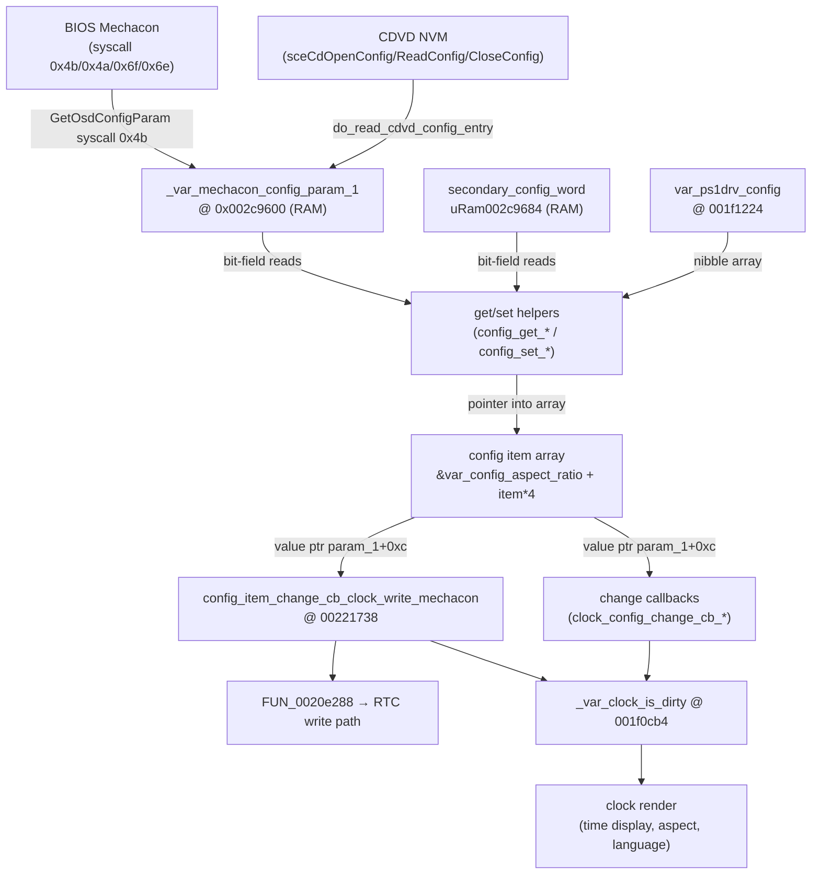
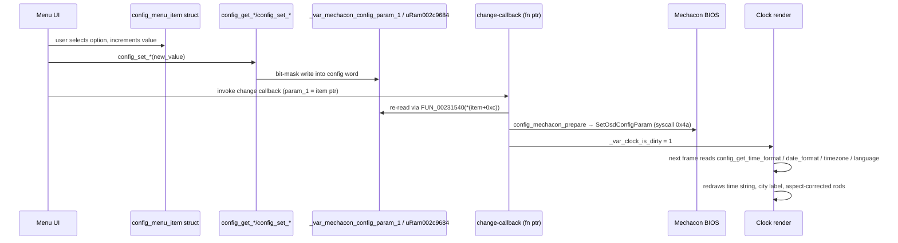
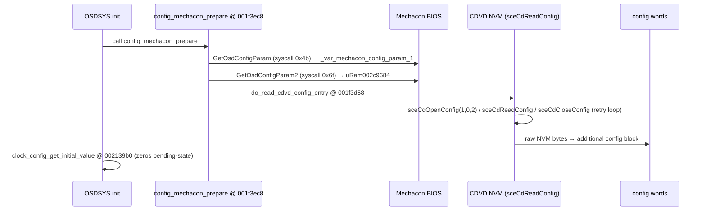

# OSDSYS Settings / Config Subsystem — Ghidra RE

> Reverse-engineered from `OSDSYS.elf` (base `0x001f0000`) via ghidra-mcp.
> Every claim cites `name @ address`. Labels marked "hypothesis" are inferred
> from bit-field position, not yet confirmed by a live trace.

---

## 1. Architecture overview



---

## 2. Storage layers

Two distinct RAM words hold all persistent config. Both are populated at boot via
`config_mechacon_prepare @ 001f3ec8` (wraps `GetOsdConfigParam` syscall `0x4b` and
`GetOsdConfigParam2` syscall `0x6f`).

### 2.1 Primary word — `_var_mechacon_config_param_1` (hypothesis: `0x002c9600`)

Set/read by `SetOsdConfigParam` (syscall `0x4a`) / `GetOsdConfigParam` (syscall `0x4b`).
`config_mechacon_prepare` reads into `0x2c9600`, writes back through the same path.
All arithmetic references use the Ghidra alias `_var_mechacon_config_param_1`.

| Bits | Mask | Field | Getter / Setter |
|------|------|-------|----------------|
| 0 | `& 1` | spdif_mode | `config_get_spdif_mode @ 001f4190` / `config_set_spdif_mode @ 001f41a0` |
| 2:1 | `>>1 & 3` | aspect_ratio | `config_get_aspect_ratio @ 001f41c8` / `config_set_aspect_ratio @ 001f41e8` |
| 3 | `>>3 & 1` | video_output | `config_set_video_output @ 001f4248` (getter `config_get_video_output @ 00204230`) |
| 8:4 | `>>4 & 0x1f` | unused/reserved | `config_get_unused_204D58 @ 001f4398` / `config_set_unused_204D70 @ 001f43b0` |
| 19:9 | `>>9 & 0x7ff` | timezone_offset | `config_get_timezone_offset @ 001f44d8` / `config_set_timezone_offset @ 001f44f0` |
| 28:20 | `>>20 & 0x1ff` | timezone_city | `config_get_timezone_city @ 001f4520` / `config_set_timezone_city @ 001f4550` |
| 29 | `>>29 & 1` | daylight_saving | `config_get_daylight_saving @ 001f45b8` / `config_set_daylight_saving @ 001f45d0` |
| 30 | `>>30 & 1` | time_format | `config_get_time_format @ 001f45f8` / `config_set_time_format @ 001f4610` |

### 2.2 Secondary word — `uRam002c9684`

Set/read by `SetOsdConfigParam2` (syscall `0x6e`) / `GetOsdConfigParam2` (syscall `0x6f`).

| Bits | Mask | Field | Getter / Setter |
|------|------|-------|----------------|
| 1:0 | `& 3` | date_format | `config_get_date_format @ 001f4638` / `config_set_date_format @ 001f4650` |
| 2 | `>>2 & 1` | config_get_204DD8 (hypothesis: unknown flag) | `config_get_204DD8 @ 001f4418` / `config_set_204DF0 @ 001f4430` |
| 3 | `>>3 & 1` | rc_gameplay | `config_set_rc_gameplay @ 001f43f0` (no paired getter named) |
| 4 | `>>4 & 1` | dvdp_remote_control | `config_get_dvdp_remote_control @ 001f4458` / `config_set_dvdp_remote_control @ 001f4470` |
| 5 | `>>5 & 1` | dvdp_support_clear_progressive | `config_get_dvdp_support_clear_progressive @ 001f4498` / `config_set_dvdp_support_clear_progressive @ 001f44b0` |

### 2.3 PS1 driver config — `var_ps1drv_config @ 001f1224`

Byte array. Accessor `module_clock_config_ps1drv_get_value @ 00215760`:

```c
byte module_clock_config_ps1drv_get_value(uint index)
{
    if ((index & 1) == 0)
        return var_ps1drv_config[index / 2] & 7;       // low nibble
    return var_ps1drv_config[index / 2] >> 4 & 7;      // high nibble
}
```

Each entry is 3 bits wide, packed two-per-byte (low/high nibble). Content: PS1 driver
hardware config options (analog mode, texel mode, etc.) — hypothesis, not yet confirmed
by cross-ref to usage sites.

### 2.4 Language table — `0x27b328`

`config_set_langtbl @ 001f4f20` writes a pointer from a table at `0x27b328` (4-byte entries,
indexed by integer) into `uRam0027b358`:

```c
undefined8 config_set_langtbl(int param_1)
{
    config_set_jpn_language();
    uRam0027b358 = *(undefined4 *)(param_1 * 4 + 0x27b328);
    return 0;
}
```

`thunk_config_get_osd_language @ 00204f00` reads back the language and computes display
geometry offsets stored in GP-relative globals `iGpffff8fd4 / 8fd0 / 8fc4 / 8fc8 / 8fcc / 8fd8`.

### 2.5 Timezone city table — `0x0027b9b2`

`config_check_timezone_city @ 001f7e78` walks a table of city records at `0x0027b9b2`
with stride `0x18` bytes each; `DAT_0027c5c8` holds the count. The city ID is at byte
offset `+0` of each record. Overflow guard: `config_get_timezone_city` clamps to
`0x80` and stashes the raw value at `DAT_0027a7c8`; `config_set_timezone_city` uses
`DAT_0027a7c8` when param == `0x80`.

---

## 3. Config-item array (clock bridge)

`module_clock_get_config_item @ 00221540`:

```c
undefined1 *module_clock_get_config_item(int param_1)
{
    return &var_config_aspect_ratio + param_1 * 4;
}
```

This is a flat `int32[]` array starting at the global `var_config_aspect_ratio`
(Ghidra symbol; exact RAM address not yet resolved — hypothesis: near `0x002c9600`
since all config state lives in that block). Stride 4 bytes = one `int` per item slot.

The index `param_1` maps to a config option. The ordering implied by the getter names
in the search results (spdif=0, aspect=1, …) is a hypothesis — the actual mapping
depends on who calls `module_clock_get_config_item` with what index. Because all
callers appear to be function-pointer-driven (all xrefs show `EXTERNAL`), the table
of indices is in the menu system, not trivially visible without a live trace.

`clock_config_get_initial_value @ 002139b0` calls `FUN_00223918 @ 00223918` (returns
immediately — stub or NOP init), then zeros `uGpffff88ac` and `DAT_0028b024`. Hypothesis:
initialises the "pending change" state before the config menu is shown.

---

## 4. Change-callback mechanism

### 4.1 `config_item_change_cb_clock_write_mechacon @ 00221738`

Called when any config item that writes back to the Mechacon changes. Steps:

1. Reads six time/date fields from `iRam00375118..0037512c` (a 6-word RTC buffer in
   the clock's working state).
2. Calls `FUN_0020e288` with pointers to those fields → writes time to the hardware RTC
   (path: `FUN_00220b88` → `FUN_00220a28` → `FUN_0026e1a0/0x0026e700/0026edc0`).
3. BCD-encodes each field via `FUN_00231700(val)` and stores results into the
   `0x001f0cad–0x001f0cb3` block (the clock's BCD display buffer).
4. Sets `_var_clock_is_dirty = 1` → triggers a visual re-render.
5. Mirrors the raw time into `iRam001f0cb8..001f0ccc` (a second copy).

BCD output layout:

| Offset | Field |
|--------|-------|
| `001f0cad` | seconds |
| `001f0cae` | minutes |
| `001f0caf` | hours |
| `001f0cb1` | day |
| `001f0cb2` | month (MSB `0x80` flag set) |
| `001f0cb3` | year % 100 |

### 4.2 `clock_config_change_cb_spdif_mode @ 00213440`

Reads the new spdif value from `*(param_1+0xc)` via `FUN_00231540`. If changed:
- `0` → `DAT_001f00b4 = 0x14`
- `1` → `DAT_001f00b4 = 0x15`

Then calls `FUN_00231888()` (hypothesis: audio output reconfiguration).

### 4.3 `clock_config_change_cb_ps1drv @ 002157b0`

Reads the new PS1 driver value. If changed, updates `iRam002c8ac0`
(PS1 driver active count), `uRam002c8afc` (reset flag), and
`fRam002c8ab0` (hypothesis: playback speed). Also triggers UI state
transitions via `FUN_002408b8 / 00240858 / 0024b430 / 0023f370`.

### 4.4 `clock_config_change_cb_dvdp_reset_progressive @ 00215940`

Reads the new value from `*(param_1+0xc)` via `FUN_00231540` and stores it
directly to `_dvdplayer_should_reset_progressive @ 001f13c0`.

### 4.5 Callback invocation pattern

All three `clock_config_change_cb_*` functions receive a struct pointer `param_1`
where `*(param_1+0xc)` is a config-item value (an index/handle resolved through
`FUN_00231540`). This is consistent with a menu-item object layout:

```
struct config_menu_item {
    /* +0x00 */ ...
    /* +0x04 */ ...
    /* +0x08 */ ...
    /* +0x0c */ int value_handle;   // passed to FUN_00231540 to get current value
    ...
};
```

`FUN_00231540` (not config-specific — it is the main input/focus handler for menu
items) dereferences the handle to produce a pointer to the live value cell.

---

## 5. Per-option table

| # | Option | Getter @ addr | Setter @ addr | Storage | Bits | Range | Visual impact |
|---|--------|---------------|---------------|---------|------|-------|---------------|
| – | spdif_mode | `config_get_spdif_mode @ 001f4190` | `config_set_spdif_mode @ 001f41a0` | `_var_mechacon_config_param_1` bit 0 | 0 | 0–1 | No (audio only) |
| – | aspect_ratio | `config_get_aspect_ratio @ 001f41c8` | `config_set_aspect_ratio @ 001f41e8` | `_var_mechacon_config_param_1` bits 2:1 | `>>1 & 3` | 0–2 | **YES** — rod projection aspect |
| – | video_output | `config_get_video_output @ 00204230` | `config_set_video_output @ 001f4248` | `_var_mechacon_config_param_1` bit 3 | `>>3 & 1` | 0–1 | **YES** — affects clock output mode |
| – | (unused) | `config_get_unused_204D58 @ 001f4398` | `config_set_unused_204D70 @ 001f43b0` | `_var_mechacon_config_param_1` bits 8:4 | `>>4 & 0x1f` | 0–31 | No |
| – | timezone_offset | `config_get_timezone_offset @ 001f44d8` | `config_set_timezone_offset @ 001f44f0` | `_var_mechacon_config_param_1` bits 19:9 | signed 11-bit | –1024..1023 (minutes) | **YES** — clock time display |
| – | timezone_city | `config_get_timezone_city @ 001f4520` | `config_set_timezone_city @ 001f4550` | `_var_mechacon_config_param_1` bits 28:20 | `>>20 & 0x1ff` | 0–127 (0x80=custom) | **YES** — city label on clock |
| – | daylight_saving | `config_get_daylight_saving @ 001f45b8` | `config_set_daylight_saving @ 001f45d0` | `_var_mechacon_config_param_1` bit 29 | `>>29 & 1` | 0–1 | **YES** — adjusts displayed time by +1h |
| – | time_format | `config_get_time_format @ 001f45f8` | `config_set_time_format @ 001f4610` | `_var_mechacon_config_param_1` bit 30 | `>>30 & 1` | 0=24h, 1=12h | **YES** — 12h/24h toggle on clock face |
| – | date_format | `config_get_date_format @ 001f4638` | `config_set_date_format @ 001f4650` | `uRam002c9684` bits 1:0 | `& 3` | 0–2 (YMD/MDY/DMY) | **YES** — date line on clock |
| – | config_get_204DD8 (unknown) | `config_get_204DD8 @ 001f4418` | `config_set_204DF0 @ 001f4430` | `uRam002c9684` bit 2 | `>>2 & 1` | 0–1 | Unknown |
| – | rc_gameplay | (no getter named) | `config_set_rc_gameplay @ 001f43f0` | `uRam002c9684` bit 3 | `>>3 & 1` | 0–1 | No |
| – | dvdp_remote_control | `config_get_dvdp_remote_control @ 001f4458` | `config_set_dvdp_remote_control @ 001f4470` | `uRam002c9684` bit 4 | `>>4 & 1` | 0–1 | No |
| – | dvdp_support_clear_progressive | `config_get_dvdp_support_clear_progressive @ 001f4498` | `config_set_dvdp_support_clear_progressive @ 001f44b0` | `uRam002c9684` bit 5 | `>>5 & 1` | 0–1 | No (triggers reset via `_dvdplayer_should_reset_progressive @ 001f13c0`) |
| – | osd_language | `thunk_config_get_osd_language @ 00204f00` | `config_set_jpn_language @ 00204318` + `config_set_langtbl @ 001f4f20` | `uRam0027b358` (pointer), table @ `0x27b328` | index | 0..N | **YES** — clock text language |
| – | ps1drv config | `module_clock_config_ps1drv_get_value @ 00215760` | (mechacon path) | `var_ps1drv_config @ 001f1224` | 3-bit nibble pairs | 0–7 per entry | No (PS1 hardware flags) |

---

## 6. Get/set/apply flow (detailed)



Boot load path:



---

## 7. Visual impact — Vulkan rebuild port notes

### 7.1 Aspect ratio

`config_get_aspect_ratio` returns 0–2. Values: `0`=4:3, `1`=16:9, `2`=(hypothesis) fullscreen.
The projection matrix builder `projection_build @ 002730a8` includes an aspect
correction branch driven by a widescreen flag (see `CLOCK-SYSTEM-MAP.md §4`).
In the Vulkan port, this becomes a `VkViewport` and projection-matrix parameter.
Read `config_get_aspect_ratio()` once per frame and pass into `projection_build` equivalent.

### 7.2 Time format (12h/24h)

`_var_mechacon_config_param_1 bit 30`. The clock display layer reads this before
formatting the hour digits. In Vulkan, the text/digit renderer needs a flag to
select AM/PM suffix or 24h hour value. The BCD display buffer at `001f0cad–001f0cb3`
is already pre-converted; hour raw value is at `001f0caf`.

### 7.3 Date format

`uRam002c9684 bits 1:0`. Three orderings (YMD=0/MDY=1/DMY=2). Vulkan port:
parametrize the date-string builder with this enum. Read once at frame start.

### 7.4 Timezone offset + DST

`timezone_offset` = signed 11-bit minutes value from `_var_mechacon_config_param_1 bits 19:9`.
`daylight_saving` adds 60 minutes. The PS2 applies these to UTC at display time.
In Vulkan, compute `display_seconds = utc_seconds + timezone_offset_minutes*60 + dst*3600`
then format.

### 7.5 Language / OSD text

`uRam0027b358` is a pointer into the language table at `0x27b328`. The clock string
renderer uses offsets from `thunk_config_get_osd_language` to position glyphs. In
Vulkan, maintain a language-index param; use it to select string tables and glyph
metrics.

### 7.6 DVD / SPDIF / RC flags

No visual impact on the clock. Skip for Phase 1.

### 7.7 Dirty flag

`_var_clock_is_dirty @ 001f0cb4` triggers a re-render. In Vulkan, maintain an equivalent
boolean; set it whenever any config setter is called and on every RTC tick.

---

## 8. Blockers / open items

1. **`var_config_aspect_ratio` address not resolved.** `module_clock_get_config_item`
   uses it as array base, but Ghidra returns no matching symbol. Likely a RAM global
   in the `0x002c96xx` block; resolve with a live PCSX2 trace or by reading the
   instruction bytes at `0x00221540` to extract the GP-relative offset.

2. **Config item table index mapping.** Which `param_1` index corresponds to which
   option (aspect=0? spdif=1? etc.) is unknown — all callers enter via function
   pointer (`xrefs = EXTERNAL`). Requires live-tracing the menu or finding the
   dispatch table.

3. **`FUN_00231540` is not the value-resolver.** In the callbacks it is called as
   `FUN_00231540(*(param_1+0xc))` but the decompile shows it is the menu input/focus
   handler. The actual value dereference happens inside it via the menu-item object.
   The real accessor is `FUN_00231540`'s return value (a pointer) — not yet confirmed.

4. **`config_get_video_output @ 00204230` decompile is corrupt** (decompiler emitted
   crash-recovery code referencing `sceCddaStream`). Raw video_output value is bit 3
   of `_var_mechacon_config_param_1`; confirm via `config_set_video_output` disassembly.

5. **`config_get_rc_gameplay` getter absent.** Only a setter (`config_set_rc_gameplay
   @ 001f43f0`) is named. Getter likely exists as an unnamed `FUN_*` at an adjacent
   address (~`001f43d8`); confirm by disassembling that region.
