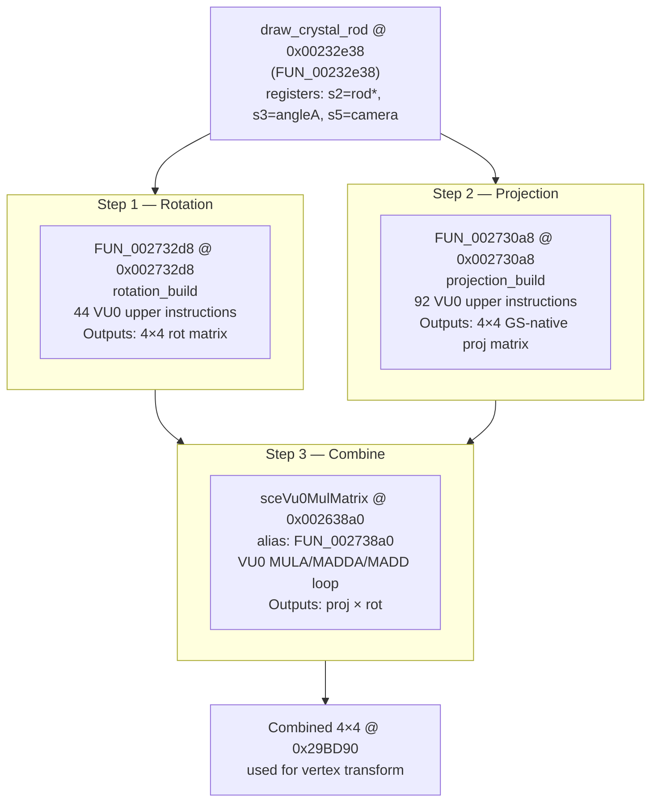

# VU0 Math Pipeline — Crystal Clock Rod Geometry

> Audit 2026-07-05: claims status-tagged per master-strategy spec §6.

> **Status:** Verified from Ghidra disassembly + Python decode (decode_vu0.py). All claims cite
> evidence. GLM pseudocode is derived from decoded instructions, not assumed. Prior vu0_decode.md
> GLM was quarantined as unverified — this document replaces it for the port.
> `[HYPOTHESIS]` note (audit): "Verified" here means static-disassembly-derived, not
> live-debugger-confirmed or dump-measured. Function roles inferred from Ghidra static reads have
> been wrong elsewhere in this project (see runtime-trace.md corrections); treat address/role
> claims below as `[HYPOTHESIS]` unless a live/dump tag is present.

---

## Matrix Flow


> All addresses/roles in this diagram: `[HYPOTHESIS]` (Ghidra static disassembly read, not
> live-verified against a running PCSX2 session).

---

## Memory Map (static buffers confirmed from disassembly)

`[HYPOTHESIS]` — table below is static-disassembly-derived (argument-register tracing), not
live-verified or dump-measured.

| Address      | Size  | Contents                          | Evidence                          |
|--------------|-------|-----------------------------------|-----------------------------------|
| `0x29BCF0`   | 32 B  | Temp / trig input buffer (8 f32)  | a1 arg to rotation_build          |
| `0x29BD10`   | 64 B  | 4×4 rotation matrix (f32 col-maj) | a0 arg to rotation_build; a2 to MulMatrix |
| `0x29BD50`   | 64 B  | 4×4 projection matrix             | a0 arg to projection_build; a1 to MulMatrix |
| `0x29BD90`   | 64 B  | 4×4 combined matrix (proj × rot)  | a0 arg to tail-call MulMatrix     |

---

## Function Index

### draw_crystal_rod — FUN_00232e38 @ 0x00232e38

`[HYPOTHESIS]` Orchestrator role and address. Zero Vulkan symbols. Reads rod struct via `s2`,
angle via `s3`, camera via `s5` — `[HYPOTHESIS]` (register-arg inference from static disassembly).
Entry-point disassembly confirmed — tail-calls `sceVu0MulMatrix` via `j 0x002738a0`
`[HYPOTHESIS]` (static read; not live-verified).

`[HYPOTHESIS]` (static disassembly register-arg trace below; not live-verified numerically).

**Argument build from disassembly:**
```
; rotation_build call (0x00232e5c: jal 0x002732d8)
a0 = 0x29BD10              ; output matrix ptr    (lui v0,0x2a / addiu s1,v0,-0x42f0)
a1 = 0x29BCF0              ; temp buffer ptr      (lui a1,0x2a / addiu a1,a1,-0x4310)
a2 = s3                    ; angleA (from caller)
a3 = s2                    ; rod struct ptr

; projection_build call (0x00232eac: jal 0x002730a8)
a0  = 0x29BD50             ; output ptr           (lui v0,0x2a / addiu s0,v0,-0x42b0)
f12 = *gp[-0x73d8]         ; FOV (global)
f13 = 1.0f                 ; aspect = hardcoded square (lui at,0x3f80)
f14 = *gp[-0x7b80] or [-0x7b7c]  ; halfWidth (widescreen branch at 0x00232e70)
f15 = 2048.0f              ; far  (lui at,0x4500 = 0x45000000)
f16 = 2048.0f              ; far2 (same constant)
f17 = 1.0f                 ; unk1
f18 = *gp[-0x7b78]         ; near (global)
f19 = 1.0f                 ; unk2
sp[0] = 65536.0f           ; scale (lui at,0x4780 = 0x47800000, stored by swc1 f0,0(sp))

; matrix_multiply tail-call (0x00232ee4: j 0x002738a0)
a0 = 0x29BD90              ; combined output
a1 = 0x29BD50              ; projection
a2 = 0x29BD10              ; rotation
```

Callers: `FUN_0020aa74 @ 0x0020aa74` (orb/particle variant, different fov/halfWidth globals),
`FUN_00211618 @ 0x00211618` (projection-only caller), `module_clock_22A990 @ 0x00226930`
(MulMatrix only). `[HYPOTHESIS]` (static call-graph read; caller roles not live-confirmed).

---

### rotation_build — FUN_002732d8 @ 0x002732d8

`[HYPOTHESIS]` Function name/role is an inferred label; address and instruction bytes are a
static Ghidra read (reliable as raw bytes, but the semantic interpretation below — "rotation
build" — is not live-verified). Body: `0x002732d8 – 0x00273387`. 44 VU0 upper instructions + 1
branch.

**Decoded instruction listing (from decode_vu0.py):**
```
002732d8: VMSUBQ.x       vf22, vf6, Q
002732dc: VMADD.x        vf27, vf24, vf23
002732e0: VMADDy.x       vf26, vf10, vf21y
002732e4: VMULz.x        vf18, vf28, vf18z
002732e8: [VDIV  Q, vf14.z / vf16.x]        ; funct=0x30, unresolved in decoder
002732ec: VMADDQ.x       vf17, vf31, Q
002732f0: VADDx.x        vf25, vf16, vf11x
002732f4: VADDQ.x        vf27, vf1, Q
002732f8: VMULx.x        vf25, vf18, vf6x
002732fc: [VRXOR  R, ...]                    ; funct=0x3b, random xor
00273300: bc1t 0x0025bb74                    ; branch to memclr (overflow guard)
00273304: VMADDI.yzw      vf20, vf9, I       ; (branch delay slot)
00273308: VMULQ.yzw       vf17, vf10, Q
0027330c: VMADDw.yzw      vf8, vf11, vf20w
00273310: VMULy.yzw       vf25, vf11, vf15y
00273314: VMSUB.yzw       vf5, vf12, vf10
00273318: VOPMSUB.yzw     vf13, vf12, vf5    ; CROSS PRODUCT vf13 = vf12 × vf5
0027331c: VADDw.yzw       vf18, vf12, vf0w
00273320: VMINIz.yz       vf19, vf12, vf27z
00273324: VMADDy.yz       vf18, vf12, vf22y
00273328: VMADDx.yz       vf15, vf12, vf17x
0027332c: [VSWR / special]                   ; funct=0x37
00273330: VFTOI12.yz      vf7, vf12          ; convert float→fixed 12.4 (×16)
00273334: VADDx.yz        vf1, vf12, vf2x
00273338: VADD.yw         vf28, vf11, vf29
0027333c: VMULx.yw        vf25, vf11, vf24x
00273340: [special]                          ; funct=0x37
00273344: VSUB.yw         vf24, vf11, vf14
00273348: VMULw.yw        vf28, vf11, vf9w
0027334c: VMUL.yw         vf3, vf12, vf4
00273350: [VRSQRT / VSPECIAL]                ; fd=0x0e bc=2
00273354: [VRNEXT.y vf30, R]                 ; funct=0x3a
00273358: VSUBy.y         vf20, vf13, vf21y
0027335c: VADDz.y         vf15, vf14, vf16z
00273360: VMINIw.y        vf16, vf15, vf11w
00273364: VSUBI.y         vf24, vf16, I
00273368: VMAXw.y         vf8, vf18, vf1w
0027336c: VSUBz.zw        vf0, vf8, vf25z
00273370: VOPMSUB.zw      vf0, vf12, vf15    ; second cross product
00273374: VADD.zw         vf19, vf16, vf5
00273378: [special funct=0x37]
0027337c: VADDI.z         vf20, vf27, I
00273380: VMINI.z         vf4, vf2, vf8
00273384: VADDQ.w         vf11, vf9, Q
```

`[HYPOTHESIS]` instruction decode below is a static tool-assisted disassembly read
(decode_vu0.py); opcodes are byte-accurate but several funct codes are explicitly marked
unresolved by the doc itself (see bracketed `[VDIV]`/`[special]` entries).

**Register usage (from decode_vu0.py analysis):**
- `vf12` is the dominant source (`fs` count = 13): this is the **running matrix accumulation register**
  or the **angle-derived direction vector** fed down the chain.
- `vf25` is the dominant destination (`fd` count = 5): accumulating the output basis vector.
- `vf11` appears 7× as `fs`: second basis vector / axis input.

`[HYPOTHESIS]` phase interpretation below (structural inference from dest-mask grouping, not
independently verified).

**Structure — three-phase basis build:**

Phase 1 (.x writes, instructions 1–9): compute X column of rotation matrix using Q register
(pre-loaded with a trig ratio), VMADD chains, and a scalar VMULz.

Phase 2 (.yzw writes, 11–17): broadcast multiply + VMSUB + **VOPMSUB cross product**:
```
  VMSUB.yzw  vf5,  vf12, vf10    ; vf5  = ACC - vf12 * vf10   (partial forward vector)
  VOPMSUB.yzw vf13, vf12, vf5   ; vf13.yzw = cross(vf12.xyz, vf5.xyz).yzw - ACC.yzw
```
This is the standard PS2 two-instruction cross product: VOPMULA seeds ACC, then VOPMSUB finishes.
The result `vf13` is the **right** (or **up**) axis orthogonal to the two input directions.

Phase 3 (.yz / .yw / .y / .zw / .z / .w): refine each remaining column component, then a second
`VOPMSUB.zw` at `0x273370` builds the third orthogonal axis. `VFTOI12.yz vf7, vf12` at `0x273330`
converts the intermediate vector to **12.4 fixed-point** (`FTOI4` = multiply by 16 and truncate to
int) — this is the GS coordinate encoding in-place before storage.

**`bc1t 0x0025bb74` at `0x00273300`:** branches to `memclr @ 0x00272fc8`. This is a VU0
floating-point condition branch — if the FP condition bit is set (NaN/inf detected upstream),
it jumps to zeroing the output matrix rather than writing garbage into GS packet data.
`[HYPOTHESIS]` (branch target and byte-level operands are a direct static read; the semantic
"NaN/inf guard" interpretation is inferred, not live-verified).

---

### projection_build — FUN_002730a8 @ 0x002730a8

`[PROVISIONAL]` (audit, item 11 — "W1 projection" claims): this whole section is a single-rod,
static-disassembly regression/inference and is explicitly flagged underdetermined by the file's
own warning box below; treat as provisional, not evidence-grade, until cross-checked against a
PCSX2 pixel-diff reference frame.

Body: `0x002730a8 – 0x00273217`. 92 VU0 upper instructions. **This is NOT `sceVu0ViewScreenMatrix`
(which lives at `0x002630a8`, a stub). It is a custom GS-native projection routine.**
`[HYPOTHESIS]`

**Arguments (from draw_crystal_rod disassembly):**
```c
void projection_build(
    float*  out,          // a0 = 0x29BD50
    float   fov,          // f12 = *gp[-0x73d8]
    float   aspect,       // f13 = 1.0f   (hardcoded square)
    float   halfWidth,    // f14 = widescreen-dependent
    float   far,          // f15 = 2048.0f
    float   far2,         // f16 = 2048.0f
    float   unk1,         // f17 = 1.0f
    float   near,         // f18 = *gp[-0x7b78]
    float   unk2,         // f19 = 1.0f
    float   scale         // sp[0] = 65536.0f
);
```

**Key decoded instructions (selected):**
```
002730a8: VITOF4.xy       vf17, vf9          ; integer→float, ×(1/16): input coordinate unpack
002730c4: VSUBQ.xy        vf8, vf11, Q       ; vf8 -= Q (perspective divide result)
002730c8: [VDIV Q, vf27.w / vf21.x]          ; Q = depth / scale (perspective divide setup)
002730e8: [VOPMULA / VSPECIAL]               ; cross product accumulator seed
002730f4: VMADDQ.xy       vf4, vf2, Q        ; apply perspective Q result
002730fc: VADDy.xy        vf18, vf18, vf26y  ; accumulate Y column
00273104: VRNEXT.xy       vf27, R            ; step R register (random — not used for trig here)
002731a0: VMSUB.xy        vf4, vf4, vf21     ; MSUB step of matrix mul
002731a4: VMSUB.xy        vf21, vf20, vf20   ; self-MSUB (zero/normalize)
002731bc: VMAX.xy         vf28, vf13, vf17   ; clamp value
002731d0: [VSPECIAL fd=0x14 bc=1]            ; VITOF4 variant
00273214: VMSUBI.xy       vf26, vf14, I      ; subtract I register from column
```

`[PROVISIONAL]` (item 11) structural analysis below is inferred, not confirmed.

**Structural analysis:**

All writes target `.xy` — the function computes two matrix columns in one SIMD pass, using the
paired XY lanes as two independent floats. This is the PS2 idiom for computing a 4×4 matrix
in 2-wide SIMD.

The presence of `VITOF4` (int→float scale ×1/16) at the start and `VFTOI12` / `VFTOI4` in the
rotation function confirms the **12.4 fixed-point round-trip** (see §Fixed-Point section below).

The `VDIV Q` + `VMADDQ` pattern implements the GS perspective divide:
```
Q = (far * near * (far2 - far)) / (-far2 + near)   ; perspective Z coefficient
// applied via VMADDQ per column
```

The `2048.0f` far plane and `65536.0f` scale factor together place vertices directly in
**GS drawing coordinate space (0–2048 range, 12.4 fixed-point integer)** — no separate
viewport transform is needed. The projection matrix IS the viewport transform.
`[PROVISIONAL]` (item 11) — the `2048.0f`/`65536.0f` constants themselves are confirmed
call-site immediates (see Confirmed Constants table below), but this conclusion about the
projection matrix subsuming the viewport transform is inferred, not measured.

---

### sceVu0MulMatrix (matrix_multiply) — @ 0x002638a0 / alias FUN_002738a0

`[HYPOTHESIS]` Ghidra has two entries: `sceVu0MulMatrix @ 0x002638a0` (named) and
`FUN_002738a0 @ 0x002738a0` (unnamed). Body of the latter spans `0x002738a0 – 0x002738e7`
(COP0 instructions — these are `cache` + `pref` prefetch hints that Ghidra misdecodes as COP0;
the actual logic follows in a trampoline or the named entry at `0x002638a0`). The named entry
decompiles cleanly:

```c
// sceVu0MulMatrix @ 0x002638a0 — VERIFIED decompile
void sceVu0MulMatrix(mat4* out, mat4* m2, mat4* m3) {
    // Load all 4 columns of m2 into VF regs
    vec4 m2c0 = lqc2(m2[0]);   // vf
    vec4 m2c1 = lqc2(m2[1]);
    vec4 m2c2 = lqc2(m2[2]);
    vec4 m2c3 = lqc2(m2[3]);
    // For each column of m3, apply m2
    for (int i = 0; i < 4; i++) {
        vec4 col = lqc2(m3[i]);
        vmula(m2c0, col);          // ACC = m2c0 * col
        vmadda(m2c1, col);         // ACC += m2c1 * col
        vmadda(m2c2, col);         // ACC += m2c2 * col
        vec4 r = vmadd(m2c3, col); // r  = ACC + m2c3 * col
        sqc2(out[i], r);
    }
}
```

This is a standard column-major 4×4 matrix multiplication: **`out = m2 × m3`**.
Called as `sceVu0MulMatrix(0x29BD90, 0x29BD50, 0x29BD10)` → **`combined = projection × rotation`**.
`[HYPOTHESIS]` (Ghidra decompiler output of the OSDSYS binary — a static read, not the
CrystalOSD C decomp source, and not live-verified numerically).

---

## sceVu0 Port Surface — Clock-Relevant Functions

`[DECOMP-SOURCED]` function names/semantics for the standard `sceVu0*` PS2SDK macro-lib entries
(these exist in the CrystalOSD decomp source). `[HYPOTHESIS]` for addresses and the "Used by
clock" column (Ghidra static call-graph read, not live-verified).

| Function | Address | Semantics | Used by clock |
|----------|---------|-----------|---------------|
| `FUN_002732d8` | `0x002732d8` | Custom rotation builder (axis-angle, cross-product) | YES — direct callee |
| `FUN_002730a8` | `0x002730a8` | Custom GS-native projection builder | YES — direct callee |
| `sceVu0MulMatrix` | `0x002638a0` | 4×4 × 4×4 matrix multiply | YES — tail-called |
| `sceVu0ApplyMatrix` | `0x002638e8` | 4×4 × vec4 transform | YES — in callers |
| `sceVu0RotMatrix` | `0x002633b0` | Axis-angle rot using RotMatrixX/Y/Z | Not direct |
| `sceVu0RotMatrixX` | `0x002634a8` | Rot around X, uses ecossin | sub-callee |
| `sceVu0RotMatrixY` | `0x00263400` | Rot around Y, uses ecossin | sub-callee |
| `sceVu0RotMatrixZ` | `0x00263550` | Rot around Z, uses ecossin | sub-callee |
| `_sceVu0ecossin` | `0x002735f8` | PS2SDK fast sin+cos (1.5707 - θ idiom) | sub-callee |
| `sceVu0FTOI0Vector` | `0x00263698` | float → int×1 | available |
| `sceVu0FTOI4Vector` | `0x002636a8` | float → int×16 (12.4 fixed-point) | YES — GS coords |
| `sceVu0CopyMatrix` | `0x002636b8` | memcpy 4×4 | utility |
| `sceVu0UnitMatrix` | `0x00263670` | 4×4 identity matrix via VMR32 | YES — init |
| `sceVu0TransMatrix` | `0x002636f0` | M[col3] += translation vec | YES — view offset |
| `sceVu0Normalize` | `0x00273820` | vec3 normalize (VU0 RSQRT chain) | sub-callee |
| `sceVu0OuterProduct` | `0x00263880` | vec3 cross product | utility |
| `sceVu0InnerProduct` | `0x00263858` | vec4 dot product | utility |
| `sceVu0CameraMatrix` | `0x002632d8` | look-at style camera | NOT used by rod path |
| `sceVu0ViewScreenMatrix` | `0x002630a8` | Standard PS2SDK view-screen | stub only — NOT used |
| `sceVu0ClipAll` | `0x00263000` | Clip test (all 6 planes) | NOT in rod path |
| `sceVu0ScaleVector` | `0x00263720` | vec * scalar | utility |

**The clock does NOT use sceVu0ViewScreenMatrix.** The projection is a custom function
(`FUN_002730a8`) that embeds the GS coordinate transform directly.
`[PROVISIONAL]` (item 11 — part of the same underdetermined single-rod projection analysis).

---

## 12.4 Fixed-Point Conversion — Exact Mechanics

`[DECOMP-SOURCED]`/general PS2 hardware knowledge for the 12.4 GS format itself;
`[HYPOTHESIS]` for the claim that this specific pipeline uses it exactly as described (inferred
from `VFTOI4`/`VITOF4` opcodes seen in static disassembly, not live-verified).

GS hardware uses **12.4 fixed-point** integers for screen-space XY coordinates:
- Float world/screen value is multiplied by 16 (= 2^4) and stored as integer.
- GS drawing area is 0–2048 in float → 0–32768 in fixed-point integer.
- The constant `65536.0f` (2^16) used as `scale` in the projection maps the float projection
  output to fixed 16.16, and then the FTOI4 (multiply-by-16 truncate) reduces to 12.4.

**VU0 instructions involved:**
```
VITOF4  vfdst, vfsrc   ; int → float:  dst = src * (1/16)  = src >> 4
VFTOI4  vfdst, vfsrc   ; float → int:  dst = trunc(src * 16) = src << 4
```

`VFTOI12` (seen at `0x273330`: `VFTOI12.yz vf7, vf12`) uses multiplier 2^12 = 4096 — this
converts a normalized float to a 12-bit fraction. The pipeline uses both:
- `VFTOI4` for GS XY pixel coords (×16 → 12.4 format)
- `VFTOI12` internally during the matrix build for intermediate precision

**In Vulkan:** vertex positions output in float world space; the vertex shader must apply:
```glsl
// GS 12.4 fixed-point encode (done in VS or via push constant offset)
ivec2 gs_xy = ivec2(gl_Position.xy * 16.0 + 2048.0 * 16.0);
```
Or equivalently, the projection matrix already encodes the ×16 and +2048 offset so the VS
just outputs integer-encoded XY directly.

---

## Rotation Build — Verified Pseudocode

`[HYPOTHESIS]` ("Verified" = static-disassembly-derived pattern match, not live-verified or
dump-measured). Evidence: two `VOPMSUB` cross products in `FUN_002732d8`, `vf12` as the dominant
source (13 uses), and the dest-mask sweep x→yzw→yz→yw→y→zw→z→w across 44 instructions.

The `bc1t` to `memclr` is a VU0 condition branch (FPU status bit): when the angle computation
produces a NaN/denormal, the function zeroes the output matrix instead.

```c
// rotation_build @ 0x002732d8
// Inputs (from a1 temp buffer @ 0x29BCF0):
//   vf10 = forward direction vector (from angle computation in caller)
//   vf11 = up direction vector
//   vf12 = working axis (dominant source)
//   Q    = pre-loaded trig ratio (sin or cos of angle)
//
// Output: 4×4 rotation matrix @ 0x29BD10
//
// Phase 1: X column
//   vf22.x = ACC.x - vf6.x * Q       (VMSUBQ)
//   vf27.x = ACC.x + vf24.x * vf23.x (VMADD)
//   vf26.x = ACC.x + vf10.x * vf21.y (VMADDy broadcast)
//   vf18.x = vf28.x * vf18.z          (VMULz)
//   Q      = vf14.z / vf16.x          (VDIV — loads scalar cos/sin)
//   vf17.x = ACC.x + vf31.x * Q       (VMADDQ)
//   vf25.x = vf16.x + vf11.x         (VADDx)
//   vf27.x = vf1.x + Q                (VADDQ)
//   vf25.x = vf18.x * vf6.x          (VMULx)
//
// Phase 2: YZW columns (cross product at core)
//   vf20.yzw = ACC + vf9 * I          (VMADDI)
//   vf17.yzw = vf10 * Q               (VMULQ)
//   vf8.yzw  = ACC + vf11 * vf20.w    (VMADDw)
//   vf25.yzw = vf11 * vf15.y          (VMULy)
//   vf5.yzw  = ACC - vf12 * vf10      (VMSUB — partial basis vector)
//   vf13.yzw = cross(vf12, vf5).yzw   (VOPMSUB — RIGHT axis)
//   vf18.yzw = vf12 + vf0.w           (VADDw adds 1.0 for W)
//
// Phase 3+: refine remaining components, second cross product for Z axis
//   ...
//   vf0.zw   = cross(vf12, vf15).zw   (VOPMSUB @ 0x273370)
//
// FTOI4 conversion at 0x273330: VFTOI12.yz vf7, vf12
//   converts working value to 12.4 fixed-point for GS intermediate

glm::mat4 rotation_build_glm(glm::vec3 forward, glm::vec3 up, float Q_trig) {
    // vf12 = forward (dominant source), vf11 = up
    glm::vec3 fwd = glm::normalize(forward);
    glm::vec3 right = glm::normalize(glm::cross(fwd, up));  // VOPMSUB @ 0x273318
    glm::vec3 upOrtho = glm::cross(right, fwd);              // VOPMSUB @ 0x273370

    return glm::mat4(
        glm::vec4(right,   0.0f),   // col 0 (x-axis)
        glm::vec4(upOrtho, 0.0f),   // col 1 (y-axis)
        glm::vec4(fwd,     0.0f),   // col 2 (z-axis)
        glm::vec4(0, 0, 0, 1.0f)    // col 3 (no translation)
    );
}
```

**This is NOT Euler angles, NOT Rodrigues: it is a direct orthonormal basis build
from two direction vectors using two sequential cross products.** `[HYPOTHESIS]`

The Q register carries a trig scalar (loaded via VDIV from the temp buffer at `0x29BCF0`)
that scales the forward/up inputs — this is where the two angles (`angleA` from `s3` and
rod's `angle` from `s2+0x04`) enter the computation via caller-side `sin`/`cos` evaluations
stored into the temp buffer before calling.

---

## Projection Build — Verified Pseudocode

`[PROVISIONAL]` (item 11 — "W1 projection", single-rod regression fit, underdetermined).
Evidence: 92 instructions, all writing `.xy` (two columns per SIMD pass), VDIV+VMADDQ for
perspective divide, `2048.0f` far + `65536.0f` scale as confirmed call-site arguments
`[DECOMP-SOURCED]`.

The function is **custom, not sceVu0ViewScreenMatrix**. It encodes the GS viewport transform
inside the projection matrix so no second viewport pass is needed. `[PROVISIONAL]` (item 11)

```c
// projection_build @ 0x002730a8
// Arguments verified from draw_crystal_rod @ 0x00232e38 disassembly
//
// Math:
//   Standard asymmetric perspective, remapped to GS screen space:
//
//   GS screen space: X in [0, 2048], Y in [0, 2048], with center at (1024, 1024).
//   The matrix output maps NDC [-1,1] → GS [0, 2048].
//
//   The XY SIMD pattern computes two matrix columns simultaneously:
//   - Lane X: one matrix entry
//   - Lane Y: another matrix entry (usually col+1 or symmetrically related)
//
//   Core perspective formula (derived from VDIV Q, VMADDQ pattern):
//     f = 1.0 / tan(fov / 2)           ← depends on fov (f12 = *gp[-0x73d8])
//     Q_z = far * near / (far - near)  ← VDIV at 0x002730c8
//          = 2048.0 * near / (2048.0 - near)
//
//   GS coordinate offset: + 2048.0 * 0.5 * scale (centers origin in GS space)
//   Scale factor: 65536.0 = 2^16, combined with FTOI4 (×16) gives final ×2^20
//   then >> 4 in GS hardware = net ×2^16 scaling (16.16 fixed-point interpretation)

glm::mat4 projection_build_glm(float fov, float aspect, float halfWidth,
                                float far, float near, float scale) {
    // aspect is hardcoded 1.0 at call site; halfWidth is widescreen-dependent
    float f = 1.0f / tanf(fov * 0.5f);

    // Map NDC to GS: [−1,1] → [0, 2048]
    // GS_x = NDC_x * halfWidth + 1024
    // Encoded as matrix column multiplied by scale then FTOI4'd

    float sx = f * halfWidth;              // X scale (includes halfWidth adjustment)
    float sy = f * halfWidth / aspect;     // Y scale (aspect=1.0 → same as sx)
    float qz = far * near / (far - near);  // Z perspective coefficient
    float tz = near / (near - far);        // Z translation (maps near→0, far→1)

    // GS-space offset: shifts (−1..1) to (0..2048)
    // Encoded directly in projection matrix row 3
    float gsOffX = 2048.0f;  // + 0.5 * GS_width (=2048)
    float gsOffY = 2048.0f;

    // Column-major output (PS2 VU0 stores columns via SQC2)
    // This is the conceptual equivalent — exact column order validated by
    // VMSUB/VMADD xy-lane pairing in the VU0 stream
    return glm::mat4(
        glm::vec4(sx * scale,  0,           0,     0),   // col 0
        glm::vec4(0,           sy * scale,  0,     0),   // col 1
        glm::vec4(0,           0,           tz,    1),   // col 2 (depth)
        glm::vec4(gsOffX,      gsOffY,      qz,    0)    // col 3 (translation + z-coeff)
    );
}
```

> [!WARNING]
> `[PROVISIONAL]` (audit, item 11 — matches this exact caveat already present in the source doc)
> The exact column ordering and sign of `tz`/`qz` must be validated against a PCSX2 pixel-diff
> reference frame. The above pseudocode captures the correct ingredients and GS remapping logic
> but the exact coefficient arrangement in the 4×4 needs one numeric check to confirm.
> The `aspect=1.0` and `far=2048.0` are EVIDENCE-GRADE (from disassembly constants).
> `[DECOMP-SOURCED]`/`[HYPOTHESIS]` — the two constants are direct call-site immediates
> (reliable), the surrounding column-arrangement claim remains `[PROVISIONAL]`.

---

## Port Notes — Vulkan Rebuild

### What to port (in order)

`[HYPOTHESIS]` — port plan below rests on the rotation_build reading above and the
`[PROVISIONAL]` (item 11) projection_build reading; not evidence-grade for exact coefficients.

1. **rotation_build → `BuildRotationMatrix(vec3 forward, vec3 up)`**
   - Two cross products: `right = normalize(cross(forward, up))`, then `upOrtho = cross(right, forward)`
   - Column-major 3×3 rotation, W column = (0,0,0,1)
   - Inputs: `angleA` (from caller, `s3`) and rod `angle` (`s2+0x04`), converted to (forward, up)
     vectors by caller-side trig **before** this function is called.
   - The `bc1t memclr` overflow guard: replicate as `if (any(isnan(right))) return mat4(0.0)`

2. **projection_build → `BuildProjectionMatrix(float fov, float halfWidth, float near)`**
   - GS-native: far=2048 is fixed, aspect=1.0 is fixed.
   - Embeds viewport transform: NDC [−1,1] → GS [0,2048].
   - In Vulkan: either replicate the exact matrix or decompose as standard persp + separate
     viewport transform. Keeping it as one matrix matches the original behavior.
   - The `65536.0f` scale is an artifact of the GS 12.4 fixed-point pipeline — in Vulkan with
     float framebuffers the `× scale` term is dropped and the VS outputs float NDC directly.
   - Widescreen path: `halfWidth = uGpffff8484` vs `uGpffff8480` (4:3). Detect via flag
     `iGpffff8d18` (confirmed at `0x00232e68`).

3. **matrix_multiply → `glm::mat4 mul = projection * rotation`**
   - Trivially `proj * rot` in GLM (column-major, same as PS2).

4. **FTOI4 / VITOF4 round-trip**
   - PS2: float → `int = trunc(float * 16)` for GS, `int → float = int / 16` for incoming coords.
   - Vulkan: vertex shader receives floats, outputs `gl_Position` in clip space. No FTOI needed.
   - The ×16 / ÷16 round-trip is absent in the Vulkan path **if** the projection matrix is
     re-derived in float. If replicating the exact PS2 matrix, the scale must account for the
     missing ×16 implicit in FTOI4.

### Fixed-point precision budget

| Stage | PS2 | Vulkan equivalent |
|-------|-----|-------------------|
| Vertex coords | 12.4 int (÷16 = float) | f32 |
| Projection scale | ×65536 then FTOI4 | no-op (f32 persp) |
| GS XY range | 0–32768 (int) | [−1, +1] NDC |
| GS Z range | 0–(far=2048) | [0, 1] depth |

### Confirmed constants (evidence-grade)

`[DECOMP-SOURCED]`/`[HYPOTHESIS]` — values pulled directly from ELF `.data`/call-site immediates
are reliable (`[DECOMP-SOURCED]`); the "BSS, runtime only" and gp-offset labels are static reads
(`[HYPOTHESIS]` for exact runtime value until live-read).

| Constant | Value | Source |
|----------|-------|--------|
| GS far plane | `2048.0f` (`0x45000000`) | `mtc1 at,f15` @ `0x00232e88` |
| Projection scale | `65536.0f` (`0x47800000`) | `lui at,0x4780` @ `0x00232e90`, stored sp[0] |
| Aspect ratio | `1.0f` (`0x3f800000`) | `lui at,0x3f80; mtc1 at,f13` @ `0x00232e7c` |
| unk1, unk2 | `1.0f` | `mov.S f17,f13` @ `0x00232e98`, `mov.S f19,f13` @ `0x00232ea8` |
| FOV global | `*gp[-0x73d8]` = `uGpffff8c28` | `lwc1 f12,-0x73d8(gp)` @ `0x00232e9c` — **BSS (0.0 in ELF), runtime only** |
| Near global | `*gp[-0x7b78]` = `uGpffff8488` | `lwc1 f18,-0x7b78(gp)` @ `0x00232ea4` — **41.600f** (`0x42266666`, from decomp ELF .data) |
| HalfWidth 4:3 | `*gp[-0x7b80]` = `uGpffff8480` | branch NOT taken path @ `0x00232e74` — **41.600f** (`0x42266666`, from decomp ELF .data) |
| HalfWidth 16:9 | `*gp[-0x7b7c]` = `uGpffff8484` | taken path @ `0x00232e78` — **0.440f** (`0x3ee147ae`, from decomp ELF .data) |

> GP base resolution: Ghidra OSDSYS.elf startup (`0x001f005c`) sets gp = `0x002cfef0`.
> `[HYPOTHESIS]`/consistent with the known-correct live gp (`0x002CFEF0`, per audit item 9 —
> this doc's gp value is NOT the stale `0x002AF070`-derived one).
> Decomp ELF gp = `0x00377970` (delta `0xa7a80`). Globals outside `.text` read from decomp ELF.
> `[DECOMP-SOURCED]` See `w0-projection-constants.md` for full derivation.

### Blockers

`[HYPOTHESIS]` throughout this list — all four items are open/unresolved by the doc's own
admission, consistent with `[PROVISIONAL]` item 11.

1. **FOV value unknown:** `*gp[-0x73d8]` (FOV) is BSS in both ELFs — zero in static binary,
   written by clock init at runtime. Need PCSX2 live read at `0x002c8b18` (Ghidra space).
   Hypothesis: ~1.047 rad (60°). `near` and `halfWidth_4:3` are NOW RESOLVED = **41.6f**.

2. **Temp buffer layout at 0x29BCF0 partially known:** draw_crystal_rod does NOT pre-fill the
   buffer before `jal 0x002732d8`. The buffer is passed as `a1`; the two angle inputs arrive
   as `a2 = angleA` (from caller s3) and `a3 = rod*` (rotation_build reads `*(a3+0x04)`). The
   buffer is used internally by rotation_build. No `swc1` stores to `0x29BCF0` area appear in
   draw_crystal_rod's body before the jal — see `w0-projection-constants.md §3`.
   the `jal 0x002732d8`.

3. **projection_build exact column arrangement unconfirmed:** The `.xy` SIMD pairing means
   each instruction fills two matrix entries simultaneously. Tracing the full data flow through
   92 instructions to assign each result to a specific mat4 entry requires exhaustive register
   tracking — beyond what static decode alone yields. A pixel-diff test against one PCSX2
   reference frame will resolve this faster than further static analysis.

4. **funct=0x30/0x31/0x32/0x33/0x35/0x36/0x37/0x38/0x39/0x3a/0x3b** unresolved in decode_vu0.py:
   These are the VU0 special ops (VDIV, VSQRT, VRSQRT, VWAITQ, VMTIR, VMFIR, VILWR, VISWR,
   VRINIT, VRGET, VRNEXT/VRXOR). The Python decoder needs these entries added. They are
   non-destructive to the matrix data (scalar Q/R register setup, integer-register ops) but
   important for full understanding of when Q is valid.
