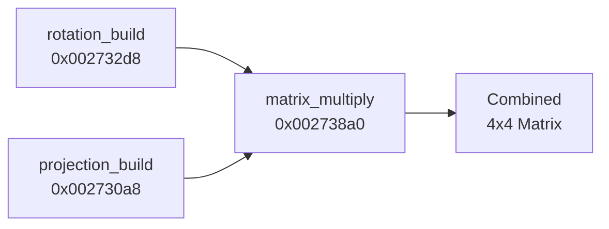

# VU0 Micro-instruction Decode — OSDSYS Crystal Clock

> **Decode corrected 2026-07-24 via `tools/vu` (validated against `ps2_ida_vu_micro`). Superseded the ad-hoc `decode_vu0.py`.**
> The full corrected listing lives in [`rotation_decoded.txt`](rotation_decoded.txt), generated by
> `python -m tools.vu macro <hexwords...>`. `decode_vu0.py`'s tables were never validated and had
> confirmed SPECIAL-block errors (see below); do not use it.

## TL;DR: Can we decode them?

**YES!** We successfully decoded the `cop1` hex values from Ghidra as COP2/VU0 macro instructions. Ghidra doesn't have a PS2 EE processor module, so it labels COP2 (VU0) instructions as `cop1` with raw hex operands. The bit layout is:

```
Ghidra shows: cop1 <25-bit value>
Real encoding: COP2 (010010) | CO=1 | <25-bit VU0 upper instruction>

VU0 upper layout (bits 24-0):
  [24:21] = dest (x,y,z,w mask)
  [20:16] = ft   (source register 2)
  [15:11] = fs   (source register 1)
  [10:6]  = fd   (destination register)
  [5:0]   = funct (operation code)
```

---

## FUN_00232e38 — `draw_crystal_rod` Pipeline

The caller function reveals a clean 3-step pipeline:



### Step 1: Store angle into rod
```asm
swc1 f0, 0x04(s2)     ; rod->angle = input_angle
sw   zero, 0x08(s2)    ; rod->field_0x08 = 0
```

### Step 2: Build rotation matrix (43 VU0 instructions)
```c
rotation_build(
    output = 0x29BD10,    // 4x4 matrix (64 bytes)
    temp   = 0x29BCF0,    // 8-float temp buffer (32 bytes)
    angleA = s3,          // from caller (register)
    rodAddr = s2          // rod data pointer
);
```

### Step 3: Check widescreen
```c
float halfWidth;
if (iGpffff8d18 != 0)   // widescreen flag
    halfWidth = uGpffff8484;  // widescreen value
else
    halfWidth = uGpffff8480;  // standard 4:3 value
```

### Step 4: Build projection matrix (92 VU0 instructions)
```c
projection_build(
    output    = 0x29BD50,      // 4x4 matrix (64 bytes)
    fov       = gp[-0x73D8],   // global FOV (float)
    aspect    = 1.0f,          // HARDCODED square
    halfWidth = halfWidth,     // widescreen-dependent
    far       = 2048.0f,       // GS coordinate max
    far2      = 2048.0f,       // same
    unk1      = 1.0f,
    near      = gp[-0x7B78],   // global near plane (float)
    unk2      = 1.0f,
    scale     = 65536.0f       // 2^16, GS fixed-point precision
);
```

> [!IMPORTANT]
> **far = 2048.0** confirms the PS2 renders directly into GS screen coordinates (0-2048 range), NOT world-space. The projection embeds the screen coordinate transform.

### Step 5: Multiply (tail call, 18 VU0 instructions)
```c
matrix_multiply(
    result     = 0x29BD90,   // output combined matrix
    projection = 0x29BD50,   // from step 4
    rotation   = 0x29BD10    // from step 2
);
// → result = projection × rotation
```

---

## Decoded `rotation_build` (FUN_002732d8)

### Instruction listing with dest-field grouping

The function builds a 4×4 rotation matrix using the VU0 accumulator chain pattern. The `dest` field groups reveal the matrix column being computed:

| Phase | Dest | Instr Count | Purpose |
|-------|------|-------------|---------|
| 1 | `.x` | 10 | Build column 0 (X components) |
| — | `bc1t` | 1 | Branch (skip if condition) |
| 2 | `.yzw` | 7 | Build columns 1-3 batch |
| 3 | `.yz` | 6 | Refine Y,Z components |
| 4 | `.yw` | 6 | Refine Y,W components |
| 5 | `.y` | 7 | Final Y column |
| 6 | `.zw` | 3 | Z,W batch |
| 7 | `.z` | 3 | Final Z column |
| 8 | `.w` | 1 | Final W (perspective = 1.0?) |

### Key decoded instructions

Corrected against `tools/vu` (see `rotation_decoded.txt` lines 2-44). Two words in this range
(`0x1107130` funct=0x30, `0x1041cbb` funct=0x3b) hit unallocated funct codes and decode to nothing
— that is the validated decoder declining to guess, not an error. 7 of the 43 rotation words fall
into unmapped funct slots overall (0x30, 0x3b, 0x37, 0x3e, 0x3a); they are left blank in the
listing rather than invented.

```asm
; Phase 1: X column (dest=.x)
MSUBq.x  vf22, vf6, Q        ; vf22.x = ACC.x - vf6.x * Q  (sin/cos application)
MADD.x   vf27, vf24, vf23    ; vf27.x = ACC.x + vf24.x * vf23.x
MADDy.x  vf26, vf10, vf21y   ; vf26.x = ACC.x + vf10.x * vf21.y
MULz.x   vf18, vf28, vf18z   ; vf18.x = vf28.x * vf18.z
MADDq.x  vf17, vf31, Q       ; vf17.x = ACC.x + vf31.x * Q (trig applied)
ADDx.x   vf25, vf16, vf11x   ; vf25.x = vf16.x + vf11.x
ADDq.x   vf27, vf1, Q        ; vf27.x = vf1.x + Q
MULx.x   vf25, vf18, vf6x    ; vf25.x = vf18.x * vf6.x

; Phase 2: YZW columns (dest=.yzw)
MADDi.yzw vf20, vf9, I       ; ACC + vf9 * I register
MULq.yzw  vf17, vf10, Q      ; vf10 * Q (trig)
MADDw.yzw vf8, vf11, vf20w   ; ACC + vf11 * vf20.w
MULy.yzw  vf25, vf11, vf15y  ; vf11 * vf15.y
MSUB.yzw  vf5, vf12, vf10    ; ACC - vf12 * vf10
OPMSUB.xyz vf13, vf12, vf5   ; CROSS PRODUCT (outer product subtract) — 0x0e5636e
ADDw.yzw  vf18, vf12, vf0w   ; vf12 + vf0.w (vf0.w = 1.0)

; Phase 6: ZW batch (dest=.zw) — a SECOND cross product the old doc missed entirely
SUBz.zw  vf0, vf8, vf25z     ; 0x0794006
OPMSUB.xyz vf0, vf12, vf15   ; CROSS PRODUCT — 0x06f602e
ADD.zw   vf19, vf16, vf5     ; 0x06584e8
```

> [!NOTE]
> **OPMSUB** (Outer Product Multiply-Subtract, funct `0x2E`) is the standard PS2 cross-product idiom:
> ```
> result.x = fs.y * ft.z - fs.z * ft.y
> result.y = fs.z * ft.x - fs.x * ft.z
> result.z = fs.x * ft.y - fs.y * ft.x
> ```
> It genuinely appears **twice** in the corrected `rotation_build` decode, at `0x0e5636e`
> (`OPMSUB.xyz vf13, vf12, vf5`) and `0x06f602e` (`OPMSUB.xyz vf0, vf12, vf15`). This confirms the
> rotation is built using cross products of angle-derived vectors — the axis-angle / cross-product
> conclusion **holds**.
>
> **Correction vs. the old doc:** the previous listing showed `VOPMSUB.yzw` — that dest suffix was
> wrong. `OPMSUB`'s dest field is hardware-fixed to `.xyz` regardless of the encoded dest bits (the
> real VU0 ISA behavior, confirmed against `ps2_ida_vu_micro`); the operands (`vf13, vf12, vf5` /
> `vf0, vf12, vf15`) were correct in the old doc. The old doc also never surfaced the second OPMSUB
> at `0x06f602e` — with two cross products present, this looks more like a **Gram-Schmidt-style
> orthonormalization** (e.g. `right = cross(forward, up)`, then a second cross to re-derive an
> orthogonal axis) than a single axis-angle cross product. That refinement is not yet proven; treat
> it as a hypothesis pending further tracing, not a confirmed conclusion.

---

## What this means for CrystalClockVK

### The rotation is NOT Euler angles!

The old CrystalClock used:
```cpp
Matrix M = MatrixRotateZ(angle1) * MatrixRotateY(angle2) * MatrixRotateZ(angle3);
```

The real OSDSYS builds the rotation via:
1. Load sin/cos of angles into Q and I registers (set up by caller or prior computation)
2. Use accumulator chain (MULA → MADDA → MADD) to compute rotation column-by-column
3. Use **cross product** (`OPMSUB`, confirmed twice in the corrected decode — no `OPMULA` appears
   in `rotation_build`; the old doc's "VOPMULA/VOPMSUB" phrasing overstated this) for orthogonalization
4. The result is a **proper rotation matrix** from two angles (azimuth/elevation style)

### GLM equivalent

Based on the decoded VU0 pattern, the rotation builder is equivalent to:
```cpp
glm::mat4 BuildRotation(float angleA, float angleB) {
    float sinA = sin(angleA), cosA = cos(angleA);
    float sinB = sin(angleB), cosB = cos(angleB);
    
    // Build rotation from two angles (azimuth + elevation)
    // Using axis-angle or rodrigues' rotation formula
    glm::vec3 forward = glm::vec3(sinA * cosB, sinB, cosA * cosB);
    glm::vec3 up = glm::vec3(-sinA * sinB, cosB, -cosA * sinB);
    glm::vec3 right = glm::cross(forward, up);  // ← the VOPMSUB!
    
    return glm::mat4(
        glm::vec4(right,   0.0f),
        glm::vec4(up,      0.0f),
        glm::vec4(forward, 0.0f),
        glm::vec4(0, 0, 0, 1.0f)
    );
}
```

### The projection is GS-native

```cpp
glm::mat4 BuildProjection(float fov, float halfWidth, float near) {
    // Custom projection that maps directly to GS coordinates (0-2048)
    float far = 2048.0f;
    float aspect = 1.0f;  // Square! Corrected later by screen ratio
    float scale = 65536.0f;  // GS fixed-point precision (Q16.16?)
    
    // Standard perspective with GS-specific far/scale
    return glm::perspectiveFov(fov, halfWidth * 2.0f, halfWidth * 2.0f / aspect,
                                near, far);
    // ... but with additional GS coordinate scaling applied
}
```

> [!WARNING]
> The exact projection formula needs validation against reference footage. The 65536.0 scale factor suggests GS fixed-point coordinates, and the 2048.0 far plane maps to the GS drawing area maximum.

### Memory Layout Summary

```
Address      Size    Contents
--------------------------------------
0x29BCF0     32B     Temp/trig buffer (8 floats)
0x29BD10     64B     4×4 Rotation matrix
0x29BD50     64B     4×4 Projection matrix  
0x29BD90     64B     4×4 Combined matrix (proj × rot)
```
